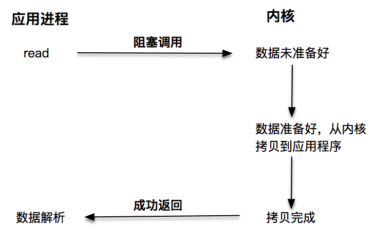
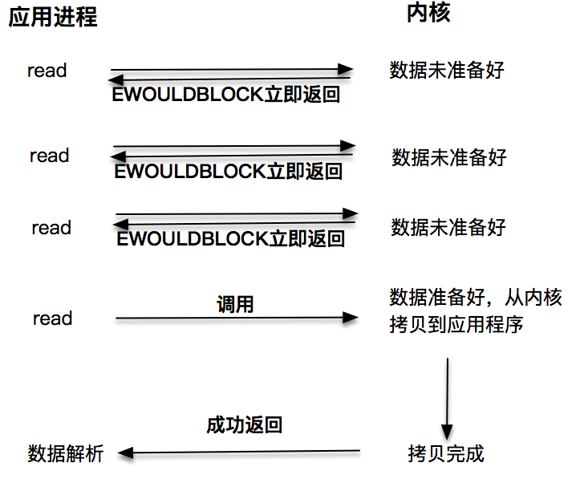
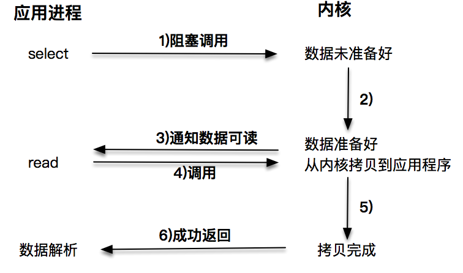
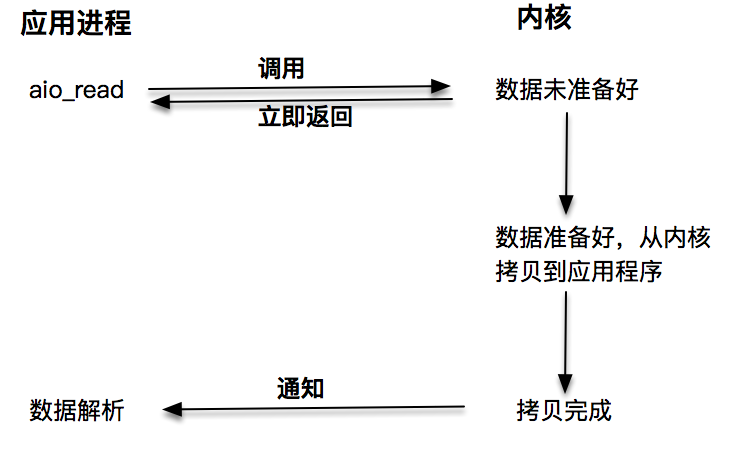

# 阻塞/非阻塞 VS 同步/异步

## 阻塞 I/O

阻塞 I/O 发起的 `read()` 请求，线程会被挂起，一直等到内核数据准备好，并把数据从内核区域拷贝到应用程序的缓冲区中，当拷贝过程完成，`read()` 请求调用才返回。接下来，应用程序就可以对缓冲区的数据进行数据解析。

## 非阻塞 I/O

非阻塞的 `read()` 请求在数据未准备好的情况下立即返回，应用程序可以不断轮询内核，直到数据准备好，内核将数据拷贝到应用程序缓冲，并完成这次 `read()` 调用。注意，这里最后一次 `read()` 调用，获取数据的过程，是一个同步的过程。这里的同步指的是内核区域的数据拷贝到缓存区这个过程。

## IO 多路复用

每次让应用程序去轮询内核的 I/O 是否准备好，是一个不高效的做法，因为在轮询的过程中应用进程啥也不能干。于是，像 `select()`、`poll()` 这样的 I/O 多路复用技术就隆重登场了。通过 I/O 事件分发，当内核数据准备好时，再通知应用程序进行操作。这个做法大大改善了应用进程对 CPU 的利用率，在没有被通知的情况下，应用进程可以使用 CPU 做其他的事情。

注意，这里 `read()` 调用，获取数据的过程，也是一个同步的过程。

## 异步 IO

无论是第一种阻塞 I/O，还是第二种非阻塞I/O，第三种基于非阻塞 I/O 的多路复用都是同步调用技术。

同步调用、异步调用的说法，是对于获取数据的过程而言的，前面几种最后获取数据的 `read()` 操作调用，都是同步的，在 `read()` 调用时，内核将数据从内核空间拷贝到应用程序空间，这个过程是在 `read()` 函数中同步进行的，如果内核实现的拷贝效率很差，`read()` 调用就会在这个同步过程中消耗比较长的时间。

而真正的异步调用则不用担心这个问题：

发起 `aio_read()` 之后，就立即返回，内核自动将数据从内核空间拷贝到应用程序空间，这个拷贝过程是异步的，内核自动完成的，和前面的同步操作不一样，应用程序并不需要主动发起拷贝动作。

## 小结

# Linux下socket套接字的异步支持

`aio` 系列函数是由 POSIX 定义的异步操作接口，可惜的是，Linux 下的 aio 操作，不是真正的操作系统级别支持的，它只是由 GNU libc 库函数在用户空间借由pthread 方式实现的，而且仅仅针对磁盘类 I/O，套接字 I/O 不支持。

综合以上结论就是，Linux 下对异步操作的支持非常有限，这也是为什么使用 epoll 等多路分发技术加上非阻塞 I/O 来解决 Linux 下高并发高性能网络 I/O 问题的根本原因。

# Windows下的IOCP和Proactor模式

和Linux不同，Windows下实现了一套完整的支持套接字的异步编程接口，这套接口一般被叫做 IOCompletetionPort(IOCP)。这样，就产生了基于 IOCP 的所谓Proactor 模式。

和 Reactor 模式一样，Proactor 模式也存在一个无限循环运行的 event loop 线程，但是不同于 Reactor模式，这个线程并不负责处理I/O调用，它只是负责在对应的 `read()`、`write()` 操作完成的情况下，分发完成事件到不同的处理函数。

这里举一个HTTP服务请求的例子来说明：

- 客户端发起一个 GET 请求
- 这个 GET 请求对应的字节流被内核读取完成，内核将这个完成事件放置到一个队列中
- event loop 线程，也就是 Poractor 从这个队列里获取事件，根据事件类型，分发到不同的处理函数上，比如一个 http handle 的 onMessage 解析函数
- HTTP request 解析函数完成报文解析
- 业务逻辑处理，比如读取数据库的记录
- 业务逻辑处理完成，开始encode，完成之后，发起一个异步写操作
- 这个异步写操作被内核执行，完成之后这个异步写操作被放置到内核的队列中
- Proactor 线程获取这个完成事件，分发到 HTTP handler 的 onWriteCompled 方法执行

