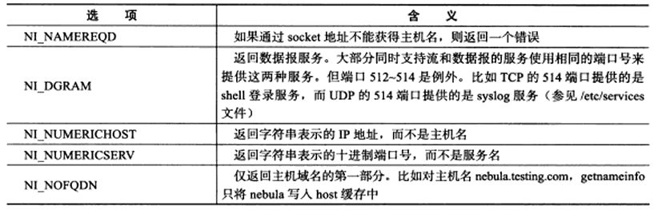
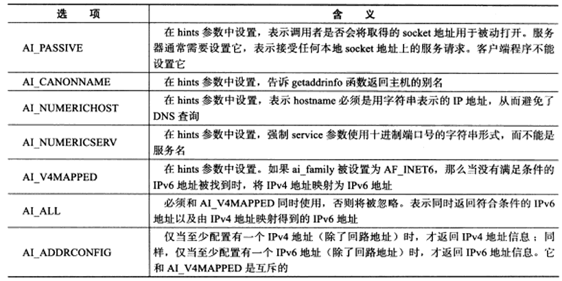
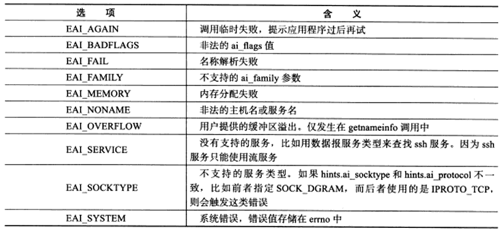

# gethostbyname() 和 gethostbyaddr()

以下两个函数不可重入，即非线程安全的。

```
#include <netdb.h>

struct hostent* gethostbyname(const char* name);
```

- 根据主机名获取主机的完整信息
- `name`：指定目标主机的主机名

```
#include <netdb.h>

struct hostent* gethostbyaddr(const void* addr,size_t len,int type);
```

- 根据 IP 地址获取主机的完整信息
- `addr`：指定 IP 地址
- `len`：指定 addr 所指 IP 地址的长度
- `type`：参数指定 IP 类型，可以是 `AF_INET`，`AF_INET6`

```
struct hostent
{
	char* h_name;		//@ 主机名
	char** h_aliases;	//@ 主机别名列表，可能有多个
	int h_addrtype;		//@ 地址类型(地址族)
	int h_length;		//@ 地址长度
	char** h_addr_list;	//@ 按网络字节序列出的主机 IP 地址列表
};
```

# getservbyname() 和 getservbyport()

以下两个函数不可重入，即非线程安全的。

```
#include <netdb.h>

struct servent* getservbyname(const char* name,const char* proto);
struct servent* getservbyport(int port,const char* proto);
```

- `proto`：
  - 流服务：`"tcp"`
  - 数据报服务：`"udp"`
  - 所有服务类型：`NULL`

```
struct servent
{
	char* s_name;		 //@ 服务名称
	char** s_aliases;	 //@ 服务的别名列表，可能有多个
	int s_port;			//@ 端口号
	char* s_proto;		//@ 服务类型，通常是 tcp 或者 udp
};
```

# getaddrinfo() 和 getnameinfo()

```
#include <netdb.h>

int getaddrinfo(const char* hostname,const char* service,const struct addrinfo* hints,struct addrinfo** result);
void freeaddrinfo(struct addrinfo* res);
```

- 可以通过主机名获得 IP 地址，内部使用 `gethostbyname()`
- 可以通过服务名获得端口号，内部使用 `getservbyname()`
- `getaddrinfo()` 函数隐式的分配了堆内存，调用结束后需要通过调用 `freeaddrinfo()` 释放
- 是否可重入决定于内部调用的函数是否可重入

```
#include <netdb.h>

int getnameinfo(const struct sockaddr* sockaddr,socklen_t addrlen,char* host,socklen_t hostlen,char* serv,socklen_t servlen,int flags);
```

- 通过 socket 地址同时获取字符串表示的主机名(内部使用 `gethostbyaddr()`) 和服务名(内部使用 `getservbyaddr()`)
- 是否可重入决定于内部调用的函数是否可重入
- `flags`：



- `struct addrinfo`：

````
  struct addrinfo {
               int              ai_flags;
               int              ai_family;
               int              ai_socktype;
               int              ai_protocol;
               socklen_t        ai_addrlen;
               struct sockaddr *ai_addr;
               char            *ai_canonname;
               struct addrinfo *ai_next;
           };
````

- `ai_flags`：



`getaddrinfo()` 和 `getnameinfo()` 成功时返回0，失败时返回错误码：



可以通过 `gai_strerror()` 将错误转换成字符串：

```
#include <netdb.h>

const char*gai_strerror(int error);
```

