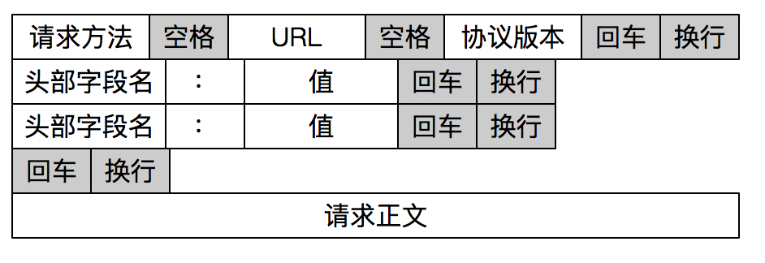
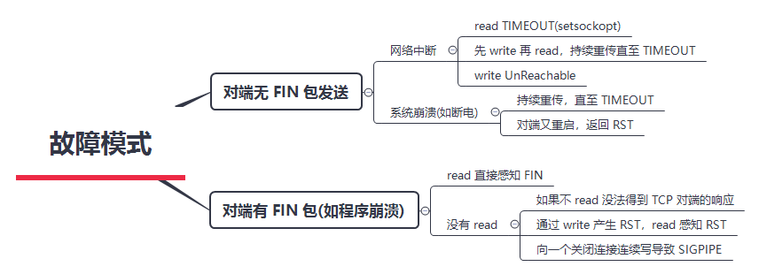

# 流式套接字编程模型

## API 调用流程


## 建立连接流程

TCP 连接建立需要经过三次握手：


服务器端通过 `socket()`，`bind()` 和 `listen()` 完成了被动套接字的准备工作，被动的意思就是等着别人来连接，然后调用 `accept()`，就会阻塞在这里，等待客户端的连接来临。客户端通过调用 `socket()` 和 `connect()` 之后也会阻塞，接下来的事情是由操作系统内核网络协议栈完成的：

- 客户端的协议栈向服务器端发送了SYN包，并告诉服务器端当前发送序列号 j，客户端进入SYNC_SENT 状态
- 服务器端的协议栈收到这个包之后，和客户端进行 ACK 应答，应答的值为 j+1，表示对 SYN 包 j 的确认，同时服务器也发送一个 SYN 包，告诉客户端当前我的发送序列号为 k，服务器端进入 SYNC_RCVD 状态
- 客户端协议栈收到 ACK 之后，使得应用程序从 `connect()` 调用返回，表示客户端到服务器端的单向连接建立成功，客户端的状态为 ESTABLISHED，同时客户端协议栈也会对服务器端的 SYN 包进行应答，应答数据为 k+1
- 应答包到达服务器端后，服务器端协议栈使得 `accept()` 阻塞调用返回，这个时候服务器端到客户端的单向连接也建立成功，服务器端也进入ESTABLISHED状态

## 关闭连接流程

TCP 关闭连接需要经过四次挥手：


- 首先，一方应用程序调用 `close()`，我们称该方为主动关闭方，该端的TCP发送一个 FIN 包，表示需要关闭连接。之后主动关闭方进入 FIN_WAIT_1 状态
- 接着，接收到这个 FIN 包的对端执行被动关闭。这个 FIN 由 TCP 协议栈处理，TCP协议栈为 FIN 包插入一个文件结束符  `EOF` 到接收缓冲区中，应用程序可以通过 `read()` 调用来感知这个 FIN 包。一定要注意，这个 `EOF` 会被放在已排队等候的其他已接收的数据之后，这就意味着接收端应用程序需要处理这种异常情况，因为 `EOF` 表示在该连接上再无额外数据到达。此时，被动关闭方进入 `CLOSE_WAIT` 状态
- 接下来，被动关闭方将读到这个 `EOF`，应用程序也调用 `close()` 关闭它的套接字，这导致它的 TCP 也发送一个 FIN 包。这样，被动关闭方将进入 LAST_ACK 状态
- 最终，主动关闭方接收到对方的 FIN 包，并确认这个 FIN 包。主动关闭方进入 TIME_WAIT 状态，而接收到 ACK 的被动关闭方则进入 CLOSED 状态。再过 2MSL 时间之后，主动关闭方也进入 CLOSED 状态

当套接字被关闭时，TCP 为其所在端发送一个 FIN 包。在大多数情况下，这是由应用进程调用 `close()` 而发生的，值得注意的是，一个进程无论是正常退出（`exit()` 或者 `main()` 返回），还是非正常退出（比如，收到 `SIGKILL` 信号关闭，就是我们常常干的kill -9），所有该进程打开的描述符都会被系统关闭，这也导致 TCP 描述符对应的连接上发出一个 FIN 包。

无论是客户端还是服务器，任何一端都可以发起主动关闭。大多数真实情况是客户端执行主动关闭，但是 HTTP/1.0 却是由服务器发起主动关闭的。

# 流格式

TCP 数据流特性决定了字节流本身是没有边界的。

对于字节流报文格式最重要的是如何确定报文的边界。常见的有两种方法：

- 一种是发送端把要发送的报文长度预先通过报文告知给接收端，例如：


- 另一种是通过一些特殊的字符来进行边界的划分，例如，HTTP 报文：



```
size_t read_line(int fd,char* buffer,size_t length)
{
	char* begin = buffer;
	static char* buffer_poiner;
	int nleft = 0;
	static char read_buffer[512];
	char c;
	
	/// 先对 length 处理
	while(--length > 0){
		if(nleft <= 0){
			int nread = recv(fd,read_buffer,sizeof(read_buffer),0);
			if(nread < 0){
				if(errno == EINTR){
					length++;
					continue;
				}
				return -1;
			}
			
			if(nread == 0)
				return 0;
			
			buffer_poiner = read_buffer;
			nleft = nread;
		}		
		
		c = *buffer_poiner;
		*buffer++ = c;
		nleft--;
		if(c == '\n'){
			*buffer = '\0';
			return buffer - begin;
		}
	}
	
	return -1;
}
```

# 感知连接状态

在很多情况下，连接的一端需要一直感知连接的状态，如果连接无效了，应用程序可能需要报错，或者重新发起连接等，通常的方法有：

- TCP Keep-Alive 选项
- 应用层探活

## TCP Keep-Alive 选项

TCP 有一个保持活跃的机制叫做 Keep-Alive，这个机制的原理是：

定义一个时间段，在这个时间段内，如果没有任何连接相关的活动，TCP 保活机制会开始作用，每隔一个时间间隔，发送一个探测报文，该探测报文包含的数据非常少，如果连续几个探测报文都没有得到响应，则认为当前的 TCP 连接已经死亡，系统内核将错误信息通知给上层应用程序。

上述的可定义变量，分别被称为：

- 保活时间，`net.ipv4.tcp_keepalive_time`，默认值是 7200 秒（2小时）
- 保活时间间隔，`net.ipv4.tcp_keepalive_intvl`，默认值是 75 秒
- 保活探测次数， `net.ipv4.tcp_keepalve_probes`，默认值是 9 次探测

如果开启了TCP保活，需要考虑以下几种情况：

- 对端程序是正常工作的。当 TCP 保活的探测报文发送给对端，对端会正常响应，这样 TCP 保活时间会被重置，等待下一个 TCP 保活时间的到来
- 对端程序崩溃并重启。当 TCP 保活的探测报文发送给对端后，对端是可以响应的，但由于没有该连接的有效信息，会产生一个 RST 报文，这样很快就会发现TCP 连接已经被重置
- 是对端程序崩溃，或对端由于其他原因导致报文不可达。当 TCP 保活的探测报文发送给对端后，石沉大海，没有响应，连续几次，达到保活探测次数后，TCP 会报告该 TCP 连接已经死亡

TCP 保活机制默认是关闭的，当我们选择打开时，可以分别在连接的两个方向上开启，也可以单独在一个方向上开启。如果开启服务器端到客户端的检测，就可以在客户端非正常断连的情况下清除在服务器端保留的 "脏数据"；而开启客户端到服务器端的检测，就可以在服务器无响应的情况下，重新发起连接。

如果使用 TCP 自身的 keep-Alive 机制，在 Linux 系统中，最少需要经过 2 小时 11 分 15 秒：2小时加上75秒乘以9的总和。实际上，对很多对时延要求敏感的系统中，这个时间间隔是不可接受的。

## 应用层探活

我们可以设计一个 PING-PONG 的机制，需要保活的一方，比如客户端，在保活时间达到后，发起对连接的 PING 操作，如果服务器端对 PING 操作有回应，则重新设置保活时间，否则对探测次数进行计数，如果最终探测次数达到了保活探测次数预先设置的值之后，则认为连接已经无效。

这里有两个比较关键的点：

- 需要使用定时器，这可以通过使用 I/O 复用自身的机制来实现
- 需要设计一个 PING-PONG 的协议



# TCP 的可靠性

发送端通过调用 `send()` 函数之后，数据流并没有马上通过网络传输出去，而是存储在套接字的发送缓冲区中，由网络协议栈决定何时发送、如何发送。当对应的数据发送给接收端，接收端回应 ACK，存储在发送缓冲区的这部分数据就可以删除了，但是，发送端并无法获取对应数据流的 ACK 情况，也就是说，发送端没有办法判断对端的接收方是否已经接收发送的数据流，如果需要知道这部分信息，就必须在应用层自己添加处理逻辑，例如，显式的报文确认机制。

从接收端来说，也没有办法保证 ACK 过的数据部分可以被应用程序处理，因为数据需要接收端程序从接收缓冲区中拷贝，可能出现的状况是，已经 ACK 的数据保存在接收端缓冲区中，但是接收端处理程序突然崩溃了，这部分数据就没有办法被应用程序继续处理。

故障分为两大类：

- 一类是对端无 FIN 包，需要通过巡检或超时来发现
- 另一类是对端有 FIN 包发出，需要通过增强 `read()` 或 `write()` 操作的异常处理，发现此类异常

## 对端无 FIN 包发送

### 网络中断造成的对端无  FIN 包

在这种情况下，TCP 程序并不能及时感知到异常信息。除非网络中的其他设备，如路由器发出一条 ICMP 报文，说明目的网络或主机不可达，这个时候通过 `read()` 或 `write()` 调用就会返回 Unreachable 的错误。可惜大多数时候并不是如此，在没有 ICMP 报文的情况下，TCP 程序并不能立即感应到连接异常。如果程序是阻塞在 `read()` 调用上，程序无法从异常中恢复。这显然是非常不合理的，不过，我们可以通过给 `read()` 操作设置超时来解决。

如果程序先调用了 `write()` 操作发送了一段数据流，接下来阻塞在 `read()` 调用上，结果会非常不同。Linux 系统的 TCP 协议栈会不断尝试将发送缓冲区的数据发送出去，大概在重传12次、合计时间约为 9 分钟之后，协议栈会标识该连接异常，这时，阻塞的 `read()` 调用会返回一条 TIMEOUT 的错误信息。如果此时程序还执着地往这条连接写数据，写操作会立即失败，返回一个 `SIGPIPE` 信号给应用程序。

### 系统崩溃造成的对端无 FIN 包

当系统突然崩溃，如断电时，网络连接上来不及发出任何东西。这里和通过系统调用杀死应用程序非常不同的是，没有任何 FIN 包被发送出来。这种情况和网络中断造成的结果非常类似，在没有 ICMP 报文的情况下，TCP 程序只能通过 `read()` 和 `write()` 调用得到网络连接异常的信息，超时错误是一个常见的结果。

不过还有一种情况需要考虑，那就是系统在崩溃之后又重启，当重传的 TCP 分组到达重启后的系统，由于系统中没有该 TCP 分组对应的连接数据，系统会返回一个 RST 重置分节，TCP 程序通过 `read()` 或 `write()` 调用可以分别对 RST 进行错误处理：

- 如果是阻塞的 `read()` 调用，会立即返回一个错误，错误信息为连接重置（Connection Reset）
- 如果是一次 `write()` 操作，也会立即失败，应用程序会被返回一个 `SIGPIPE` 信号

## 对端有 FIN 包发出

对端如果有 FIN 包发出，可能的场景是对端调用了 `close()` 或 `shutdown()` 显式地关闭了连接，也可能是对端应用程序崩溃，操作系统内核代为清理所发出的。从应用程序角度上看，无法区分是哪种情形。

阻塞的 `read()` 操作在完成正常接收的数据读取之后，FIN 包会通过返回一个 `EOF` 来完成通知，此时，`read()` 调用返回值为0。这里强调一点，收到 FIN 包之后`read()` 操作不会立即返回。可以这样理解，收到 FIN 包相当于往接收缓冲区里放置了一个 `EOF` 符号，之前已经在接收缓冲区的有效数据不会受到影响。

# 传输小数据包

调用数据发送接口以后并不意味着数据被真正发送到网络上，其实，这些数据只是从应用程序中被拷贝到了系统内核的套接字缓冲区中，或者说是发送缓冲区中，等待协议栈的处理。至于这些数据是什么时候被发送出去的，对应用程序来说，是无法预知的。对这件事情真正负责的，是运行于操作系统内核的 TCP 协议栈实现模块。

发送窗口和接收窗口是 TCP 连接的双方，一个作为生产者，一个作为消费者，为了达到一致协同的生产-消费速率、而产生的算法模型实现。

## 拥塞控制和数据传输

TCP的生产者-消费者模型，只是在考虑单个连接的数据传递，但是， TCP数据包是需要经过网卡、交换机、核心路由器等一系列的网络设备的，网络设备本身的能力也是有限的，当多个连接的数据包同时在网络上传送时，势必会发生带宽争抢、数据丢失等，这样，TCP 就必须考虑多个连接共享在有限的带宽上，兼顾效率和公平性的控制，这就是拥塞控制的本质。在TCP协议中，拥塞控制是通过拥塞窗口来完成的，拥塞窗口的大小会随着网络状况实时调整。拥塞控制常用的算法：

- “慢启动”，它通过一定的规则，慢慢地将网络发送数据的速率增加到一个阈值，超过这个阈值之后，慢启动就结束了
- 此后，"拥塞避免" 算法登场。在这个阶段，TCP会不断地探测网络状况，并随之不断调整拥塞窗口的大小

在任何一个时刻，TCP 发送缓冲区的数据是否能真正发送出去，至少取决于两个因素，一个是当前的发送窗口大小，另一个是拥塞窗口大小，而 TCP 协议中总是取两者中最小值作为判断依据。比如当前想要发送的字节为 100，发送窗口的大小是 200，拥塞窗口的大小是 80，那么取 200 和 80 中的最小值，就是80，当前发送的字节数显然是大于拥塞窗口的，结论就是不能发送出去。

发送窗口反应了作为单 TCP 连接、点对点之间的流量控制模型，它是需要和接收端一起共同协调来调整大小的；而拥塞窗口则是反应了作为多个 TCP 连接共享带宽的拥塞控制模型，它是发送端独立地根据网络状况来动态调整的。

## 延时 ACK

延时 ACK 在收到数据后并不马上回复，而是累计需要发送的 ACK 报文，等到有数据需要发送给对端时，将累计的 ACK 捎带一并发送出去。当然，延时 ACK 机制，不能无限地延时下去，否则发送端误认为数据包没有发送成功，引起重传，反而会占用额外的网络带宽。

## Nagle 算法

Nagle 算法的本质其实就是限制大批量的小数据包同时发送，为此，它提出在任何一个时刻，未被确认的小数据包不能超过一个。这里的小数据包，指的是长度小于最大报文段长度 MSS 的 TCP 分组。这样，发送端就可以把接下来连续的几个小数据包存储起来，等待接收到前一个小数据包的 ACK 分组之后，再将数据一次性发送出去。

关闭 Nagle 算法：

```
int on = 1; 
setsockopt(sock, IPPROTO_TCP, TCP_NODELAY, (void *)&on, sizeof(on)); 
```

除非我们对此有十足的把握，否则不要轻易改变默认的 TCP Nagle 算法。因为在现代操作系统中，针对 Nagle 算法和延时 ACK 的优化已经非常成熟了，有可能在禁用 Nagle 算法之后，性能问题反而更加严重。


