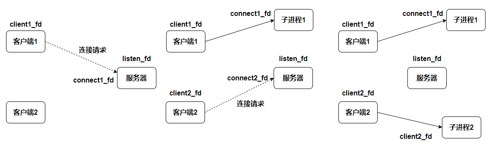
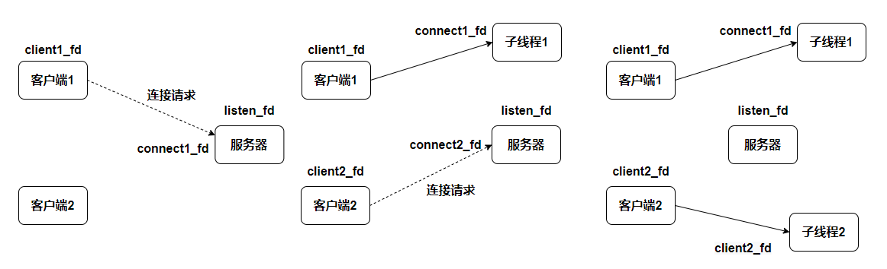
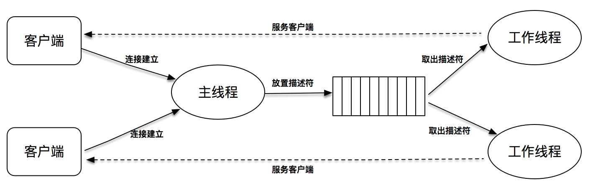

# 阻塞 I/O 和进程模型

使用阻塞 I/O 和进程模型，为每一个连接创建一个独立的子进程来进行服务，是一个非常简单有效的实现方式，这种方式可能很难足高性能程序的需求，但好处在于实现简单。在实现这样的程序时，我们需要注意两点：

- 要注意对套接字的关闭梳理
  - 在子进程中，使用连接套接字和客户端通信，因此子进程不需要关心监听套接字，只需要关心连接套接字
  - 父进程则相反，将客户服务交给子进程来处理，因此父进程不需要关心连接套接字，只需要关心监听套接字
- 要注意对子进程进行回收，避免产生不必要的僵尸进程

# 阻塞 I/O 和线程模型

# 阻塞 I/O 和线程池模型

