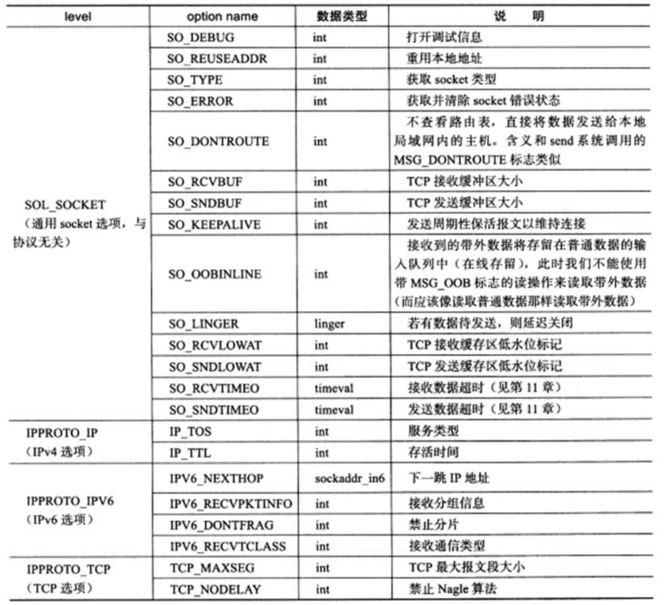

# 套接字选项

```
#include <sys/socket.h>

int getsockopt(int sockfd,int level,int option_name,void* option_value,socklen_t* restrict option_len);
int setsockopt(int sockfd,int level,int option_name,const void* option_value,socklen_t option_len);
```

- `level`： 指定要操作哪个协议的选项，比如 IPv4，IPv6，TCP 等
- `option_name` ：指定选项的名字，`option_value`：指定操作选项的值，`option_len`：选项的长度
- 成功返回 0，失败时返回 -1，并设置 `errno`



对于客户端，socket 选项应该在调用 `connect()` 函数之前设置，因为 `connet()` 返回，TCP 三次握手已经完成。

对于服务器，有部分 socket 选项只有在调用 `listen()` 之前针对 socket 的设置才有效，这是因为连接 socket 只能由 `accept()` 调用返回，而 `accept()` 从队列中接受连接至少已经完成了  TCP 三次握手中的前两个步骤。但是有的 socket 选项应该在 TCP 同步报文段中设置，比如 TCP 最大报文段选项，此类问题的解决方法是对监听的 socket 设置这些选项，那么 `accept()` 返回的连接 socket 将继承这些选项：`SO_DEBUG`，`SO_DONTROUTE`，`SO_KEEPALIVE`，`SO_LINGER`，`SO_OOBINLINE`，`SO_RCVBUF`，`SO_RCVLOWAT`，`SO_SNDBUF`，`SO_SNDLOWAT`，`TCP_MAXSEG`，`TCP_NODELAY`。

#　SO_REUSEADDR 选项

`SO_REUSEADDR` 选项的作用是强制处于 TIME_WAIT 状态的连接占用 socket 地址。

也可以修改内核参数 `/proc/sys/net/ipv4/tcp_tw_recycle` 来快速回收关闭的 socket，从而使得  TCP 连接不进入 TIME_WAIT 状态。这是比较安全的设置，使用这个选项，还有一个前提，需要打开对TCP时间戳的支持，即 `net.ipv4.tcp_timestamps=1`（默认即为1）。另外这种方法只适用于连接发起方（C/S模型中的客户端）。

一个 TCP 连接是通过四元组（源地址、源端口、目的地址、目的端口）来唯一确定的，极小的概率下，新连接和旧连接的四元组相同，在现代 Linux 操作系统下，也不会有什么大的问题，原因是现代Linux操作系统对此进行了一些优化：

- 第一种优化是新连接 SYN 告知的初始序列号，一定比 TIME_WAIT 老连接的末序列号大，这样通过序列号就可以区别出新老连接
- 第二种优化是开启了 tcp_timestamps，使得新连接的时间戳比老连接的时间戳大，这样通过时间戳也可以区别出新老连接

在这样的优化之下，一个 TIME_WAIT 的 TCP 连接可以忽略掉旧连接，重新被新的连接所使用。这就是重用套接字选项，通过给套接字配置可重用属性，告诉操作系统内核，这样的 TCP 连接完全可以复用 TIME_WAIT 状态的连接：

```
int sock_fd = socket(AF_INET,SOCK_STREAM,0);
assert(sock_fd >= 0);
int reuse = 1;
setsockopt(sock_fd,SOL_SOCKET,SO_REUSEADDR,&reuse,sizeof(reuse));
```

`SO_REUSEADDR` 套接字选项，允许启动绑定在一个端口，即使之前存在一个和该端口一样的连接。

`SO_REUSEADDR` 套接字选项还有一个作用，那就是本机服务器如果有多个地址，可以在不同地址上使用相同的端口提供服务：一台服务器有 `192.168.1.101` 和`10.10.2.102` 两个地址，我们可以在这台机器上启动三个不同的 HTTP 服务：

- 第一个以本地通配地址 ANY 和端口 80 启动
- 第二个以 `192.168.101` 和端口 80 启动
- 第三个以 `10.10.2.102` 和端口 80 启动

服务器端程序，都应该设置 `SO_REUSEADDR` 套接字选项，以便服务端程序可以在极短时间内复用同一个端口启动。

`tcp_tw_reuse` 和 `SO_REUSEADDR`：

- `tcp_tw_reuse` 是内核选项，主要用在连接的发起方。TIME_WAIT 状态的连接创建时间超过1秒后，新的连接才可以被复用，注意，这里是连接的发起方
- `SO_REUSEADDR` 是用户态的选项，`SO_REUSEADDR` 选项用来告诉操作系统内核，如果端口已被占用，但是 TCP 连接状态位于 TIME_WAIT ，可以重用端口。如果端口忙，而TCP处于其他状态，重用端口时依旧得到 "Address already in use" 的错误信息。注意，这里一般都是连接的服务方

# SO_RCVBUF 和 SO_SNDBUF 选项

`SO_RCVBUF` 和 `SO_SNDBUF` 选项分别表示 TCP 接收缓冲区和发送缓冲区的大小，当使用 `setsockopt()` 来设置接收缓冲区和发送缓冲区的大小时，系统都会将其值加倍，并且不得不小于某个最小值，TCP 接收缓冲区的最小值是 256 字节，发送缓冲区的最小字节是  2048 字节(不过，不同的系统可能有不同的默认最小值)。系统这样做的主要目的是确保一个 TCP 连接拥有足够的空闲缓冲区来处理拥塞(比如快速重传算法就期望 TCP 接收缓冲区能至少容纳 4 个大小为 SMSS 的 TCP 报文段)。

也可以修改 `/proc/sys/net/ipv4/tcp_rmem` 和 `/proc/sys/net/ipv4/tcp_wmem` 强制 TCP 接收缓冲区和发送缓冲区的大小没有最小值限制。

# SO_RCVLOWAT 和 SO_SNDLOWAT 选项

`SO_RCVLOWAT` 和 `SO_SNDLOWAT` 选项分别表示 TCP 接收缓冲区和发送缓冲区的低水平标记，一般被 I/O 复用系统调用用来判断 socket 是否可读或可写：

- 当 TCP 接收缓冲区中可读数据的总数大于其低水位标记时，I/O 复用系统调用将通知应用程序可以从对应的 socket 上读取数据
- 当 TCP 发送缓冲区中的空闲时间大于其低水位标记时，I/O 复用系统调用将通知应用程序可以往对应的 socket 上写入数据

默认情况下，TCP 接收缓冲区和发送缓冲区的低水位标记默认都是 1 字节。

# SO_LINGER 选项

`SO_LINGER` 选项控制 `close()` 系统调用在关闭 TCP 连接时的行为，默认情况下，当我们使用 `close()` 系统调用来关闭一个 socket 时，`close()` 将立即返回，TCP 模块负责该 socket 对应的 TCP 发送缓冲区中残留的数据发送给对方。

`struct linger` ：

```
#include <sys/socket.h>

struct linger
{
	int l_onoff;  //@ 开启(非0)还是关闭(0)该选项
	int l_linger; //@ 滞留时间
};
```

`close()` 系统调用可能产生的三种行为：

- `l_onoff` 等于0，`SO_LINGER` 选项不起作用，`close()` 用默认行为来关闭 socket
- `l_onoff` 不等于0，`linger` 等于0，`close()` 系统调用立即返回，TCP 模块将丢弃关闭的 socket 对应的 TCP 发送缓冲区中残留的数据，同时给对方发送一个复位报文段，这种情况给服务器提供了异常终止一个连接的方法
- `l_onoff` 不等于0，`linger` 大于0，此时 `close()` 的行为取决于两个条件：
  - 被关闭的 socket 对应的 TCP 发送缓冲区中是否有残留的数据
  - 该 socket 是阻塞的还是非阻塞的：
    - 阻塞 socket：`close()` 将等待一段长为 `l_linger` 的时间，直到 TCP 模块发送完所有残留的数据并得到对方的确认，如果这段时间内  TCP 模块没有发送完残留的数据并得到对方确认，那么 `close()` 将返回 -1，`errno` 设置为 `EWOULDBLACK`
    - 非阻塞 socket：`close()` 将立即返回，根据返回值和 `errno` 来判断残留数据是否已经发送完毕

# 在 `accept()` 中继承标记和选项

在 Linux 上，如下属性是不会被 `accept()` 返回的新的文件描述符所继承：

- 同打开的文件描述符相关的状态标记，即可以通过 `fcntl()`  的 `F_SETFL` 操作所修改的标记，例如 `O_NONBLOCK` 和 `O_ASYNC`
- 文件描述符标记，可以通过 `fcntl()`  的 `F_SETFD` 操作所修改的标记，唯一的一个标记就是 `FD_CLOEXEC`
- 与信号驱动 IO 相关联的文件描述符属性，如 `fcntl()` 的 `F_SETOWN`（属主进程 ID）以及 `F_SETSIG`(生成信号)操作

也就是说 `accept()` 返回的新套接字继承了大部分套接字选项。
