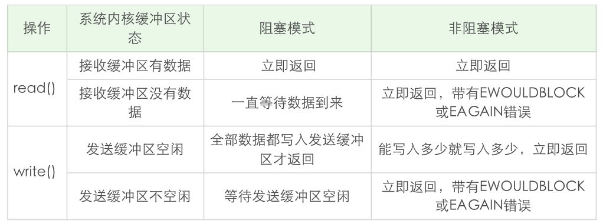

# 阻塞 VS 非阻塞

当应用程序调用阻塞 I/O 完成某个操作时，应用程序会被挂起，等待内核完成操作，感觉上应用程序像是被 “阻塞” 了一样。实际上内核所做的事情是将 CPU 时间切换给其他有需要的进程，网络应用程序在这种情况下就会得不到 CPU 时间做该做的事情。

非阻塞 I/O 则不然，当应用程序调用非阻塞 I/O 完成某个操作时，内核立即返回，不会把 CPU 时间切换给其他进程，应用程序在返回后，可以得到足够的 CPU 时间继续完成其他事情。

按照使用场景，非阻塞I/O可以被用到读操作、写操作、接收连接操作和发起连接操作上。

# 非阻塞 IO

## 读操作

如果套接字对应的接收缓冲区没有数据可读，在非阻塞情况下 `read()` 调用会立即返回，一般返回 `EWOULDBLOCK` 或 `EAGAIN` 出错信息。在这种情况下，出错信息是需要小心处理，比如后面再次调用 `read()` 操作，而不是直接作为错误直接返回。

## 写操作

在阻塞 IO 情况下，`write()` 函数返回的字节数，和输入的参数总是一样的。在非阻塞 IO 的情况下，如果套接字的发送缓冲区已达到了极限，不能容纳更多的字节，那么操作系统内核会尽最大可能从应用程序拷贝数据到发送缓冲区中，并立即从 `write()` 等函数调用中返回。可想而知，在拷贝动作发生的瞬间，有可能一个字符也没拷贝，有可能所有请求字符都被拷贝完成，那么这个时候就需要返回一个数值，告诉应用程序到底有多少数据被成功拷贝到了发送缓冲区中，应用程序需要再次调用 `write()` 函数，以输出未完成拷贝的字节。

`write()` 等函数是可以同时作用到阻塞 IO 和非阻塞 IO 上的，为了复用一个函数，处理非阻塞和阻塞 IO 多种情况，设计出了写入返回值，并用这个返回值表示实际写入的数据大小。

也就是说，非阻塞 IO 和阻塞 IO 处理的方式是不一样的：

- 非阻塞 IO 需要这样：拷贝→返回→再拷贝→再返回
- 阻塞 IO 需要这样：拷贝→直到所有数据拷贝至发送缓冲区完成→返回

不过在实战中，可以不用区别阻塞和非阻塞 IO，使用循环的方式来写入数据就好了。只不过在阻塞 IO 的情况下，循环只执行一次就结束了。

```
ssize_t writen(int fd,const void* data,size_t b)
{
	size_t nleft;
	ssize_t nwritten;
	const char* ptr;
	
	ptr = data;
	nleft = n;
	
	while(nleft > 0){
		if((nwritten = write(fd,ptr,nleft)) <= 0){
			//@ 这里EINTR是非阻塞non-blocking情况下，通知我们再次调用write() 
			if(nwritten < 0 && errno == EINTR)
				nwritten = 0;
			else
				return -1; //@ 出错退出
		}
		
		nleft -= nwritten;
		ptr += nwritten;		
	}
	return n;
}
```

## 读写小结



- `read()` 
  - 总是在接收缓冲区有数据时就立即返回，不是等到应用程序给定的数据充满才返回
  - 当接收缓冲区为空时，阻塞模式会等待，非阻塞模式立即返回 -1，并有 `EWOULDBLOCK` 或 `EAGAIN` 错误
- `write()` 
  - 阻塞模式下，只有在发送缓冲区足以容纳应用程序的输出字节时才返回
  - 非阻塞模式下，则是能写入多少就写入多少，并返回实际写入的字节数
  - 阻塞模式下的 `write()` 有个特例，就是对方主动关闭了套接字，这个时候 `write()` 调用会立即返回，并通过返回值告诉应用程序实际写入的字节数，如果再次对这样的套接字进行 `write()` 操作，就会返回失败。失败是通过返回值 -1 来通知到应用程序的

## accept()

当 `accept()` 和 IO 多路复用 `select()`、`poll()` 等一起配合使用时，如果在监听套接字上触发事件，说明有连接建立完成，此时调用 `accept()` 肯定可以返回已连接套接字。

构建一个客户端程序，设置 `SO_LINGER` 套接字选项，把 `l_onoff` 标志设置为1，把 `l_linger` 时间设置为0。这样，连接被关闭时，TCP 套接字上将会发送一个 RST：

```
struct linger ling;
ling.l_onoff = 1; 
ling.l_linger = 0;
setsockopt(socket_fd, SOL_SOCKET, SO_LINGER, &ling, sizeof(ling));
close(socket_fd);
```

服务器端使用 `select()`  IO多路复用，不过，监听套接字仍然是 `blocking` 的。如果监听套接字上有事件发生，休眠 5 秒：

```
if (FD_ISSET(listen_fd, &readset)) {
    printf("listening socket readable\n");
    sleep(5);
    struct sockaddr_storage ss;
    socklen_t slen = sizeof(ss);
    int fd = accept(listen_fd, (struct sockaddr *) &ss, &slen);
    }
```

在监听套接字上有可读事件发生时，并没有马上调用 `accept()`。由于客户端发生了 RST 分节，该连接被接收端内核从自己的已完成队列中删除了，此时再调用 `accept()`，由于没有已完成连接（假设没有其他已完成连接），`accept()` 一直阻塞，更为严重的是，该线程再也没有机会对其他 IO 事件进行分发，相当于该服务器无法对新连接和其他 IO 进行服务。

如果我们将监听套接字设为非阻塞，上述的情形就不会再发生。只不过对于 `accept()` 的返回值，需要正确地处理各种看似异常的错误，例如忽略 `EWOULDBLOCK`、`EAGAIN` 等。

这个例子给我们的启发是，一定要将监听套接字设置为非阻塞的。

## connect()

在非阻塞 TCP 套接字上调用 `connect()` 函数，会立即返回一个 `EINPROGRESS` 错误。TCP三次握手会正常进行，应用程序可以继续做其他初始化的事情。当该连接建立成功或者失败时，通过 IO 多路复用 `select()`、`poll()` 等可以进行连接的状态检测。
