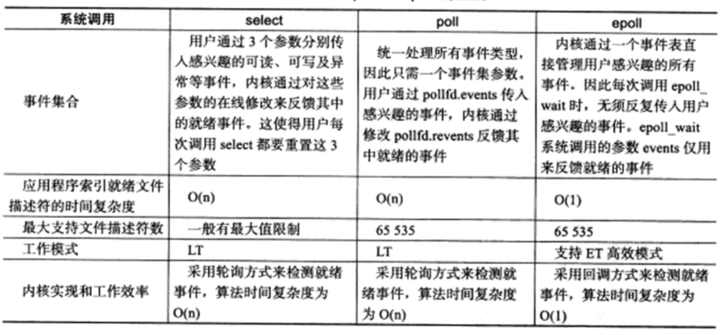

# IO多路复用

多路复用的意思，就是在任何一路 IO 有 "事件" 发生的情况下，内核就会通知应用程序去处理相应的 IO 事件，这样程序就变成了 "多面手"，在同一时刻仿佛可以处理多个 IO 事件。

I/O复用使用于以下场合：

- 当客户处理多个描述符（通常是交互式输入和网络套接字）时，必须使用I/O复用
- 一个客户同时处理多个套接字是可能的，不过比较少见
- 如果一个TCP服务器既要处理监听套接字，又要处理已连接套接字，一般就要使用I/O复用。

4）如果一个服务器既要处理TCP，又要处理UDP，一般就要使用I/O复用。

5） 如果一个服务器要处理多个服务或者多个协议，一般就要使用I/O复用。

# 文件描述符就绪条件

## 套接字可读

- 套接字接收缓冲区有数据可以读，如果我们使用 `read()` 函数去执行读操作，肯定不会被阻塞，而是会直接读到这部分数据
- 对方发送了 FIN，使用 `read()` 函数执行读操作，不会被阻塞，直接返回 0
- 针对一个监听套接字而言的，有已经完成的连接建立，此时使用 `accept()` 函数去执行不会阻塞，直接返回已经完成的连接
- 套接字有错误待处理，使用 `read()` 函数去执行读操作，不阻塞，且返回 -1

## 套接字可写

- 套接字发送缓冲区足够大，如果我们使用非阻塞套接字进行 `write()` 操作，将不会被阻塞，直接返回
- 连接的写半边已经关闭，如果继续进行写操作将会产生 `SIGPIPE` 信号
- 套接字上有错误待处理，使用 `write()` 函数去执行读操作，不阻塞，且返回 -1

# select()

```
#include <sys/select.h>

int select(int nfds,fd_set* readfds,fd_set* writefds,fd_set* exceptfds,struct timeval* timeout);
```

- `nfds`：指定被监听的文件描述符的总数，通常被设置为 `select()` 监听的所有文件描述符的最大值加1，因为文件描述符都是从 0 开始计数的
- `readfds`：可读事件对应的文件描述符集合
- `writefds`：可写事件对应的文件描述符集合
- `exceptfds`：异常事件的文件描述符集合
- `time_out`：用来设置超时时间，不能够完全信任 `select()`  调用返回的 `timeout` 值，比如调用失败时 `timeout` 的值是不确定的

```
struct timeval
{
	long tv_sec; //@ 秒数
	long tv_usec; //@ 微秒数
};
```

- `struct timeval`
  - 如果 `tv_sec` 和 `tv_usec` 都设置成0，则 `select()` 将立即返回
  - 如果给 `timeout` 传递 `NULL`，则 `select()` 将一直堵塞，直到某个文件描述符就绪

- `fd_set`：是一个仅包含一个整型数组，该数组的每个元素的每一位标记一个文件描述符。`fd_set` 能够容纳的文件描述符数量由  `FD_SETSIZE` 指定。这就限制了 `select()` 能同时处理的文件描述符的总量，在 Linux 系统中，`select()` 的默认最大值为 1024
- 设置文件描述符的方法：

```
#include <sys/time.h>
#include <sys/types.h>
#include <unistd.h>

void FD_ZERO(fd_set *set);
void FD_SET(int fd, fd_set *set);
void FD_CLR(int fd, fd_set *set);
int  FD_ISSET(int fd, fd_set *set);
```

- `FD_ZERO` 用来将这个向量的所有元素都设置成 0
- `FD_SET` 用来把对应套接字 `fd` 的元素，`a[fd]` 设置成 1
- `FD_CLR` 用来把对应套接字 `fd` 的元素，`a[fd]` 设置成 0
- `FD_ISSET` 对这个向量进行检测，判断出对应套接字的元素 `a[fd]` 是 0 还是1

# poll()

```
#include <poll.h>

int poll(struct pollfd *fds, nfds_t nfds, int timeout);
```

- `pollfd` 的结构如下：

```
struct pollfd 
{
	int fd;		//@ 文件描述符
	short events; //@ 注册的事件
	short revents;   //@ 实际发生的事件，由内核填充
};
```

- 参数 `nfds` 描述的是数组 `fds` 的大小，简单说，就是向 `poll()` 申请的事件检测的个数
- 参数 `timeout`，指定 poll 的超时值，单位是毫秒：
  - 如果是一个 `<0` 的数，表示在有事件发生之前永远等待
  - 如果是 0，表示不阻塞进程，立即返回
  - 如果是一个 `>0` 的数，表示 `poll()` 调用方等待指定的毫秒数后返回
- 当有错误发生时，`poll()` 函数的返回值为 -1；如果在指定的时间到达之前没有任何事件发生，则返回 0，否则就返回检测到的事件个数，也就是 "returned events" 中非 0 的描述符个数
- 和 `select()` 非常不同的地方在于，`poll()` 每次检测之后的结果不会修改原来的传入值，而是将结果保留在 `revents` 字段中，这样就不需要每次检测完都得重置待检测的描述字和感兴趣的事件。我们可以把 `revents` 理解成 "returned events"

`events` 和 `revents`：


如果我们不想对某个 `pollfd` 结构进行事件检测，可以把它对应的 `pollfd` 结构的 `fd` 成员设置成一个负值。这样，`poll()` 函数将忽略这样的 `events` 事件，检测完成以后，所对应的 "returned events" 的成员值也将设置为 0。

在 `select()` 里面，文件描述符的个数已经随着 `fd_set` 的实现而固定，没有办法对此进行配置；而在 `poll()` 函数里，我们可以控制 `pollfd` 结构的数组大小，这意味着我们可以突破原来 `select()` 函数最大描述符的限制，在这种情况下，应用程序调用者需要分配 `pollfd` 数组并通知 `poll` 函数该数组的大小。

# epoll()

使用 `epoll()` 进行网络程序的编写，需要三个步骤，分别是 `epoll_create()`，`epoll_ctl()` 和 `epoll_wait()`。

## epoll_create()

```
#include <sys/epoll.h>

int epoll_create(int size);
int epoll_create1(int flags);
```

- `epoll_create()` 方法创建了一个 epoll 实例，这个 epoll 实例被用来调用 `epoll_ctl()` 和 `epoll_wait()` ，如果这个 epoll 实例不再需要，比如服务器正常关机，需要调用 `close()` 方法释放 epoll 实例，这样系统内核可以回收 epoll 实例所分配使用的内核资源
- `size` 在一开始的 `epoll_create()` 实现中，是用来告知内核期望监控的文件描述字大小，然后内核使用这部分的信息来初始化内核数据结构，在新的实现中，这个参数不再被需要，因为内核可以动态分配需要的内核数据结构。我们只需要注意，每次将 `size` 设置成一个大于 0 的整数就可以了
- `epoll_create1()` 的用法和 `epoll_create()` 基本一致，如果 `epoll_create1()` 的输入 `flags` 为 0，则和 `epoll_create()` 一样，内核自动忽略。可以增加如 `EPOLL_CLOEXEC` 的额外选项

## epoll_ctl()

```
#include <sys/epoll.h>

int epoll_ctl(int epfd, int op, int fd, struct epoll_event *event);
```

- `epoll_ctl()` 往这个 epoll 实例增加或删除监控的事件
- `epfd` 是刚刚调用 `epoll_create()` 创建的 epoll 实例描述字，可以简单理解成是 epoll 句柄
- `op` 表示操作选项，可以选择为：
  - `EPOLL_CTL_ADD`： 向 epoll 实例注册文件描述符对应的事件
  - `EPOLL_CTL_DEL`：向 epoll 实例删除文件描述符对应的事件
  - `EPOLL_CTL_MOD`： 修改文件描述符对应的事件
- `fd` 是注册的事件的文件描述符，比如一个监听套接字
- `event` 表示的是注册的事件类型，并且可以在这个结构体里设置用户需要的数据，其中最为常见的是使用联合结构里的 `fd` 字段，表示事件所对应的文件描述符：

```
typedef union epoll_data
{
	void* ptr;		//@ 用来指定与 fd 相关的用户数据。
	int fd;			//@ 指定事件所从属的目标文件描述符。
	uint32_t u32;	//@
	uint64_t u64;	//@
}epoll_data_t;

struct epoll_event 
{
	__uint32_t events;  //@ epoll 事件
	epoll_data_t data;	//@ 用户数据
};
```

- 事件类型：
  - `EPOLLIN`：表示对应的文件描述字可以读
  - `EPOLLOUT`：表示对应的文件描述字可以写
  - `EPOLLRDHUP`：表示套接字的一端已经关闭，或者半关闭
  - `EPOLLHUP`：表示对应的文件描述字被挂起
  - `EPOLLET`：设置为 edge-triggered，默认为 level-triggered
- 成功返回 0，若返回 -1 表示出错

## epoll_wait()

```
#include <sys/epoll.h>

int epoll_wait(int epfd, struct epoll_event *events,int maxevents, int timeout);
```

- `epoll_wait()` 函数类似之前的 `poll()` 和 `select()` 函数，调用者进程被挂起，在等待内核 IO 事件的分发
- `epfd` 是 epoll 实例描述字，也就是 epoll 句柄
- `events` 返回给用户空间需要处理的 IO 事件，这是一个数组，数组的大小由 `epoll_wait()` 的返回值决定，这个数组的每个元素都是一个需要待处理的 I/O 事件，其中 events 表示具体的事件类型，事件类型取值和 `epoll_ctl()` 可设置的值一样，这个 `epoll_event` 结构体里的 `data` 值就是在 `epoll_ctl()` 那里设置的 `data`，也就是用户空间和内核空间调用时需要的数据
- `maxevents` 是一个大于 0 的整数，表示 `epoll_wait()` 可以返回的最大事件值
- `timeout` 是 `epoll_wait()` 阻塞调用的超时值，如果这个值设置为 -1，表示不超时；如果设置为 0 则立即返回，即使没有任何 IO 事件发生

# IO 复用函数比较



- `select()` 和 `poll()` 都是采用事件的传入传出机制，`epoll()` 则无需反复传入感兴趣事件
- 应用程序索引就绪文件描述符的时间复杂度 `select()` 和 `poll()` 都是 `O(n)`，`epoll()` 是 `O(1)`
- `select()` 最大文件描述符的上限一般有限制，`poll()` 和 `epoll()` 上限是 65535
- `select()` 和 `poll()` 只能工作在 LT 模式，`epoll()` 可以工作在 ET 模式
- 内核实现方面：`select()` 和 `poll()` 都是采用轮询方式检测就绪时间，时间复杂度是 `O(n)`，`epoll()` 采用回调方式，时间复杂度是 `O(1)`

