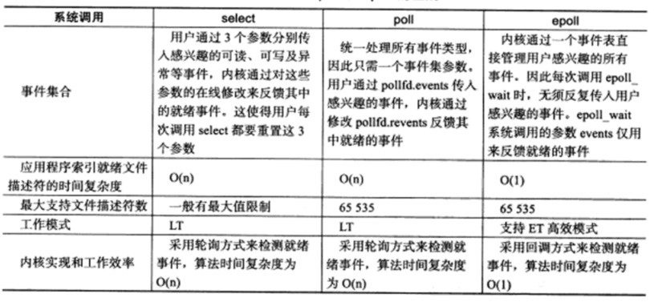

# IO多路复用

多路复用的意思，就是在任何一路 IO 有 "事件" 发生的情况下，内核就会通知应用程序去处理相应的 IO 事件，这样程序就变成了 "多面手"，在同一时刻仿佛可以处理多个 IO 事件。

I/O复用使用于以下场合：

- 当客户处理多个描述符（通常是交互式输入和网络套接字）时，必须使 用I/O 复用
- 一个客户同时处理多个套接字是可能的，不过比较少见，此时一般需要使用 I/O 复用
- 如果一个TCP服务器既要处理监听套接字，又要处理已连接套接字，一般就要使用 I/O 复用
- 如果一个服务器既要处理 TCP，又要处理 UDP，一般就要使用 I/O 复用
- 如果一个服务器要处理多个服务或者多个协议，一般就要使用 I/O 复用

# 文件描述符就绪条件

## 套接字可读

- 该套接字接收缓冲区中的数据字节数大于等于套接字接收缓冲区低水位标记的当前大小。对这样的套接字执行读操作不会阻塞并将返回一个大于 0 的值（也就是返回准备好读入的数据，即进程可以从缓冲区中读取数据）
- 该连接的读半部关闭（也就是接收了 FIN 的 TCP 连接）。对这样的套接字的读操作将不阻塞并返回0（因为这时候服务器执行 `close()` 套接字需要一段时间，而这段时间内，客户端可继续从服务器读取数据，只是读取的是 `EOF` 而已）
- 该套接字是一个监听套接字且已完成的连接数不为0。（这样服务端才能执行 `accept()` 函数，读取客户端发送过来的数据）
- 其上有一个套接字错误待处理。对这样的套接字的读操作将不阻塞并返回 -1，同时把 `errno` 设置成确切的错误条件

## 套接字可写

- 该套接字发送缓冲区中的可用空间字节数大于等于套接字发送缓冲区低水位标记的当前大小，并且或者该套接字已连接，或者该套接字不需要连接
- 该连接的写半关闭。对这样的套接字的写操作将产生 `SIGPIPE` 信号。（就是如果服务器不启动，而客户端启动向服务器发送数据，则服务端向客户端发送`RST`，并且向客户端写入数据（相当于客户端读取数据），则产生 `SIGPIPE` 信号，进程强行终止）
- 使用非阻塞式 `connect()` 的套接字已建立连接，或者 `connect()` 已经以失败告终
- 其上有一个套接字错误待处理

注意：

- 当某个套接字上发生错误时，它将 `select()` 标记为即可读又可写
- 接收低水位标记和发送低水位标记的目的在于：允许应用进程控制在 `select()` 返回可读或可写条件之前有多少数据可读或有多大空间可用于写。举例来说，如果我们知道除非至少存在64个字节的数据，否则我们的应用进程没有任何有效工作可做，那么可以把接收低水位标记设置为64，以防少于64个字节的数据准备好读时 `select()` 唤醒我们

# select()

```
#include <sys/select.h>

int select(int nfds,fd_set* readfds,fd_set* writefds,fd_set* exceptfds,struct timeval* timeout);
```

- `nfds`：指定被监听的文件描述符的总数，通常被设置为 `select()` 监听的所有文件描述符的最大值加1，因为文件描述符都是从 0 开始计数的
- `readfds`：可读事件对应的文件描述符集合
- `writefds`：可写事件对应的文件描述符集合
- `exceptfds`：异常事件的文件描述符集合
- `time_out`：用来设置超时时间，不能够完全信任 `select()`  调用返回的 `timeout` 值，比如调用失败时 `timeout` 的值是不确定的

```
struct timeval
{
	long tv_sec; //@ 秒数
	long tv_usec; //@ 微秒数
};
```

- `struct timeval`
  - 如果 `tv_sec` 和 `tv_usec` 都设置成0，则 `select()` 将立即返回
  - 如果给 `timeout` 传递 `NULL`，则 `select()` 将一直堵塞，直到某个文件描述符就绪

- `fd_set`：是一个仅包含一个整型数组，该数组的每个元素的每一位标记一个文件描述符。`fd_set` 能够容纳的文件描述符数量由  `FD_SETSIZE` 指定。这就限制了 `select()` 能同时处理的文件描述符的总量，在 Linux 系统中，`select()` 的默认最大值为 1024
- 设置文件描述符的方法：

```
#include <sys/time.h>
#include <sys/types.h>
#include <unistd.h>

void FD_ZERO(fd_set *set);
void FD_SET(int fd, fd_set *set);
void FD_CLR(int fd, fd_set *set);
int  FD_ISSET(int fd, fd_set *set);
```

- `FD_ZERO` 用来将这个向量的所有元素都设置成 0
- `FD_SET` 用来把对应套接字 `fd` 的元素，`a[fd]` 设置成 1
- `FD_CLR` 用来把对应套接字 `fd` 的元素，`a[fd]` 设置成 0
- `FD_ISSET` 对这个向量进行检测，判断出对应套接字的元素 `a[fd]` 是 0 还是1

## 小结

- `select()` 能监听的文件描述符个数受限于 `FD_SETSIZE`，一般为1024，单纯改变进程打开的文件描述符个数并不能改变 `select()` 监听文件个数
-  解决 1024 以下客户端时使用 `select()` 是很合适的，但如果连接过多，`select()` 采用的是轮询模型，会大大降低服务器响应效率

# poll()

```
#include <poll.h>

int poll(struct pollfd *fds, nfds_t nfds, int timeout);
```

- `pollfd` 的结构如下：

```
struct pollfd 
{
	int fd;		//@ 文件描述符
	short events; //@ 注册的事件
	short revents;   //@ 实际发生的事件，由内核填充
};
```

- 参数 `nfds` 描述的是数组 `fds` 的大小，简单说，就是向 `poll()` 申请的事件检测的个数
- 参数 `timeout`，指定 poll 的超时值，单位是毫秒：
  - 如果是一个小于的数，表示在有事件发生之前永远等待
  - 如果是 0，表示不阻塞进程，立即返回
  - 如果是一个大于的数，表示 `poll()` 调用方等待指定的毫秒数后返回
- 当有错误发生时，`poll()` 函数的返回值为 -1；如果在指定的时间到达之前没有任何事件发生，则返回 0，否则就返回检测到的事件个数，也就是 "returned events" 中非 0 的描述符个数
- 和 `select()` 非常不同的地方在于，`poll()` 每次检测之后的结果不会修改原来的传入值，而是将结果保留在 `revents` 字段中，这样就不需要每次检测完都得重置待检测的描述字和感兴趣的事件。我们可以把 `revents` 理解成 "returned events"

`events` 和 `revents`：


## 小结

- 如果我们不想对某个 `pollfd` 结构进行事件检测，可以把它对应的 `pollfd` 结构的 `fd` 成员设置成一个负值。这样，`poll()` 函数将忽略这样的 `events` 事件，检测完成以后，所对应的 "returned events" 的成员值也将设置为 0
- 在 `select()` 里面，文件描述符的个数已经随着 `fd_set` 的实现而固定，没有办法对此进行配置；而在 `poll()` 函数里，我们可以控制 `pollfd` 结构的数组大小，这意味着我们可以突破原来 `select()` 函数最大描述符的限制，在这种情况下，应用程序调用者需要分配 `pollfd` 数组并通知 `poll` 函数该数组的大小

# epoll()

## API

使用 `epoll()` 进行网络程序的编写，需要三个步骤，分别是 `epoll_create()`，`epoll_ctl()` 和 `epoll_wait()`。

### epoll_create()

```
#include <sys/epoll.h>

int epoll_create(int size);
int epoll_create1(int flags);
```

- `epoll_create()` 方法创建了一个 epoll 实例，这个 epoll 实例被用来调用 `epoll_ctl()` 和 `epoll_wait()` ，如果这个 epoll 实例不再需要，比如服务器正常关机，需要调用 `close()` 方法释放 epoll 实例，这样系统内核可以回收 epoll 实例所分配使用的内核资源
- `size` 在一开始的 `epoll_create()` 实现中，是用来告知内核期望监控的文件描述字大小，然后内核使用这部分的信息来初始化内核数据结构，在新的实现中，这个参数不再被需要，因为内核可以动态分配需要的内核数据结构。我们只需要注意，每次将 `size` 设置成一个大于 0 的整数就可以了
- `epoll_create1()` 的用法和 `epoll_create()` 基本一致，如果 `epoll_create1()` 的输入 `flags` 为 0，则和 `epoll_create()` 一样，内核自动忽略。可以增加如 `EPOLL_CLOEXEC` 的额外选项

### epoll_ctl()

```
#include <sys/epoll.h>

int epoll_ctl(int epfd, int op, int fd, struct epoll_event *event);
```

- `epoll_ctl()` 往这个 epoll 实例增加或删除监控的事件
- `epfd` 是刚刚调用 `epoll_create()` 创建的 epoll 实例描述字，可以简单理解成是 epoll 句柄
- `op` 表示操作选项，可以选择为：
  - `EPOLL_CTL_ADD`： 向 epoll 实例注册文件描述符对应的事件
  - `EPOLL_CTL_DEL`：向 epoll 实例删除文件描述符对应的事件
  - `EPOLL_CTL_MOD`： 修改文件描述符对应的事件
- `fd` 是注册的事件的文件描述符，比如一个监听套接字
- `event` 表示的是注册的事件类型，并且可以在这个结构体里设置用户需要的数据，其中最为常见的是使用联合结构里的 `fd` 字段，表示事件所对应的文件描述符：

```
typedef union epoll_data
{
	void* ptr;		//@ 用来指定与 fd 相关的用户数据。
	int fd;			//@ 指定事件所从属的目标文件描述符。
	uint32_t u32;	//@
	uint64_t u64;	//@
}epoll_data_t;

struct epoll_event 
{
	__uint32_t events;  //@ epoll 事件
	epoll_data_t data;	//@ 用户数据
};
```

- 事件类型：
  - `EPOLLIN`：表示对应的文件描述字可以读
  - `EPOLLOUT`：表示对应的文件描述字可以写
  - `EPOLLRDHUP`：表示套接字的一端已经关闭，或者半关闭
  - `EPOLLHUP`：表示对应的文件描述字被挂起
  - `EPOLLET`：设置为 edge-triggered，默认为 level-triggered
  - `EPOLLONESHOT`：只监听一次事件，当监听完这次事件之后，如果还需要继续监听这个socket的话，需要再次把这个 socket 加入到 EPOLL 队列里
- 函数调用成功返回 0，若返回 -1 表示出错

### epoll_wait()

```
#include <sys/epoll.h>

int epoll_wait(int epfd, struct epoll_event *events,int maxevents, int timeout);
```

- `epoll_wait()` 函数类似之前的 `poll()` 和 `select()` 函数，调用者进程被挂起，在等待内核 IO 事件的分发，成功时返回就绪文件描述符的个数，失败时返回-1，并设置 `errno`
- `epfd` 是 epoll 实例描述字，也就是 epoll 句柄
- `events` 返回给用户空间需要处理的 IO 事件，这是一个数组，数组的大小由 `epoll_wait()` 的返回值决定，这个数组的每个元素都是一个需要待处理的 I/O 事件，其中 events 表示具体的事件类型，事件类型取值和 `epoll_ctl()` 可设置的值一样，这个 `epoll_event` 结构体里的 `data` 值就是在 `epoll_ctl()` 那里设置的 `data`，也就是用户空间和内核空间调用时需要的数据
- `maxevents` 是一个大于 0 的整数，表示 `epoll_wait()` 可以返回的最大事件值
- `timeout` 是 `epoll_wait()` 阻塞调用的超时值，如果这个值设置为 -1，表示不超时；如果设置为 0 则立即返回，即使没有任何 IO 事件发生

## 两种工作模式

LT(level triggered)：事件触发是缺省的工作方式，并且同时支持 block 和 no-block socket。在这种做法中，内核告诉你一个文件描述符是否就绪了，然后你可以对这个就绪的 `fd` 进行 IO 操作。如果你不作任何操作，内核还是会继续通知你的，所以，这种模式编程出错误可能性要小一点。传统的 `select()/poll()` 都是这种模型的代表。

ET(edge-triggered)：边沿触发是高速工作方式，只支持 no-block socket。在这种模式下，当描述符从未就绪变为就绪时，内核通过 `epoll()` 告诉你。然后它会假设你知道文件描述符已经就绪，并且不会再为那个文件描述符发送更多的就绪通知。请注意，如果一直不对这个 `fd` 作 IO 操作(从而导致它再次变成未就绪)，内核不会发送更多的通知。

## 小结

- `epoll()` 能显著提高程序在大量并发连接中只有少量活跃的情况下的系统 CPU 利用率：
  - 因为它会复用文件描述符集合来传递结果而不用迫使开发者每次等待事件之前都必须重新准备要被侦听的文件描述符集合
  - 另一点原因就是获取事件的时候，它无须遍历整个被侦听的描述符集，只要遍历那些被内核 IO 事件异步唤醒而加入Ready 队列的描述符集合就行了
- `epoll()` 除了提供 `select()`/`poll()` 那种 IO 事件的事件触发（Level Triggered）外，还提供了边沿触发（Edge Triggered），这就使得用户空间程序有可能缓存 IO 状态，减少 `epoll_wait()` 的调用，提高应用程序效率

# IO 复用函数比较



`epoll()` 高性能原因：

- 事件集合
  - 在每次使用 `poll()` 或 `select()` 之前，都需要准备一个感兴趣的事件集合，系统内核拿到事件集合，进行分析并在内核空间构建相应的数据结构来完成对事件集合的注册。而 `epoll()` 则不是这样，`epoll()` 维护了一个全局的事件集合，通过 epoll 句柄，可以操纵这个事件集合，增加、删除或修改这个事件集合里的某个元素。要知道在绝大多数情况下，事件集合的变化没有那么的大，这样操纵系统内核就不需要每次重新扫描事件集合，构建内核空间数据结构。
- 就绪列表
  - 每次在使用 `poll()` 或者 `select()` 之后，应用程序都需要扫描整个感兴趣的事件集合，从中找出真正活动的事件，这个列表如果增长到 10K 以上，每次扫描的时间损耗也是惊人的。事实上，很多情况下扫描完一圈，可能发现只有几个真正活动的事件。而 `epoll()` 则不是这样，`epoll()` 返回的直接就是活动的事件列表，应用程序减少了大量的扫描时间
- 工作模式
  - `select()` 和 `poll()` 只能工作在 LT 模式，`epoll()` 可以工作在 ET 模式
    - 如果某个套接字有100个字节可以读，边缘触发和条件触发都会产生 read ready notification 事件，如果应用程序只读取了50个字节，边缘触发就会陷入等待；而条件触发则会因为还有50个字节没有读取完，不断地产生 read ready notification 事件
    - 在条件触发下，如果某个套接字缓冲区可以写，会无限次返回 write ready notification 事件，在这种情况下，如果应用程序没有准备好，不需要发送数据，一定需要解除套接字上的 ready notification 事件，否则CPU就直接跪了

在数量限制方面：

- `select()` 最大文件描述符的上限一般有限制，`poll()` 和 `epoll()` 支持的文件描述符上限是最大可以打开文件的数目
