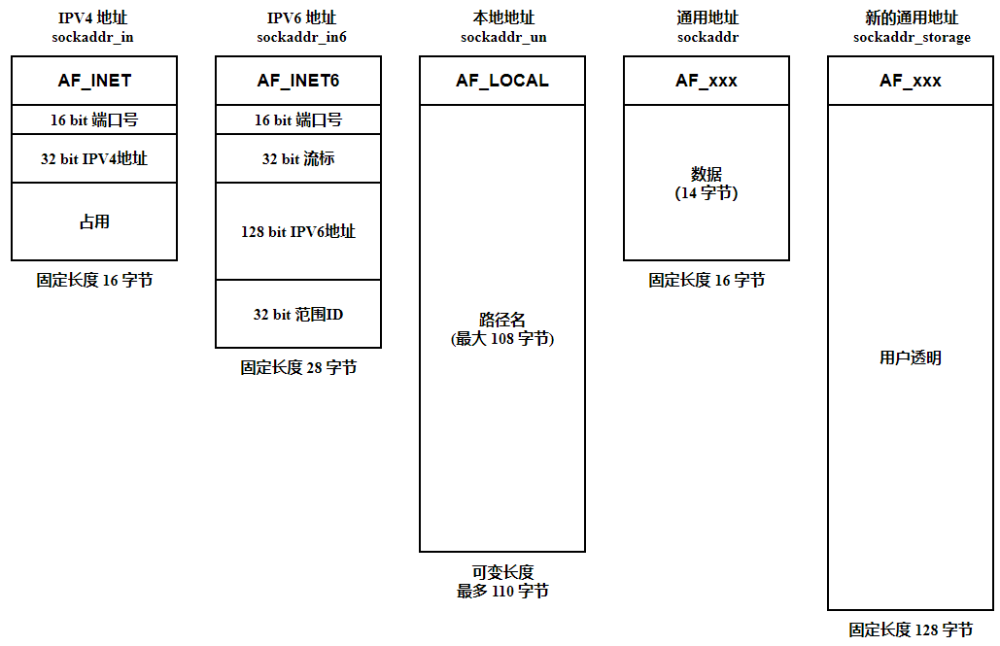

# 套接字地址结构

在使用套接字时，首先要解决通信双方寻址的问题。我们需要使用套接字的地址建立连接。

## 通用套接字地址格式

`sockaddr` 是一个通用的地址结构，适用于多种地址族。这个类型的唯一用途是将各种特定的地址结构转换成单个类型以供 socket 系统调用使用。

```
/* POSIX.1g 规范规定了地址族为2字节的值.  */
typedef unsigned short int sa_family_t;
/* 描述通用套接字地址  */
struct sockaddr{
    sa_family_t sa_family;  /* 地址族.  16-bit*/
    char sa_data[14];   /* 具体的地址值 112-bit */
  }; 
```

`sa_family` 是地址族，它表示使用什么样的方式对地址进行解释和保存：

- `AF_LOCAL`：表示的是本地地址，对应的是 Unix 套接字，这种情况一般用于本地 socket 通信，很多情况下也可以写成 `AF_UNIX`、`AF_FILE`
- `AF_INET`：因特网使用的 IPv4 地址
- `AF_INET6`：因特网使用的 IPv6 地址

`AF_` 表示的含义是 `Address Family`，但是很多情况下，我们也会看到以 `PF_` 表示的宏，意思是 `Protocol Family`，也就是协议族的意思。`<sys/socket.h>` 头文件中可以清晰地看到，这两个值本身就是一一对应的。

## IPv4 套接字格式地址

```
/* IPV4套接字地址，32bit值.  */
typedef uint32_t in_addr_t;
struct in_addr
  {
    in_addr_t s_addr;
  };
  
/* 描述IPV4的套接字地址格式  */
struct sockaddr_in
  {
    sa_family_t sin_family; /* 16-bit */
    in_port_t sin_port;     /* 端口口  16-bit*/
    struct in_addr sin_addr;    /* 网络地址 32-bit */


    /* 这里仅仅用作占位符，不做实际用处  */
    unsigned char sin_zero[8];
  };
```

- IPv4 地址是一个32-bit的字段，可以想象最多支持的地址数就是 2 的 32 次方，大约是 42 亿
- 端口号最多是16-bit，也就是说最大支持 2 的 16 次方，所以我们应该知道支持寻址的端口号最大就是 65535

## IPv6 套接字地址格式

```
struct sockaddr_in6
{
    sa_family_t sin6_family; /* 16-bit */
    in_port_t sin6_port;  /* 传输端口号 # 16-bit */
    uint32_t sin6_flowinfo; /* IPv6流控信息 32-bit*/
    struct in6_addr sin6_addr;  /* IPv6地址128-bit */
    uint32_t sin6_scope_id; /* IPv6域ID 32-bit */
};
```

## 本地套接字格式

以上无论 IPv4 还是 IPv6 的地址格式都是因特网套接字的格式，还有一种本地套接字格式，也就是前面提到的 `AF_LOCAL`。

```
struct sockaddr_un {
    unsigned short sun_family; /* 固定为 AF_LOCAL */
    char sun_path[108];   /* 路径名 */
};
```

## 新的通用套接字地址结构

`sockaddr` 14 字节的 `sa_data` 无法容纳所有协议的地址值，因此定义新的通用套接字地址结构 `sockaddr_storage`：

```
/* Structure large enough to hold any socket address
(with the historical exception of AF_UNIX). 128 bytes reserved.  */

#if ULONG_MAX > 0xffffffff
# define __ss_aligntype __uint64_t
#else
# define __ss_aligntype __uint32_t
#endif
#define _SS_SIZE        128
#define _SS_PADSIZE     (_SS_SIZE - (2 * sizeof (__ss_aligntype)))

struct sockaddr_storage
{
    sa_family_t ss_family;      /* Address family */
    __ss_aligntype __ss_align;  /* Force desired alignment.  */
    char __ss_padding[_SS_PADSIZE];
};
```

- 如果系统支持的任何套接字地址结构有对齐需求，那么 `sockaddr_storage` 能够满足最苛刻的对齐要求

- `sockaddr_storage` 足够大，能够容纳系统支持的任何套接字地址结构

## 小结

IPv4 和 IPv6 套接字地址结构的长度是固定的，而本地地址结构的长度是可变的：



# 值-结果参数

当往一个套接字函数传递一个套接字地址结构时，该结构总是以引用形式来传递，也就是说传递的是指向该结构的一个指针。该结构的长度也作为一个参数来传递，不过其传递方式取决于该结构的传递方向：

- 从进程到内核
- 从内核到进程

从进程到内核传递套接字地址结构的函数例如：`bind()`，`connect()` 和 `sendto()` 。这些函数的一个参数是指向某个套接字地址结构的指针，另一个参数是该结构的整数大小。

```
struct sockaddr_in serv;

connect( sockfd, ( SA * )&serv, sizeof( serv ) );
```

既然指针和指针所指内容的大小都传递给了内核，于是内核知道到底需从进程复制多少数据进来。

从内核到进程传递套接字地址结构的函数例如：`accept()`，`recvfrom()`，`getsockname()` 和 `getpeername()`。

```
struct sockaddr_un cli;
socklen_t len;

len = sizeof( cli );
getpeername( unixfd, ( SA * )&cli, &len );
/*len may have changed*/
```

这里 `len` 既作为值传递进去，又作为结果返回。

# 字节排序函数

网络协议使用的是大端字节序。

为了保证网络字节序一致，POSIX 标准提供了如下的转换函数：

```
#include <netinet/in.h>

uint16_t htons( uint16_t host16bitvalue );
uint32_t htonl( uint32_t host32bitvalue );
                        //------------均返回：网络字节序的值
uint16_t ntohs( uint16_t net16bitvalue );
uint32_t ntohl( uint32_t net32bitvalue );
                        //------------均返回：主机字节序的值
```

`n` 代表的就是 `network`，`h` 代表的是 `host`。`s` 表示的是 `short`，`l` 表示的是 `long`，分别表示 16 位和 32 位的整数

# IP 地址转换函数

## IPv4 地址转换

### inet_addr()

```
#include <arpa/inet.h>

in_addr_t inet_addr(const char *cp);
```

- 点分十进制字符串转换成网络字节序的整数表示
- 失败时返回 `INADDR_NONE`

### inet_aton()

```
#include <arpa/inet.h>

int inet_aton( const char *strptr, struct in_addr *addrptr );  
```

-  与 `inet_addr()` 的功能相同，转换结果存放在参数 `inp` 指向的结构中 
- 成功返回1，失败返回0

### inet_ntoa()

```
#include <arpa/inet.h>

char *inet_ntoa( struct in_addr inaddr );
```

- 网络字节序表示的整数转换成点分十进制字符串
- 该函数是不可重入的
- 成功返回1，失败返回0

## 兼容IPv4 和 IPv6 的转换

### inet_pton()

```
#include <arpa/inet.h>

int inet_pton(int af,const char* src,void* dst);
```

- `af`：指定协议族，可以是 `AF_INET`，`AF_INET6`
- `src` ：待转换的 IP 地址字符串表示
- `dst` ：转换成的网络字节序的整数表示的 IP 地址
- 成功返回1 ，失败返回0，设置 `errno`

### inet_ntop()

```
#include <arpa/inet.h>

const char* inet_ntop(int af,const void* src,char* dst,socklen_t cnt);
```

- `cnt`：指定目标存储单元的大小，可以借助宏：

```
#include <netinet.in.h>

#define INET_ADDRSTRLEN 16 /* for IPv4 dotted-decimal */
#define INET6_ADDRSTRLEN 46 /* for IPv6 hex string */`
```

- 成功返回目标存储单元的地址，失败返回 `NULL`，并设置 `errno`

# 自定义读写函数

字节流套接字上调用 `read()` 或 `write()` 输入或输出的字节数可能比请求的数量少，然而这不是出错的状态。这个现象的原因在于内核中用于套接字的缓冲区可能已达到极限，此时所需的是调用者再次调用 `read()` 或 `write()`函数，以输入或输出剩余的字节。

`EINTR` 错误表示系统调用被信号中断，如果发生该错误应该继续读写。

## readn

```
ssize_t readn(int fd,void* vptr,size_t n)
{
	size_t nleft,nread;
	char* ptr;
	
	ptr = vptr;
	nleft = n;
	
	while(nleft > 0){
		if((nread = read(fd,ptr,nleft)) < 0)
		{
			if(errno == EINTR)
				nread = 0; //@ call read again
			else
				return -1;
		}else if(nread == 0) //@ EOF
			break;
		
		nleft -= nread;
		ptr += nread;
	}
	return (n - nleft);
}
```

## writen

```
ssize_t writen(int fd,void* vptr,size_t n)
{
	size_t nleft,nwritten; 
	const char* ptr;
	
	ptr = vptr;
	nleft = n;
	
	while(nleft > 0){
		if((nwritten = write(fd,ptr,nleft)) < 0)
		{
			if(nwritten < 0 && errno != EINTR)
				nwritten = 0;	//@ call write again
			else
				return -1;
		}
		
		nleft -= nwritten;
		ptr += nwritten;
	}
	return n;
}
```

## read_line

```
ssize_t read_line(int fd,void* vptr,size_t maxlen)
{
	ssize_t n,rc;
	char c,*ptr;
	
	ptr = vptr;
	for(n = 1; n < maxlen;n++)
	{
	again:
		if((rc = read(fd,&c,1)) = 1){
			*ptr++ = c;
			if(c == '\n')
				break;
		}else if(rc == 0){
			*ptr = 0;
			return n-1;
		}else{
			if(errno == EINTR){
				goto again;
			}
			return -1;
		}
	}
	*ptr = 0;
	return n;
}
```

