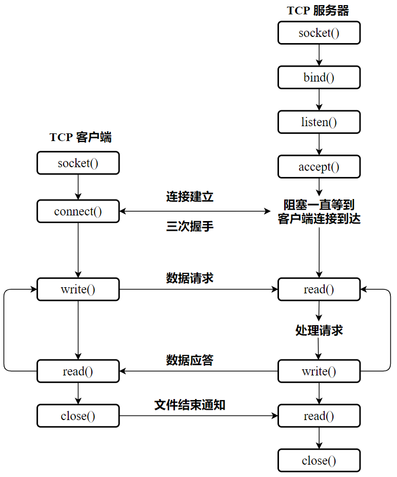
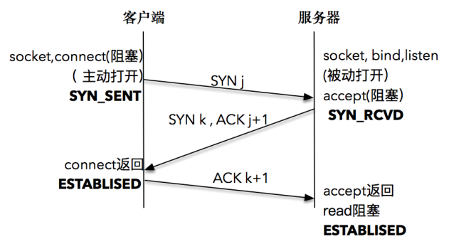
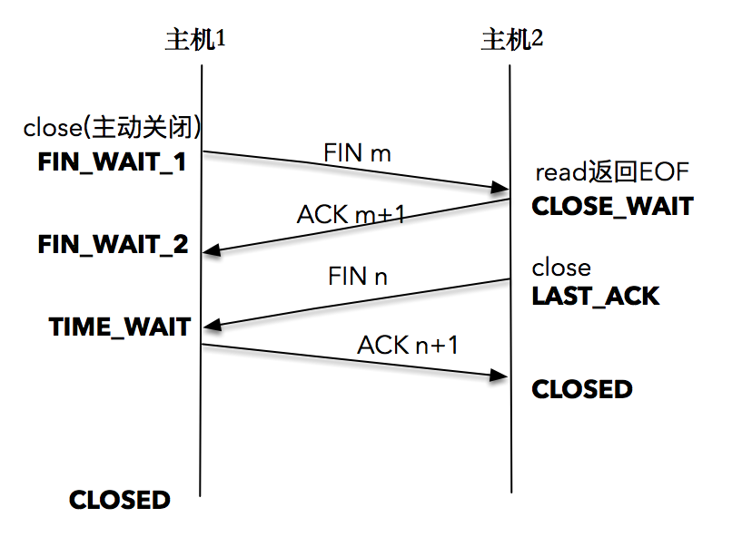
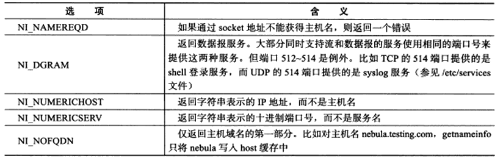
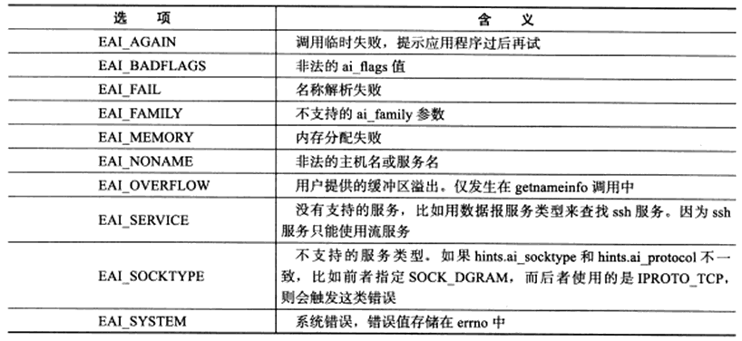

# 概述

## API 调用流程



## 建立连接流程

TCP 连接建立需要经过三次握手：




服务器端通过 `socket()`，`bind()` 和 `listen()` 完成了被动套接字的准备工作，被动的意思就是等着别人来连接，然后调用 `accept()`，就会阻塞在这里，等待客户端的连接来临。客户端通过调用 `socket()` 和 `connect()` 之后也会阻塞，接下来的事情是由操作系统内核网络协议栈完成的：

- 客户端的协议栈向服务器端发送了SYN包，并告诉服务器端当前发送序列号 j，客户端进入SYNC_SENT 状态
- 服务器端的协议栈收到这个包之后，和客户端进行 ACK 应答，应答的值为 j+1，表示对 SYN 包 j 的确认，同时服务器也发送一个 SYN 包，告诉客户端当前我的发送序列号为 k，服务器端进入 SYNC_RCVD 状态
- 客户端协议栈收到 ACK 之后，使得应用程序从 `connect()` 调用返回，表示客户端到服务器端的单向连接建立成功，客户端的状态为 ESTABLISHED，同时客户端协议栈也会对服务器端的 SYN 包进行应答，应答数据为 k+1
- 应答包到达服务器端后，服务器端协议栈使得 `accept()` 阻塞调用返回，这个时候服务器端到客户端的单向连接也建立成功，服务器端也进入ESTABLISHED状态

## 关闭连接流程

TCP 关闭连接需要经过四次挥手：



- 首先，一方应用程序调用 `close()`，我们称该方为主动关闭方，该端的TCP发送一个 FIN 包，表示需要关闭连接。之后主动关闭方进入 FIN_WAIT_1 状态
- 接着，接收到这个 FIN 包的对端执行被动关闭。这个 FIN 由 TCP 协议栈处理，TCP协议栈为 FIN 包插入一个文件结束符  `EOF` 到接收缓冲区中，应用程序可以通过 `read()` 调用来感知这个 FIN 包。一定要注意，这个 `EOF` 会被放在已排队等候的其他已接收的数据之后，这就意味着接收端应用程序需要处理这种异常情况，因为 `EOF` 表示在该连接上再无额外数据到达。此时，被动关闭方进入 `CLOSE_WAIT` 状态
- 接下来，被动关闭方将读到这个 `EOF`，应用程序也调用 `close()` 关闭它的套接字，这导致它的 TCP 也发送一个 FIN 包。这样，被动关闭方将进入 LAST_ACK 状态
- 最终，主动关闭方接收到对方的 FIN 包，并确认这个 FIN 包。主动关闭方进入 TIME_WAIT 状态，而接收到 ACK 的被动关闭方则进入 CLOSED 状态。再过 2MSL 时间之后，主动关闭方也进入 CLOSED 状态

当套接字被关闭时，TCP 为其所在端发送一个 FIN 包。在大多数情况下，这是由应用进程调用 `close()` 而发生的，值得注意的是，一个进程无论是正常退出（`exit()` 或者 `main()` 返回），还是非正常退出（比如，收到 `SIGKILL` 信号关闭，就是我们常常干的kill -9），所有该进程打开的描述符都会被系统关闭，这也导致 TCP 描述符对应的连接上发出一个 FIN 包。

无论是客户端还是服务器，任何一端都可以发起主动关闭。大多数真实情况是客户端执行主动关闭，但是 HTTP/1.0 却是由服务器发起主动关闭的。

# 基础 API

## socket()

创建套接字：

```
#include <sys/types.h>
#include <sys/socket.h>

int socket(int domain, int type, int protocol);
```

- `domain` 就是指 `PF_INET`、`PF_INET6` 以及 `PF_LOCAL` 等，表示什么样的套接字
- `type` 可用的值是：
  - `SOCK_STREAM`: 表示的是字节流，对应 TCP
  - `SOCK_DGRAM`： 表示的是数据报，对应 UDP
  - `SOCK_RAW`: 表示的是原始套接字
- `protocol` 原本是用来指定通信协议的，但现在基本废弃。因为协议已经通过前面两个参数指定完成。目前一般写成 0 即可

## connect()

客户端调用 `connect()` 建立与 TCP 服务器的连接。

```
#include <sys/types.h>  
#include <sys/socket.h>

int connect(int sockfd, const struct sockaddr *addr,socklen_t addrlen);
```

- `addr` 和 `addrlen` 分别代表指向套接字地址结构的指针和该结构的大小，套接字地址结构必须含有服务器的 IP 地址和端口号
- 客户端在调用函数 `connect()` 前不必非得调用 `bind()`，因为如果需要的话，内核会确定源 IP 地址，并按照一定的算法选择一个临时端口作为源端口
- 如果是TCP套接字，调用 `connect()` 函数将激发 TCP 的三路握手过程，而且仅在连接建立成功或出错时才返回，其中错误返回可能有以下几种情况：
  - 若TCP客户没有收到SYN分节的响应，则返回 `ETIMEDOUT` 错误（超时）
  - 若对客户的 SYN 的响应是 RST（表示复位），则表明该服务器主机在我们指定的端口上没有进程在等待与之连接（例如，服务器进程也许没在运行）。这是一种硬件错误，客户一接收到 RST 就马上返回 `ECONNREFUSED` 错误
  - 若客户发出的 SYN 在中间的某个路由器上引发了一个 "destination unreadchable" ICMP 错误，则认为是一种软件错误。客户主机内核保存该消息，并继续发送 SYN。若超时，则将 ICMP 错误作为 `EHOSTUNREACH` 或 `ENETUNREACH` 错误返回给进程
- 若 `connect()` 失败则该套接字不再可用，必须关闭，我们不能对这样的套接字再次调用 `connect()` 函数。当循环调用函数 `connect()` 为给定主机尝试各个 IP 地址直到有一个成功时，在每次 `connect()` 失败后，都必须 `close()` 当前的套接字描述符并重新调用 `socket()`

## bind()

把一个本地协议地址赋予一个套接字：

```
#include <sys/types.h> 
#include <sys/socket.h>

int bind(int sockfd, const struct sockaddr *addr,socklen_t addrlen);
```

- 这里的 `addr` 可以设置为通配地址，对于 IPv4 的地址来说，使用 `INADDR_ANY` 来完成通配地址的设置；对于 IPv6 的地址来说，使用 `IN6ADDR_ANY` 来完成通配地址的设置
- 成功返回0，失败返回 -1，并设置 `errno`：
  - `EACCES`：被绑定的地址是受保护的地址，仅超级用户可以访问，比如普通用户试图绑定 [0-1023] 端口
  - `EADDRINUSE`：被绑定的端口正在使用，例如将 socket 绑定到处于 TIME_WAIT 状态的地址

## listen()

`socket()` 创建的套接字称为主动套接字，也就是一个将调用 `connect()` 发起连接请求的客户端套接字，`listen()` 函数把一个未连接的套接字转换成一个被动套接字，指示内核应接受指向该套接字的连接请求：

```
#include <sys/types.h>
#include <sys/socket.h>

int listen(int sockfd, int backlog);
```

- `sockfd`：指定被监听的 socket
- 从 Linux 2.2 开始，`backlog` 的参数内核有了新的语义，它现在定义的是已完成连接队列的最大长度，表示的是已建立的连接（established connection），正在等待被接收（`accept()` 调用返回），而不是原先的未完成队列的最大长度，默认值为128
- 成功返回0 ，失败返回-1,并设置 `errno`

## accept()

`accept()` 用于从已完成连接队列队头返回下一个已完成连接。如果已完成连接队列为空，那么进程被投入睡眠（假定套接字为默认的阻塞方式）：

```
#include <sys/types.h>
#include <sys/socket.h>

int accept(int sockfd, struct sockaddr *addr, socklen_t *addrlen);
```

- `sockfd `：监听套接字是监听套接字，监听套接字一直都存在，它是要为成千上万的客户来服务的，直到这个监听套接字关闭
- `addrlen` 是一个值-结果参数，它指向一个整数，在调用被执行前必须将这个值初始化为 `addr` 指向的缓冲区大小，这样内核就知道有多少空间可以用于返回  socket 地址，当 `accept()` 返回之后，这个整数会被设置成实际被复制进缓冲区中的数据的字节数，如果不关心对等 socket 地址，那么可以将 `addr` 和 `addrlen` 指定为 `NULL` 和 0
- 如果在调用 `accept()` 时不存在未决连接，那么调用就会阻塞直到有连接请求到达为止
- `accept()` 会创建一个新 socket，并且正是这个新 socket 会与执行  `connect()` 对等 socket 进行连接，其返回的结果是已连接 socket 的文件描述符

## close()

```
#include <unistd.h>

int close( int sockfd);
```

- 并非立即关闭一个连接，只是将 `sockfd` 的引用计数减1，当 `sockfd` 的应用计数为0时，关闭连接

# 地址信息 API

```
#include <sys/socket.h>

int getsockname(int sockfd,struct sockaddr* address,socklen_t* address_len);
```

- 获取 `sockfd` 对应的本端 socket 地址，并将存储于 `address` 参数指定的内存中，该 socket 地址的长度则存储于 `address_len` 参数指向的变量
- 如果实际 socket 地址的长度大于 `address` 所指内存区的大小，那么该 socket 地址将被截断
- 成功返回0，失败返回 -1，并设置 `errno`

```
#include <sys/socket.h>

int getpeername(int sockfd,struct sockaddr* address,socklen_t* address_len);
```

- 获取 sockfd 对应的远端的 socket 地址
- 参数和返回值与 `getsockname()` 相同

# 网络信息  API

## gethostbyname() 和 gethostbyaddr()

以下两个函数不可重入，即非线程安全的。

```
#include <netdb.h>

struct hostent* gethostbyname(const char* name);
```

- 根据主机名获取主机的完整信息
- `name`：指定目标主机的主机名

```
#include <netdb.h>

struct hostent* gethostbyaddr(const void* addr,size_t len,int type);
```

- 根据 IP 地址获取主机的完整信息
- `addr`：指定 IP 地址
- `len`：指定 addr 所指 IP 地址的长度
- `type`：参数指定 IP 类型，可以是 `AF_INET`，`AF_INET6`

```
struct hostent
{
	char* h_name;		//@ 主机名
	char** h_aliases;	//@ 主机别名列表，可能有多个
	int h_addrtype;		//@ 地址类型(地址族)
	int h_length;		//@ 地址长度
	char** h_addr_list;	//@ 按网络字节序列出的主机 IP 地址列表
};
```

##　getservbyname() 和 getservbyport()

以下两个函数不可重入，即非线程安全的。

```
#include <netdb.h>

struct servent* getservbyname(const char* name,const char* proto);
struct servent* getservbyport(int port,const char* proto);
```

- `proto`：
  - 流服务：`"tcp"`
  - 数据报服务：`"udp"`
  - 所有服务类型：`NULL`

```
struct servent
{
	char* s_name;		 //@ 服务名称
	char** s_aliases;	 //@ 服务的别名列表，可能有多个
	int s_port;			//@ 端口号
	char* s_proto;		//@ 服务类型，通常是 tcp 或者 udp
};
```

## getaddrinfo() 和 getnameinfo()

```
#include <netdb.h>

int getaddrinfo(const char* hostname,const char* service,const struct addrinfo* hints,struct addrinfo** result);
void freeaddrinfo(struct addrinfo* res);
```

- 可以通过主机名获得 IP 地址，内部使用 `gethostbyname()`
- 可以通过服务名获得端口号，内部使用 `getservbyname()`
- `getaddrinfo()` 函数隐式的分配了堆内存，调用结束后需要通过调用 `freeaddrinfo()` 释放
- 是否可重入决定于内部调用的函数是否可重入

```
#include <netdb.h>

int getnameinfo(const struct sockaddr* sockaddr,socklen_t addrlen,char* host,socklen_t hostlen,char* serv,socklen_t servlen,int flags);
```

- 通过 socket 地址同时获取字符串表示的主机名(内部使用 `gethostbyaddr()`) 和服务名(内部使用 `getservbyaddr()`)
- 是否可重入决定于内部调用的函数是否可重入
- `flags`：



`getaddrinfo()` 和 `getnameinfo()` 成功时返回0，失败时返回错误码：



可以通过 `gai_strerror()` 将错误转换成字符串：

```
#include <netdb.h>

const char*gai_strerror(int error);
```

