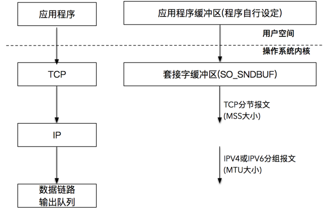

# 套接字基础 API

## socket()

创建套接字：

```
#include <sys/types.h>
#include <sys/socket.h>

int socket(int domain, int type, int protocol);
```

- `domain` 就是指 `PF_INET`、`PF_INET6` 以及 `PF_LOCAL` 等，表示什么样的套接字
- `type` 可用的值是：
  - `SOCK_STREAM`: 表示的是字节流，对应 TCP
  - `SOCK_DGRAM`： 表示的是数据报，对应 UDP
  - `SOCK_RAW`: 表示的是原始套接字
- `protocol` 原本是用来指定通信协议的，但现在基本废弃。因为协议已经通过前面两个参数指定完成。目前一般写成 0 即可

## connect()

客户端调用 `connect()` 建立与 TCP 服务器的连接。

```
#include <sys/types.h>  
#include <sys/socket.h>

int connect(int sockfd, const struct sockaddr *addr,socklen_t addrlen);
```

- `addr` 和 `addrlen` 分别代表指向套接字地址结构的指针和该结构的大小，套接字地址结构必须含有服务器的 IP 地址和端口号
- 客户端在调用函数 `connect()` 前不必非得调用 `bind()`，因为如果需要的话，内核会确定源 IP 地址，并按照一定的算法选择一个临时端口作为源端口
- 如果是TCP套接字，调用 `connect()` 函数将激发 TCP 的三路握手过程，而且仅在连接建立成功或出错时才返回，其中错误返回可能有以下几种情况：
  - 若TCP客户没有收到SYN分节的响应，则返回 `ETIMEDOUT` 错误（超时）
  - 若对客户的 SYN 的响应是 RST（表示复位），则表明该服务器主机在我们指定的端口上没有进程在等待与之连接（例如，服务器进程也许没在运行）。这是一种硬件错误，客户一接收到 RST 就马上返回 `ECONNREFUSED` 错误
  - 若客户发出的 SYN 在中间的某个路由器上引发了一个 "destination unreadchable" ICMP 错误，则认为是一种软件错误。客户主机内核保存该消息，并继续发送 SYN。若超时，则将 ICMP 错误作为 `EHOSTUNREACH` 或 `ENETUNREACH` 错误返回给进程
- 若 `connect()` 失败则该套接字不再可用，必须关闭，我们不能对这样的套接字再次调用 `connect()` 函数。当循环调用函数 `connect()` 为给定主机尝试各个 IP 地址直到有一个成功时，在每次 `connect()` 失败后，都必须 `close()` 当前的套接字描述符并重新调用 `socket()`

## bind()

把一个本地协议地址赋予一个套接字：

```
#include <sys/types.h> 
#include <sys/socket.h>

int bind(int sockfd, const struct sockaddr *addr,socklen_t addrlen);
```

- 这里的 `addr` 可以设置为通配地址，对于 IPv4 的地址来说，使用 `INADDR_ANY` 来完成通配地址的设置；对于 IPv6 的地址来说，使用 `IN6ADDR_ANY` 来完成通配地址的设置
- 成功返回0，失败返回 -1，并设置 `errno`：
  - `EACCES`：被绑定的地址是受保护的地址，仅超级用户可以访问，比如普通用户试图绑定 [0-1023] 端口
  - `EADDRINUSE`：被绑定的端口正在使用，例如将 socket 绑定到处于 TIME_WAIT 状态的地址

## listen()

`socket()` 创建的套接字称为主动套接字，也就是一个将调用 `connect()` 发起连接请求的客户端套接字，`listen()` 函数把一个未连接的套接字转换成一个被动套接字，指示内核应接受指向该套接字的连接请求：

```
#include <sys/types.h>
#include <sys/socket.h>

int listen(int sockfd, int backlog);
```

- `sockfd`：指定被监听的 socket
- 从 Linux 2.2 开始，`backlog` 的参数内核有了新的语义，它现在定义的是已完成连接队列的最大长度，表示的是已建立的连接（established connection），正在等待被接收（`accept()` 调用返回），而不是原先的未完成队列的最大长度，默认值为128
- 成功返回0 ，失败返回-1,并设置 `errno`

## accept()

`accept()` 用于从已完成连接队列队头返回下一个已完成连接。如果已完成连接队列为空，那么进程被投入睡眠（假定套接字为默认的阻塞方式）：

```
#include <sys/types.h>
#include <sys/socket.h>

int accept(int sockfd, struct sockaddr *addr, socklen_t *addrlen);
```

- `sockfd `：监听套接字是监听套接字，监听套接字一直都存在，它是要为成千上万的客户来服务的，直到这个监听套接字关闭
- `addrlen` 是一个值-结果参数，它指向一个整数，在调用被执行前必须将这个值初始化为 `addr` 指向的缓冲区大小，这样内核就知道有多少空间可以用于返回  socket 地址，当 `accept()` 返回之后，这个整数会被设置成实际被复制进缓冲区中的数据的字节数，如果不关心对等 socket 地址，那么可以将 `addr` 和 `addrlen` 指定为 `NULL` 和 0
- 如果在调用 `accept()` 时不存在未决连接，那么调用就会阻塞直到有连接请求到达为止
- `accept()` 会创建一个新 socket，并且正是这个新 socket 会与执行  `connect()` 对等 socket 进行连接，其返回的结果是已连接 socket 的文件描述符

# 关闭套接字

## close()

```
#include <unistd.h>

int close( int sockfd);
```

- 并非立即关闭一个连接，只是将 `sockfd` 的引用计数减1，当 `sockfd` 的应用计数为0时，关闭连接

## shutdown()

```
#include <sys/socket.h>

int shutdown(int sockfd, int how);
```

`how` 参数的选项：

- `SHUT_RD(0)`：关闭连接的“读”这个方向，对该套接字进行读操作直接返回 `EOF`。从数据角度来看，套接字上接收缓冲区已有的数据将被丢弃，如果再有新的数据流到达，会对数据进行 `ACK`，然后悄悄地丢弃。也就是说，对端还是会接收到 `ACK`，在这种情况下根本不知道数据已经被丢弃了
- `SHUT_WR(1)`：关闭连接的“写”这个方向，这就是常被称为”半关闭“的连接。套接字上发送缓冲区已有的数据将被立即发送出去，并发送一个FIN报文给对端。应用程序如果对该套接字进行写操作会报错
- `SHUT_RDWR(2)`：相当于 `SHUT_RD` 和 `SHUT_WR` 操作各一次，关闭套接字的读和写两个方向

## close() 和 shutdown() 的区别

- `close()` 会关闭连接，并释放所有连接对应的资源，而 `shutdown()` 并不会释放掉套接字和所有的资源，所以最终还是需要使用 `close()` 释放资源
- `close()` 存在引用计数的概念，并不一定导致该套接字不可用；`shutdown()` 则不管引用计数，直接使得该套接字不可用，如果有别的进程企图使用该套接字，将会受到影响，进一步可以理解为 `close()` 的引用计数机制导致不一定会发出 `FIN` 结束报文，而 `shutdown()` 则总是会发出 `FIN` 结束报文，这在我们打算关闭连接通知对端的时候，是非常重要的

在大多数情况下，我们会优选 `shutdown()` 来完成对连接一个方向的关闭，待对端处理完之后，再完成另外一个方向的关闭。

# 流式套接字的读写

## 流式套接字读取

### read()

```
#include <unistd.h>

ssize_t read(int fd, void *buf, size_t count);
```

`read()` 要求操作系统内核从套接字描述字 `fd` 读取最多 `count` 个字节，并将结果存储到 `buf` 中。返回值是实际读取的字节数，也有一些特殊情况：

- 如果返回值为 0，表示 EOF（end-of-file），这在网络中表示对端发送了 FIN 包，要处理断连的情况
- 如果返回值为 -1，表示出错。当然，如果是非阻塞 I/O，情况会略有不同

实现一个 `readn()` 函数：

```
ssize_t readn(int fd,void* vptr,size_t n)
{
	size_t nleft,nread;
	char* ptr;
	
	ptr = vptr;
	nleft = n;
	
	while(nleft > 0){
		if((nread = read(fd,ptr,nleft)) < 0)
		{
			if(errno == EINTR)  //@ EINTR 表示系统调用被信号中断
				nread = 0; //@ call read again
			else
				return -1;
		}else if(nread == 0) //@ EOF
			break;
		
		nleft -= nread;
		ptr += nread;
	}
	return (n - nleft);
}
```

### recv()

```
#include <sys/types.h>
#include <sys/socket.h>

ssize_t recv(int sockfd,void *buf,size_t len,int flags);
```

- `buf`：指定读取的缓冲区的位置
- `len`：指定读取缓冲区的大小
- 成功时返回实际读取到的字节数，可能小于期望的 `len`，因此可能需要多次调用 `recv`，才能读取到完整的数据，`recv` 返回 0，意味着对方已经关闭了链接，失败时返回 -1，并设置 `errno`
- `flags`：通常设置为0，可以是一个或者多个逻辑的组合：


## 流式套接字发送

### write()

```
#include <unistd.h>
ssize_t write(int fd, const void *buf, size_t count);
```

对于 `write()` 的调用，在普通文件和套接字上进行写入操作是有区别的：

- 对于普通文件描述符而言，一个文件描述符代表了打开的一个文件句柄，通过调用 `write()`，操作系统内核帮我们不断地往文件系统中写入字节流。写入的字节流大小通常和输入参数 `size` 的值是相同的，否则表示出错
- 对于套接字描述符而言，它代表了一个双向连接，在套接字描述符上调用 `write()` 写入的字节数有可能比请求的数量少，这在普通文件描述符情况下是不正常的

TCP连接成功建立后，操作系统内核会为每一个连接创建配套的基础设施，比如发送缓冲区。发送缓冲区的大小可以通过套接字选项来改变，当应用程序调用 `write()` 时，实际所做的事情是把数据从应用程序中拷贝到操作系统内核的发送缓冲区中，并不一定是把数据通过套接字写出去：

- 如果操作系统内核的发送缓冲区足够大，可以直接容纳这份数据， `write()` 将会写入全部请求的字节数，然后返回
- 如果操作系统内核的发送缓冲区不足以容纳全部要发送的数据，在这种情况下将会阻塞，大部分 UNIX系统的做法是一直等到可以把应用程序数据完全放到操作系统内核的发送缓冲区中，再从系统调用中返回



实现一个 `writen()` 函数：

```
ssize_t writen(int fd,void* vptr,size_t n)
{
	size_t nleft,nwritten; 
	const char* ptr;
	
	ptr = vptr;
	nleft = n;
	
	while(nleft > 0){
		if((nwritten = write(fd,ptr,nleft)) < 0)
		{
			if(nwritten < 0 && errno == EINTR)
				nwritten = 0;	//@ call write again
			else
				return -1;
		}
		
		nleft -= nwritten;
		ptr += nwritten;
	}
	return n;
}
```

### send()

如果想指定选项或者想要发送带外数据，就需要使用 `send()`，所谓带外数据，是一种基于TCP协议的紧急数据，用于客户端-服务器在特定场景下的紧急处理。

```
#include <sys/types.h>
#include <sys/socket.h>

ssize_t send(int sockfd,void *buf,size_t len,int flags);
```

- 成功时返回实际写入数据的长度，失败时返回 -1，并设置 `errno`
- `flags` 参考 `recv()`

# 数据报套接字的读写

UDP 无连接，因而每次发送和读取都要带有是 socket 地址。

```
#include <sys/types.h>
#include <sys/socket.h>

ssize_t recvfrom(int sockfd,void* buf,size_t len,int flags,struct sockaddr* src_addr,socklen_t* addrlen);
ssize_t sendto(int sockfd,void* buf,size_t len,int flags,struct sockaddr* dest_addr,socklen_t* addrlen);
```

- `flags` 参数与 `recv()`/`send()` 的 `flags` 一致
- `recvfrom()`/`sendto()` 系统调用也可以用于面向连接(STREAM)的 socket 的数据读写，只需要将最后两个参数都设置为 `NULL`
- 返回值与 `send()`/`recv()` 一致 

# 通用读写

通用读写指的是既可以用于 TCP 读写，也可以用于 UDP 读写。

如果想指定多重缓冲区传输数据，就需要使用 `sendmsg()`/`recvmsg()`

```
#include <sys/socket.h>

ssize_t recvmsg(int sockfd,struct msghdr* msg,int flags);
ssize_t sendvmsg(int sockfd,struct msghdr* msg,int flags);
```

- `struct msghdr`

```
struct msghdr
{
	void* msg_name;  			//@ socket 地址
	socklen_t msg_namelen;  	 //@ socket 地址的长度
	struct iovec* msg_iov;  	 //@ 分散的内存块
	int msg_iovlen; 			//@ 分散的内存块的数量
	void* msg_control;      	 //@ 指向辅助数据的起始位置
	socklen_t msg_controllen;  	 //@ 辅助数据的大小
	int msg_flags;  			//@ 复制函数中的 flags 参数，并在调用过程中更新
};
```

- `msg_name` 指向一个 socket 地址结构，指定通信对方的 socket 地址，对于基于连接的 TCP 是无意义的，设置为 `NULL` 即可
- `struct iovec`

```
struct iovec
{
	void* iov_base; //@ 内存起始地址
	size_t iov_len; //@ 这块内存的长度
};
```

- 对于 `recvmsg()`，数据将被读取并存放在 `msg_iovlen` 块分散的内存中，这些内存的位置和长度由 `msg_iov` 指向的数组决定，称为分散读
- 对于 `sendmsg()`，`msg_iovlen` 块分散内存中的数据将被一并发送，这称为集中写
- `msg_control`，`msg_controllen`  用于辅助数据的发送
- `flags` 参数与 `send()`/`recv()` 是一致的

# 地址信息 API

```
#include <sys/socket.h>

int getsockname(int sockfd,struct sockaddr* address,socklen_t* address_len);
```

- 获取 `sockfd` 对应的本端 socket 地址，并将存储于 `address` 参数指定的内存中，该 socket 地址的长度则存储于 `address_len` 参数指向的变量
- 如果实际 socket 地址的长度大于 `address` 所指内存区的大小，那么该 socket 地址将被截断
- 成功返回0，失败返回 -1，并设置 `errno`

```
#include <sys/socket.h>

int getpeername(int sockfd,struct sockaddr* address,socklen_t* address_len);
```

- 获取 sockfd 对应的远端的 socket 地址
- 参数和返回值与 `getsockname()` 相同

