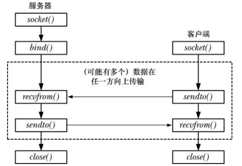

# 数据报套接字编程模型



# 数据报套接字也可以 `connect()`

可以对 UDP 套接字调用 `connect()`，但是不会引起和服务器目标端的网络交互，也就是说，并不会触发三次握手。

UDP 套接字进行 `connect()` 操作主要是为了让应用程序能够接收 ""异步错误" 的信息。在服务器端不开启的情况下，客户端程序是不会报错的，程序只会阻塞在`recvfrom()` 上，等待返回（或者超时），通过对 UDP 套接字进行 `connect()` 操作，将 UDP 套接字建立了 "上下文"，该套接字和服务器端的地址和端口产生了联系，正是这种绑定关系给了操作系统内核必要的信息，能够将操作系统内核收到的信息和对应的套接字进行关联。

当我们调用 `sendto()` 或者 `send()` 操作函数时，应用程序报文被发送，我们的应用程序返回，操作系统内核接管了该报文，之后操作系统开始尝试往对应的地址和端口发送，因为对应的地址和端口不可达，一个 ICMP 报文会返回给操作系统内核，该 ICMP 报文含有目的地址和端口等信息：

- 如果我们不进行 `connect()` 操作，建立（UDP套接字——目的地址+端口）之间的映射关系，操作系统内核就没有办法把 ICMP 不可达的信息和 UDP 套接字进行关联，也就没有办法将 ICMP 信息通知给应用程序
- 如果我们进行了 `connect()` 操作，帮助操作系统内核从容建立了（UDP套接字——目的地址+端口）之间的映射关系，当收到一个 ICMP 不可达报文时，操作系统内核可以从映射表中找出是哪个 UDP 套接字拥有该目的地址和端口，别忘了套接字在操作系统内部是全局唯一的，当我们在该套接字上再次调用 `recvfrom()` 或 `recv()` 方法时，就可以收到操作系统内核返回的 "Connection Refused" 的信息。

一般来说，服务器端不会主动发起 `connect()` 操作，因为一旦如此，服务器端就只能响应一个客户端了。不过，有时候也不排除这样的情形，一旦一个客户端和服务器端发送 UDP 报文之后，该服务器端就要服务于这个唯一的客户端。

## 性能考虑

一般来说，客户端通过 `connect()` 绑定服务端的地址和端口，对 UDP 而言，可以有一定程度的性能提升。

因为如果不使用 `connect()` 方式，每次发送报文都会需要这样的过程：

```
连接套接字→发送报文→断开套接字→连接套接字→发送报文→断开套接字 →………
```

而如果使用 `connect()` 方式，就会变成下面这样：

```
连接套接字→发送报文→发送报文→……→最后断开套接字
```

连接套接字是需要一定开销的，比如需要查找路由表信息。所以，UDP 客户端程序通过 `connect()` 可以获得一定的性能提升。


