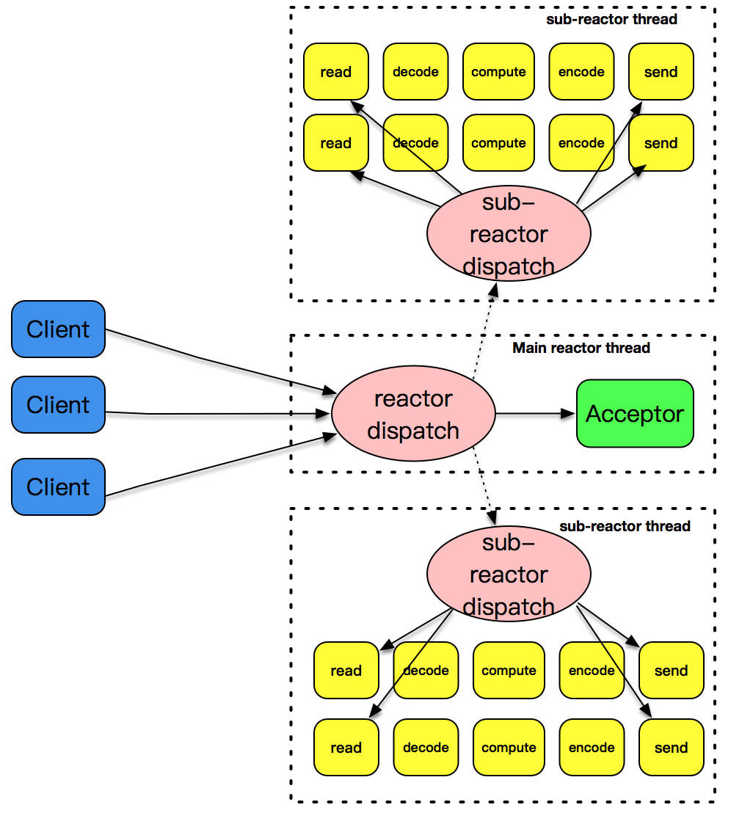
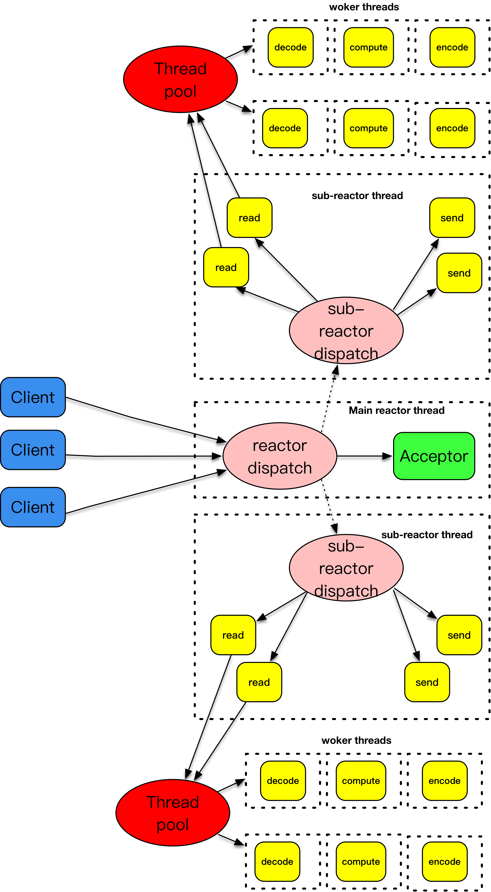
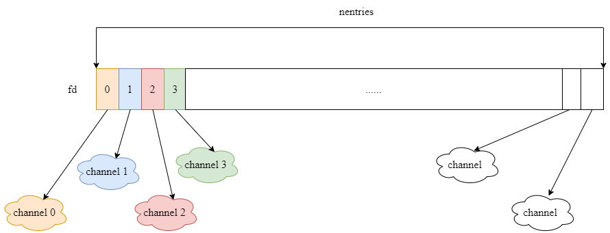

# 事件驱动

事件驱动模型，也被叫做反应堆模型（reactor），或者是 Event loop 模型。这个模型的核心有两点：

- 它存在一个无限循环的事件分发线程，或者叫做 reactor 线程、Event loop 线程。这个事件分发线程的背后，就是 `poll()`、`epoll()` 等 I/O 分发技术的使用
- 所有的 I/O 操作都可以抽象成事件，每个事件必须有回调函数来处理。acceptor上有连接建立成功、已连接套接字上发送缓冲区空出可以写、通信管道 pipe上有数据可以读，这些都是一个个事件，通过事件分发，这些事件都可以一一被检测，并调用对应的回调函数加以处理

# 几种I/O模型和线程模型设计

任何一个网络程序，所做的事情可以总结成下面几种：

- read：从套接字收取数据
- decode：对收到的数据进行解析
- compute：根据解析之后的内容，进行计算和处理
- encode：将处理之后的结果，按照约定的格式进行编码
- send：最后，通过套接字把结果发送出去

这几个过程和套接字最相关的是 read 和 send 这两种。

## fork

`fork()` 创建子进程，为每个到达的客户连接服务。`fork()` 的子进程也越来越多，即使客户和服务器之间的交互比较少，这样的子进程也不能被销毁，一直需要存在。使用 `fork()` 的方式处理非常简单，它的缺点是处理效率不高，`fork()` 子进程的开销太大。


## pthread

因为线程是比进程更轻量级的执行单位，所以它的效率相比 `fork()` 的方式，有一定的提高。但是，每次创建一个线程的开销仍然是不小的，因此，引入了线程池的概念，预先创建出一个线程池，在每次新连接达到时，从线程池挑选出一个线程为之服务，很好地解决了线程创建的开销。但是，这个模式还是没有解决空闲连接占用资源的问题，如果一个连接在一定时间内没有数据交互，这个连接还是要占用一定的线程资源，直到这个连接消亡为止。


## single reactor thread

一个 reactor 线程上同时负责分发 acceptor 的事件、已连接套接字的 I/O 事件。


## single reactor thread + worker threads

但是上述的设计模式有一个问题，和 I/O 事件处理相比，应用程序的业务逻辑处理是比较耗时的，比如 XML 文件的解析、数据库记录的查找、文件资料的读取和传输、计算型工作的处理等，这些工作相对而言比较独立，它们会拖慢整个反应堆模式的执行效率。

所以，将这些 decode、compute、enode 型工作放置到另外的线程池中，和反应堆线程解耦，是一个比较明智的选择。反应堆线程只负责处理 I/O 相关的工作，业务逻辑相关的工作都被裁剪成一个一个的小任务，放到线程池里由空闲的线程来执行。当结果完成后，再交给反应堆线程，由反应堆线程通过套接字将结果发送出去。


## 主-从 reactor 模式

主-从这个模式的核心思想是，主反应堆线程只负责分发 Acceptor 连接建立，已连接套接字上的I/O事件交给 sub-reactor 负责分发。其中 sub-reactor 的数量，可以根据 CPU 的核数来灵活设置。

比如一个四核CPU，我们可以设置sub-reactor为4。相当于有4个身手不凡的反应堆线程同时在工作，这大大增强了I/O分发处理的效率。而且，同一个套接字事件分发只会出现在一个反应堆线程中，这会大大减少并发处理的锁开销。



主反应堆线程一直在感知连接建立的事件，如果有连接成功建立，主反应堆线程通过accept方法获取已连接套接字，接下来会按照一定的算法选取一个从反应堆线程，并把已连接套接字加入到选择好的从反应堆线程中。

## 主-从reactor+worker threads模式

分发之间的耦合问题。把这两个策略组装在一起，就是实战中普遍采用的模式。



主-从反应堆跟上面介绍的做法是一样的。和上面不一样的是，这里将decode、compute、encode等CPU密集型的工作从I/O线程中拿走，这些工作交给worker线程池来处理，而且这些工作拆分成了一个个子任务进行。encode之后完成的结果再由sub-reactor的I/O线程发送出去。

# 程序示例

## buffer

可扩展的读写数据缓冲区：


```
struct buffer {
  char *data;      //实际缓冲
  int readIndex;   //缓冲读取位置
  int writeIndex;  //缓冲写入位置
  int total_size;  //总大小
};
```


## channel_map



```
struct channel_map {
  void **entries;

  int nentries;
};
```


