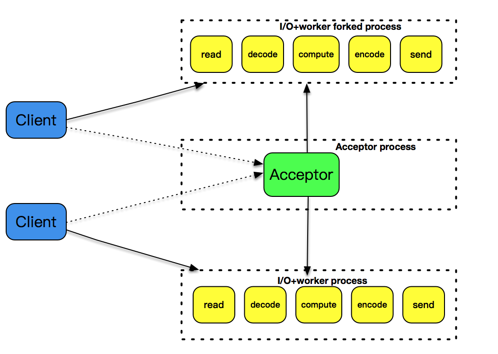
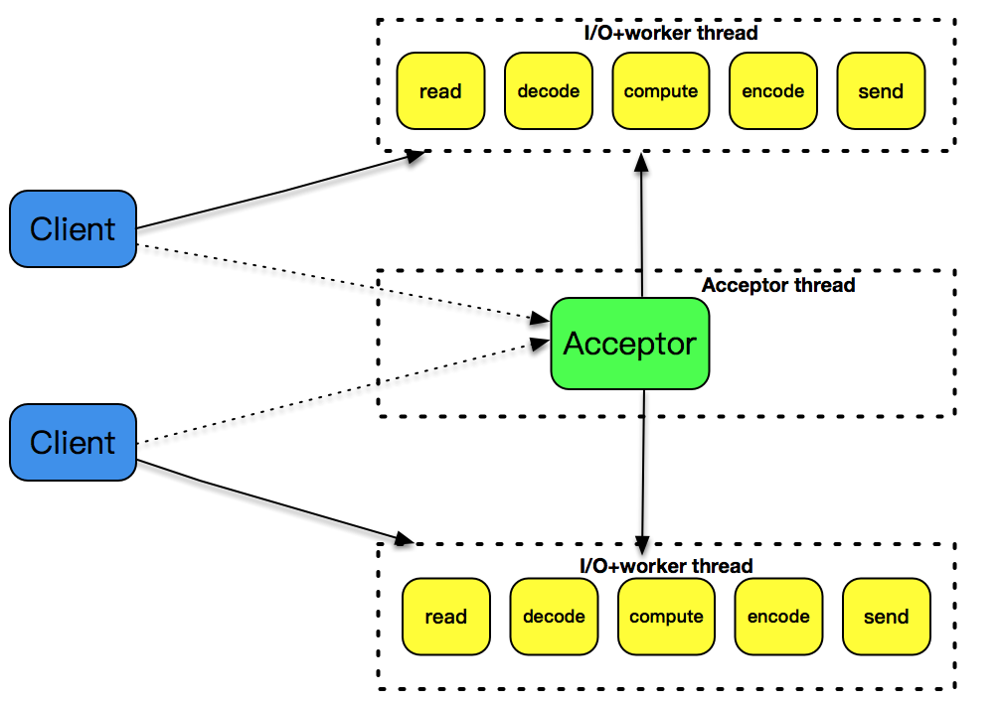
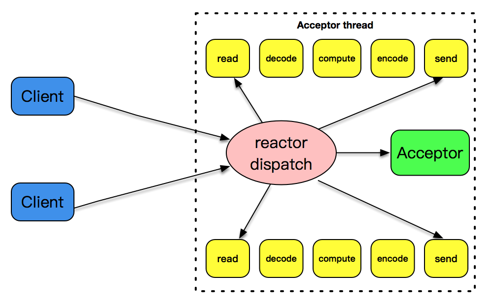
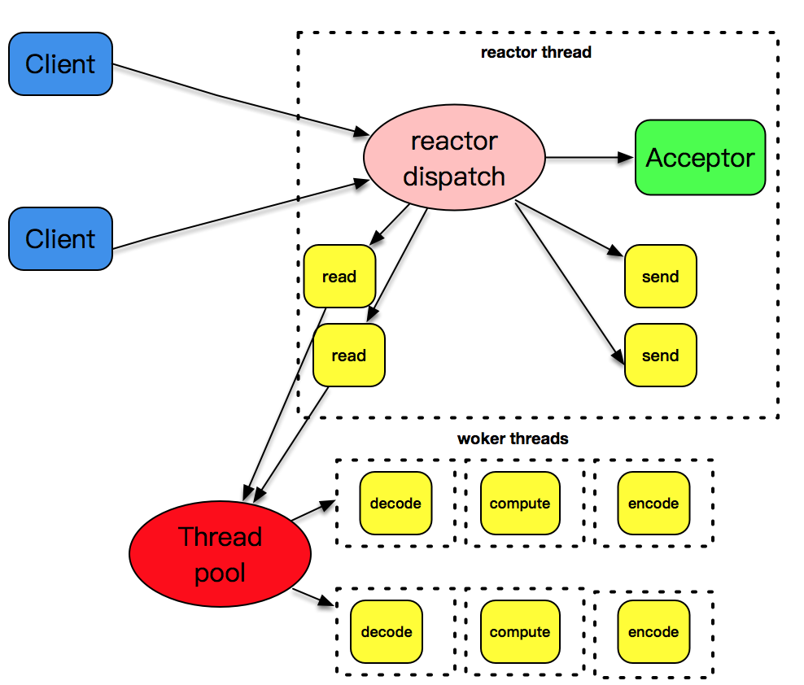
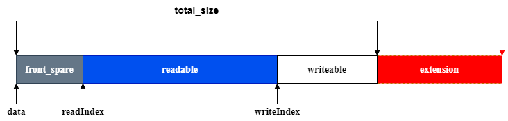

# 事件驱动

事件驱动模型，也被叫做反应堆模型（reactor），或者是 Event loop 模型。这个模型的核心有两点：

- 它存在一个无限循环的事件分发线程，或者叫做 reactor 线程、Event loop 线程。这个事件分发线程的背后，就是 `poll()`、`epoll()` 等 I/O 分发技术的使用
- 所有的 I/O 操作都可以抽象成事件，每个事件必须有回调函数来处理。acceptor上有连接建立成功、已连接套接字上发送缓冲区空出可以写、通信管道 pipe上有数据可以读，这些都是一个个事件，通过事件分发，这些事件都可以一一被检测，并调用对应的回调函数加以处理

# 几种I/O模型和线程模型设计

任何一个网络程序，所做的事情可以总结成下面几种：

- read：从套接字收取数据
- decode：对收到的数据进行解析
- compute：根据解析之后的内容，进行计算和处理
- encode：将处理之后的结果，按照约定的格式进行编码
- send：最后，通过套接字把结果发送出去

这几个过程和套接字最相关的是 read 和 send 这两种。

## fork

`fork()` 创建子进程，为每个到达的客户连接服务。`fork()` 的子进程也越来越多，即使客户和服务器之间的交互比较少，这样的子进程也不能被销毁，一直需要存在。使用 `fork()` 的方式处理非常简单，它的缺点是处理效率不高，`fork()` 子进程的开销太大。



## pthread

因为线程是比进程更轻量级的执行单位，所以它的效率相比 `fork()` 的方式，有一定的提高。但是，每次创建一个线程的开销仍然是不小的，因此，引入了线程池的概念，预先创建出一个线程池，在每次新连接达到时，从线程池挑选出一个线程为之服务，很好地解决了线程创建的开销。但是，这个模式还是没有解决空闲连接占用资源的问题，如果一个连接在一定时间内没有数据交互，这个连接还是要占用一定的线程资源，直到这个连接消亡为止。



## single reactor thread

一个 reactor 线程上同时负责分发 acceptor 的事件、已连接套接字的 I/O 事件。



## single reactor thread + worker threads

但是上述的设计模式有一个问题，和 I/O 事件处理相比，应用程序的业务逻辑处理是比较耗时的，比如 XML 文件的解析、数据库记录的查找、文件资料的读取和传输、计算型工作的处理等，这些工作相对而言比较独立，它们会拖慢整个反应堆模式的执行效率。

所以，将这些 decode、compute、enode 型工作放置到另外的线程池中，和反应堆线程解耦，是一个比较明智的选择。反应堆线程只负责处理 I/O 相关的工作，业务逻辑相关的工作都被裁剪成一个一个的小任务，放到线程池里由空闲的线程来执行。当结果完成后，再交给反应堆线程，由反应堆线程通过套接字将结果发送出去。



# 程序示例

## buffer

可扩展的读写数据缓冲区：



```
struct buffer {
  char *data;      //实际缓冲
  int readIndex;   //缓冲读取位置
  int writeIndex;  //缓冲写入位置
  int total_size;  //总大小
};
```

实现：

```
/// buffer.c

const char *CRLF = "\r\n";

struct buffer *buffer_new() {
  struct buffer *buf = malloc(sizeof(struct buffer));
  if (!buf) return NULL;

  buf->data = malloc(INIT_BUFFER_SIZE);
  buf->total_size = INIT_BUFFER_SIZE;
  buf->readIndex = 0;
  buf->writeIndex = 0;
  return buf;
}

void buffer_free(struct buffer *buffer) {
  free(buffer->data);
  free(buffer);
}

int buffer_writeable_size(struct buffer *buffer) {
  return buffer->total_size - buffer->writeIndex;
}

int buffer_readable_size(struct buffer *buffer) {
  return buffer->writeIndex - buffer->readIndex;
}

int buffer_front_spare_size(struct buffer *buffer) { return buffer->readIndex; }

static void make_room(struct buffer *buffer, int size) {
  if (buffer_writeable_size(buffer) >= size) {
    return;
  }
  //@ 如果front_spare和writeable的大小加起来可以容纳数据，则把可读数据往前面拷贝
  if (buffer_front_spare_size(buffer) + buffer_writeable_size(buffer) >= size) {
    int readable = buffer_readable_size(buffer);
    int i;
    for (i = 0; i < readable; i++) {
      memcpy(buffer->data + i, buffer->data + buffer->readIndex + i, 1);
    }
    buffer->readIndex = 0;
    buffer->writeIndex = readable;
  } else {
    //@ 扩大缓冲区
    void *tmp = realloc(buffer->data, buffer->total_size + size);
    if (tmp == NULL) {
      return;
    }
    buffer->data = tmp;
    buffer->total_size += size;
  }
}

int buffer_append(struct buffer *buffer, void *data, int size) {
  if (data != NULL) {
    make_room(buffer, size);
    //@ 拷贝数据到可写空间中
    memcpy(buffer->data + buffer->writeIndex, data, size);
    buffer->writeIndex += size;
  }
}

int buffer_append_char(struct buffer *buffer, char data) {
  make_room(buffer, 1);
  //@ 拷贝数据到可写空间中
  buffer->data[buffer->writeIndex++] = data;
}

int buffer_append_string(struct buffer *buffer, char *data) {
  if (data != NULL) {
    int size = strlen(data);
    buffer_append(buffer, data, size);
  }
}

int buffer_socket_read(struct buffer *buffer, int fd) {
  char additional_buffer[INIT_BUFFER_SIZE];
  struct iovec vec[2];
  int max_writable = buffer_writeable_size(buffer);
  vec[0].iov_base = buffer->data + buffer->writeIndex;
  vec[0].iov_len = max_writable;
  vec[1].iov_base = additional_buffer;
  vec[1].iov_len = sizeof(additional_buffer);
  int result = readv(fd, vec, 2);
  if (result < 0) {
    return -1;
  } else if (result <= max_writable) {
    buffer->writeIndex += result;
  } else {
    buffer->writeIndex = buffer->total_size;
    buffer_append(buffer, additional_buffer, result - max_writable);
  }
  return result;
}

char buffer_read_char(struct buffer *buffer) {
  char c = buffer->data[buffer->readIndex];
  buffer->readIndex++;
  return c;
}

char *buffer_find_CRLF(struct buffer *buffer) {
  char *crlf = memmem(buffer->data + buffer->readIndex,
                      buffer_readable_size(buffer), CRLF, 2);
  return crlf;
}
```

## channel

```
struct channel {
  int fd;
  int events;  //@ 表示 event 类型

  event_read_callback eventReadCallback;
  event_write_callback eventWriteCallback;
  void *data;  //@  callback data,
               //@  可能是event_loop，也可能是tcp_server或者tcp_connection
};
```

实现：

```
struct channel *channel_new(int fd, int events,
                            event_read_callback eventReadCallback,
                            event_write_callback eventWriteCallback,
                            void *data) {
  struct channel *chan = malloc(sizeof(struct channel));
  chan->fd = fd;
  chan->events = events;
  chan->eventReadCallback = eventReadCallback;
  chan->eventWriteCallback = eventWriteCallback;
  chan->data = data;
  return chan;
}

int channel_write_event_is_enabled(struct channel *channel) {
  return channel->events & EVENT_WRITE;
}

int channel_write_event_enable(struct channel *channel) {
  struct event_loop *eventLoop = (struct event_loop *)channel->data;
  channel->events = channel->events | EVENT_WRITE;
  event_loop_update_channel_event(eventLoop, channel->fd, channel);
}

int channel_write_event_disable(struct channel *channel) {
  struct event_loop *eventLoop = (struct event_loop *)channel->data;
  channel->events = channel->events & ~EVENT_WRITE;
  event_loop_update_channel_event(eventLoop, channel->fd, channel);
}
```

## event_loop

```
struct channel_element {
  int type;  //@ 1: add  2: delete
  struct channel *channel;
  struct channel_element *next;
};

struct event_loop {
  int quit;
  const struct event_dispatcher *eventDispatcher;

  //@ 对应的 event_dispatcher 的数据
  void *event_dispatcher_data;
  struct channel_map *channelMap;

  int is_handle_pending;
  struct channel_element *pending_head;
  struct channel_element *pending_tail;

  pthread_t owner_thread_id;
  pthread_mutex_t mutex;
  pthread_cond_t cond;
  int socketPair[2];
  char *thread_name;
};
```


