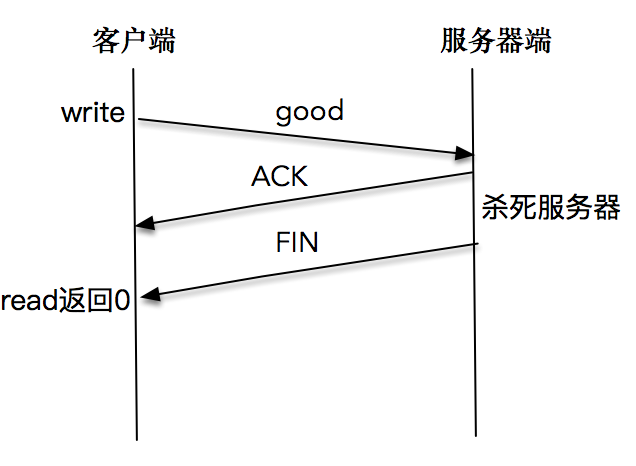
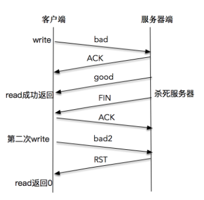
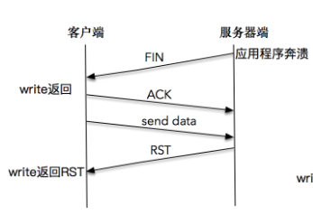

# TCP是可靠的？

发送端通过调用 `send()` 函数之后，数据流并没有马上通过网络传输出去，而是存储在套接字的发送缓冲区中，由网络协议栈决定何时发送、如何发送。当对应的数据发送给接收端，接收端回应 ACK，存储在发送缓冲区的这部分数据就可以删除了，但是，发送端并无法获取对应数据流的 ACK 情况，也就是说，发送端没有办法判断对端的接收方是否已经接收发送的数据流，如果需要知道这部分信息，就必须在应用层自己添加处理逻辑，例如显式的报文确认机制。

从接收端来说，也没有办法保证 ACK 过的数据部分可以被应用程序处理，因为数据需要接收端程序从接收缓冲区中拷贝，可能出现的状况是，已经 ACK 的数据保存在接收端缓冲区中，接收端处理程序突然崩溃了，这部分数据就没有办法被应用程序继续处理。

# 故障模式总结

故障分为两大类：

- 一类是对端无 FIN 包，需要通过巡检或超时来发现
- 另一类是对端有 FIN 包发出，需要通过增强 `read()` 或 `write()` 操作的异常处理，发现此类异常


## 对端无 FIN 包发送

### 网络中断造成的对端无  FIN 包

在这种情况下，TCP 程序并不能及时感知到异常信息。除非网络中的其他设备，如路由器发出一条 ICMP 报文，说明目的网络或主机不可达，这个时候通过 `read()` 或 `write()` 调用就会返回 Unreachable 的错误。可惜大多数时候并不是如此，在没有 ICMP 报文的情况下，TCP 程序并不能理解感应到连接异常。如果程序是阻塞在 `read()` 调用上，程序无法从异常中恢复。这显然是非常不合理的，不过，我们可以通过给 `read()` 操作设置超时来解决。

如果程序先调用了 `write()` 操作发送了一段数据流，接下来阻塞在 `read()` 调用上，结果会非常不同。Linux 系统的 TCP 协议栈会不断尝试将发送缓冲区的数据发送出去，大概在重传12次、合计时间约为9分钟之后，协议栈会标识该连接异常，这时，阻塞的 `read()` 调用会返回一条 TIMEOUT 的错误信息。如果此时程序还执着地往这条连接写数据，写操作会立即失败，返回一个 `SIGPIPE` 信号给应用程序。

### 系统崩溃造成的对端无 FIN 包

当系统突然崩溃，如断电时，网络连接上来不及发出任何东西。这里和通过系统调用杀死应用程序非常不同的是，没有任何 FIN 包被发送出来。这种情况和网络中断造成的结果非常类似，在没有 ICMP 报文的情况下，TCP 程序只能通过 `read()` 和 `write()` 调用得到网络连接异常的信息，超时错误是一个常见的结果。

不过还有一种情况需要考虑，那就是系统在崩溃之后又重启，当重传的 TCP 分组到达重启后的系统，由于系统中没有该 TCP 分组对应的连接数据，系统会返回一个 RST 重置分节，TCP 程序通过 `read()` 或 `write()` 调用可以分别对 RST 进行错误处理。

如果是阻塞的 `read()` 调用，会立即返回一个错误，错误信息为连接重置（Connection Reset）。

如果是一次 `write()` 操作，也会立即失败，应用程序会被返回一个 `SIGPIPE` 信号。

# 对端有 FIN 包发出

对端如果有 FIN 包发出，可能的场景是对端调用了 `close()` 或 `shutdown()` 显式地关闭了连接，也可能是对端应用程序崩溃，操作系统内核代为清理所发出的。从应用程序角度上看，无法区分是哪种情形。

阻塞的 `read()` 操作在完成正常接收的数据读取之后，FIN 包会通过返回一个 `EOF` 来完成通知，此时，`read()` 调用返回值为0。这里强调一点，收到 FIN 包之后`read()` 操作不会立即返回。可以这样理解，收到 FIN 包相当于往接收缓冲区里放置了一个 `EOF` 符号，之前已经在接收缓冲区的有效数据不会受到影响。

## 客户端程序

```
#include <errno.h>
#include <netinet/in.h>
#include <stdio.h>
#include <stdlib.h>
#include <string.h>
#include <sys/socket.h>
#include <sys/types.h>
#include <sys/un.h>
#include <unistd.h>

#define MESSAGE_SIZE 102400000
#define SERV_PORT 12345

int tcp_client(char *address, int port) {
  int socket_fd;
  socket_fd = socket(AF_INET, SOCK_STREAM, 0);

  struct sockaddr_in server_addr;
  bzero(&server_addr, sizeof(server_addr));
  server_addr.sin_family = AF_INET;
  server_addr.sin_port = htons(port);
  inet_pton(AF_INET, address, &server_addr.sin_addr);

  socklen_t server_len = sizeof(server_addr);
  int connect_rt =
      connect(socket_fd, (struct sockaddr *)&server_addr, server_len);
  if (connect_rt < 0) {
    fprintf(stderr, "connect() failed:%s\n", strerror(errno));
    exit(EXIT_FAILURE);
  }

  return socket_fd;
}

int main(int argc, char **argv) {
  if (argc != 2) {
    printf("usage:%s <Ipaddress>\n", argv[0]);
    exit(EXIT_SUCCESS);
  }

  int socket_fd = tcp_client(argv[1], SERV_PORT);
  char buf[129];
  int len;
  int rc;

  while (fgets(buf, sizeof(buf), stdin) != NULL) {
    len = strlen(buf);
    rc = send(socket_fd, buf, len, 0);
    if (rc < 0) {
      fprintf(stderr, "send() failed:%s\n", strerror(errno));
      exit(EXIT_FAILURE);
    }
    sleep(3);
    rc = read(socket_fd, buf, sizeof(buf));
    if (rc < 0) {
      fprintf(stderr, "read() failed:%s\n", strerror(errno));
      exit(EXIT_FAILURE);
    } else if (rc == 0) {
      fprintf(stderr, "peer connection closed\n");
      exit(EXIT_FAILURE);
    } else
      fputs(buf, stdout);
  }
  exit(0);
}
```

## 服务端程序

```
#include <errno.h>
#include <netinet/in.h>
#include <signal.h>
#include <stdio.h>
#include <stdlib.h>
#include <string.h>
#include <sys/socket.h>
#include <sys/types.h>
#include <sys/un.h>
#include <unistd.h>

#define SERV_PORT 12345

int tcp_server(int port) {
  int listenfd;
  listenfd = socket(AF_INET, SOCK_STREAM, 0);

  struct sockaddr_in server_addr;
  bzero(&server_addr, sizeof(server_addr));
  server_addr.sin_family = AF_INET;
  server_addr.sin_addr.s_addr = htonl(INADDR_ANY);
  server_addr.sin_port = htons(port);

  int on = 1;
  setsockopt(listenfd, SOL_SOCKET, SO_REUSEADDR, &on, sizeof(on));

  int rt1 =
      bind(listenfd, (struct sockaddr *)&server_addr, sizeof(server_addr));
  if (rt1 < 0) {
    fprintf(stderr, "bind() failed:%s\n", strerror(errno));
    exit(EXIT_FAILURE);
  }

  int rt2 = listen(listenfd, 1024);
  if (rt2 < 0) {
    fprintf(stderr, "listen() failed:%s\n", strerror(errno));
    exit(EXIT_FAILURE);
  }

  signal(SIGPIPE, SIG_IGN);

  int connfd;
  struct sockaddr_in client_addr;
  socklen_t client_len = sizeof(client_addr);

  if ((connfd = accept(listenfd, (struct sockaddr *)&client_addr,
                       &client_len)) < 0) {
    fprintf(stderr, "accept() failed:%s\n", strerror(errno));
    exit(EXIT_FAILURE);
  }

  return connfd;
}

int main(int argc, char **argv) {
  int connfd;
  char buf[1024];

  connfd = tcp_server(SERV_PORT);

  for (;;) {
    int n = read(connfd, buf, 1024);
    if (n < 0) {
      fprintf(stderr, "read() failed:%s\n", strerror(errno));
      exit(EXIT_FAILURE);
    } else if (n == 0) {
      fprintf(stderr, "client closed\n");
      exit(EXIT_SUCCESS);
    }

    sleep(5);

    int write_nc = send(connfd, buf, n, 0);
    printf("send bytes: %zu \n", write_nc);
    if (write_nc < 0) {
      fprintf(stderr, "send() failed:%s\n", strerror(errno));
      exit(EXIT_FAILURE);
    }
  }

  exit(0);
}
```

### `read()` 直接感知 FIN 包

依次启动服务器端和客户端程序，在客户端输入 "good" 字符串之后，迅速结束掉服务器端程序，这里需要赶在服务器端从睡眠中苏醒之前杀死服务器程序

```
./reliable_client localhost
good
peer connection closed
```

这说明客户端程序通过 `read()` 调用，感知到了服务端发送的 FIN 包，于是正常退出了客户端程序：



### 通过 `write()` 产生 RST，`read()` 调用感知 RST

依次启动服务器端和客户端程序，在客户端输入 "bad" 字符串之后，等待一段时间，直到客户端正确显示了服务端的回应 "bad" 字符之后，再杀死服务器程序。客户端再次输入 "bad2"：

```
./reliable_client localhost
bad
bad
bad2
peer connection closed
```



## 向一个已关闭连接连续写，最终导致 SIGPIPE

### 服务端程序

```
#include <errno.h>
#include <netinet/in.h>
#include <signal.h>
#include <stdio.h>
#include <stdlib.h>
#include <string.h>
#include <sys/socket.h>
#include <sys/types.h>
#include <sys/un.h>
#include <unistd.h>

#define SERV_PORT 12345

int tcp_server(int port) {
  int listenfd;
  listenfd = socket(AF_INET, SOCK_STREAM, 0);

  struct sockaddr_in server_addr;
  bzero(&server_addr, sizeof(server_addr));
  server_addr.sin_family = AF_INET;
  server_addr.sin_addr.s_addr = htonl(INADDR_ANY);
  server_addr.sin_port = htons(port);

  int on = 1;
  setsockopt(listenfd, SOL_SOCKET, SO_REUSEADDR, &on, sizeof(on));

  int rt1 =
      bind(listenfd, (struct sockaddr *)&server_addr, sizeof(server_addr));
  if (rt1 < 0) {
    fprintf(stderr, "bind() failed:%s\n", strerror(errno));
    exit(EXIT_FAILURE);
  }

  int rt2 = listen(listenfd, 1024);
  if (rt2 < 0) {
    fprintf(stderr, "listen() failed:%s\n", strerror(errno));
    exit(EXIT_FAILURE);
  }

  signal(SIGPIPE, SIG_IGN);

  int connfd;
  struct sockaddr_in client_addr;
  socklen_t client_len = sizeof(client_addr);

  if ((connfd = accept(listenfd, (struct sockaddr *)&client_addr,
                       &client_len)) < 0) {
    fprintf(stderr, "accept() failed:%s\n", strerror(errno));
    exit(EXIT_FAILURE);
  }

  return connfd;
}

int main(int argc, char **argv) {
  int connfd;
  char buf[1024];

  connfd = tcp_server(SERV_PORT);

  for (;;) {
    int n = read(connfd, buf, 1024);
    if (n < 0) {
      fprintf(stderr, "read() failed:%s\n", strerror(errno));
      exit(EXIT_FAILURE);
    } else if (n == 0) {
      fprintf(stderr, "client closed\n");
      exit(EXIT_SUCCESS);
    }

    sleep(5);

    int write_nc = send(connfd, buf, n, 0);
    printf("send bytes: %zu \n", write_nc);
    if (write_nc < 0) {
      fprintf(stderr, "send() failed:%s\n", strerror(errno));
      exit(EXIT_FAILURE);
    }
  }

  exit(0);
}
```

### 客户端程序

```
#include <errno.h>
#include <netinet/in.h>
#include <stdio.h>
#include <stdlib.h>
#include <string.h>
#include <sys/socket.h>
#include <sys/types.h>
#include <sys/un.h>
#include <unistd.h>

#define MESSAGE_SIZE 102400000
#define SERV_PORT 12345

int tcp_client(char *address, int port) {
  int socket_fd;
  socket_fd = socket(AF_INET, SOCK_STREAM, 0);

  struct sockaddr_in server_addr;
  bzero(&server_addr, sizeof(server_addr));
  server_addr.sin_family = AF_INET;
  server_addr.sin_port = htons(port);
  inet_pton(AF_INET, address, &server_addr.sin_addr);

  socklen_t server_len = sizeof(server_addr);
  int connect_rt =
      connect(socket_fd, (struct sockaddr *)&server_addr, server_len);
  if (connect_rt < 0) {
    fprintf(stderr, "connect() failed:%s\n", strerror(errno));
    exit(EXIT_FAILURE);
  }

  return socket_fd;
}

int main(int argc, char **argv) {
  if (argc != 2) {
    printf("usage:%s <Ipaddress>\n", argv[0]);
    exit(EXIT_SUCCESS);
  }

  int socket_fd = tcp_client(argv[1], SERV_PORT);
  char buf[129];
  int len;
  int rc;

  while (fgets(buf, sizeof(buf), stdin) != NULL) {
    len = strlen(buf);
    rc = send(socket_fd, buf, len, 0);
    if (rc < 0) {
      fprintf(stderr, "send() failed:%s\n", strerror(errno));
      exit(EXIT_FAILURE);
    }
    sleep(3);
    rc = read(socket_fd, buf, sizeof(buf));
    if (rc < 0) {
      fprintf(stderr, "read() failed:%s\n", strerror(errno));
      exit(EXIT_FAILURE);
    } else if (rc == 0) {
      fprintf(stderr, "peer connection closed\n");
      exit(EXIT_FAILURE);
    } else
      fputs(buf, stdout);
  }
  exit(0);
}
```

如果在服务端读取数据并处理过程中，突然杀死服务器进程，我们会看到客户端很快也会退出：

```
send into buffer -1
send() failed:Connection reset by peer
```



这是因为服务端程序被杀死之后，操作系统内核会做一些清理的事情，为这个套接字发送一个 FIN 包，但是，客户端在收到 FIN 包之后，没有 `read()` 操作，还是会继续往这个套接字写入数据。这是因为根据 TCP 协议，连接是双向的，收到对方的 FIN 包只意味着对方不会再发送任何消息。 在一个双方正常关闭的流程中，收到 FIN 包的一端将剩余数据发送给对面（通过一次或多次 `write()` ），然后关闭套接字。

当数据到达服务器端时，操作系统内核发现这是一个指向关闭的套接字，会再次向客户端发送一个 RST 包，对于发送端而言如果此时再执行 `write()` 操作，立即会返回一个 RST 错误信息。