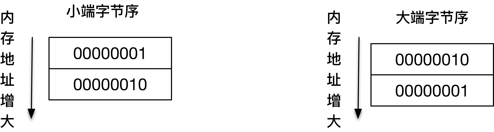
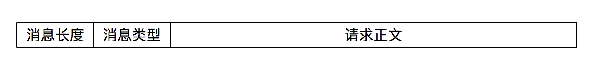
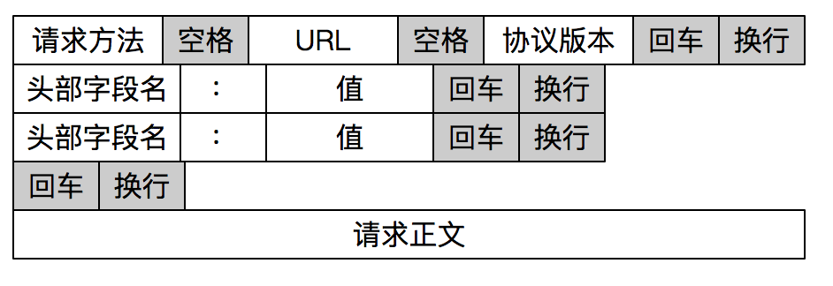

# TCP 是一种流式协议

TCP数据流特性决定了字节流本身是没有边界的。

假设要发送报文： "network" 和 "program" ，可能的情况是：

- 一次性将 "network" 和 "program" 在一个 TCP 分组中发送出去：

```
...xxxnetworkprogramxxx...
```

- "program" 的部分随 "network" 在一个 TCP 分组中发送出去

```
/// TCP 分组 1
...xxxxxnetworkpro

/// TCP 分组 2
gramxxxxxxxxxx...
```

- "network" 的一部分随 TCP 分组被发送出去，另一部分和 "program" 一起随另一个 TCP 分组发送出去

```
/// TCP 分组 1
...xxxxxxxxxxxnet

/// TCP 分组 2
workprogramxxx...
```

实际上类似的组合可以枚举出无数种。不管是哪一种，核心的问题就是，我们不知道 "network" 和 "program" 这两个报文是如何进行 TCP 分组传输的。换言之，我们在发送数据的时候，不应该假设 "数据流和TCP分组是一种映射关系"。就好像在前面，我们似乎觉得 "network" 这个报文一定对应一个TCP分组，这是完全不正确的。

再来看客户端，数据流的特征更明显，如果我们使用 `recv()` 从接收端缓冲区读取数据，发送端缓冲区的数据是以字节流的方式存在的，无论发送端如何构造 TCP分组，接收端最终受到的字节流总是像下面这样：

```
xxxxxxxxxxxxxxxxxnetworkprogramxxxxxxxxxxxx
```

关于接收端字节流，有两点需要注意：

- 这里 "netwrok" 和 "program" 的顺序肯定是会保持的，也就是说，先调用 `send()` 函数发送的字节，总在后调用 `send()` 函数发送字节的前面，这个是由TCP严格保证的
- 如果发送过程中有 TCP 分组丢失，但是其后续分组陆续到达，那么 TCP 协议栈会缓存后续分组，直到前面丢失的分组到达，最终，形成可以被应用程序读取的数据流

# 网络字节排序

字节流在网络上的传输，是通过二进制来完成的。比如 `0x0201` 可以表示为：



但是在网络传输中，必须保证双方都用同一种标准来表达，网络协议使用的是大端字节序。

为了保证网络字节序一致，POSIX 标准提供了如下的转换函数：

```
uint16_t htons (uint16_t hostshort)
uint16_t ntohs (uint16_t netshort)
uint32_t htonl (uint32_t hostlong)
uint32_t ntohl (uint32_t netlong)
```

- `n` 代表的就是 `network`，`h` 代表的是 `host`。`s` 表示的是 `short`，`l` 表示的是 `long`，分别表示 16 位和 32 位的整数

# 报文读取和解析

报文格式实际上定义了字节的组织形式，发送端和接收端都按照统一的报文格式进行数据传输和解析，这样就可以保证彼此能够完成交流。只有知道了报文格式，接收端才能针对性地进行报文读取和解析工作。

报文格式最重要的是如何确定报文的边界。常见的报文格式有两种方法：

- 一种是发送端把要发送的报文长度预先通过报文告知给接收端
- 另一种是通过一些特殊的字符来进行边界的划分

## 显式编码报文长度



### 客户端程序

```
#include <errno.h>
#include <netinet/in.h>
#include <stdio.h>
#include <stdlib.h>
#include <string.h>
#include <sys/socket.h>
#include <sys/types.h>
#include <sys/uio.h>
#include <sys/un.h>
#include <unistd.h>

#define SERV_PORT (50005)

int main(int argc, char **argv) {
  if (argc != 2) {
    fprintf(stderr, "usage: %s <LocalPath> \n", argv[0]);
    exit(EXIT_FAILURE);
  }

  int socket_fd;
  socket_fd = socket(AF_INET, SOCK_STREAM, 0);

  struct sockaddr_in server_addr;
  bzero(&server_addr, sizeof(server_addr));
  server_addr.sin_family = AF_INET;
  server_addr.sin_port = htons(SERV_PORT);
  inet_pton(AF_INET, argv[1], &server_addr.sin_addr);

  socklen_t server_len = sizeof(server_addr);
  int connect_rt =
      connect(socket_fd, (struct sockaddr *)&server_addr, server_len);
  if (connect_rt < 0) {
    fprintf(stderr, "connect() error:%s\n", strerror(errno));
    exit(EXIT_FAILURE);
  }

  struct {
    u_int32_t message_length;
    u_int32_t message_type;
    char buf[128];
  } message;

  int n;
  while (fgets(message.buf, sizeof(message.buf), stdin) != NULL) {
    n = strlen(message.buf);
    message.message_length = htonl(n);
    message.message_type = 1;
    if (send(socket_fd, (char *)&message,
             sizeof(message.message_length) + sizeof(message.message_type) + n,
             0) < 0) {
      fprintf(stderr, "send() error:%s\n", strerror(errno));
      exit(EXIT_FAILURE);
    }
  }
  exit(0);
}
```

### 服务端程序

服务端程序需要依据协议进行解析。

```
#include <errno.h>
#include <netinet/in.h>
#include <signal.h>
#include <stdio.h>
#include <stdlib.h>
#include <string.h>
#include <sys/socket.h>
#include <sys/types.h>
#include <sys/uio.h>
#include <sys/un.h>
#include <unistd.h>

#define SERV_PORT (50005)

static int s_count;

static void sig_int(int signo) {
  printf("\nreceived %d datagrams\n", s_count);
  exit(0);
}

size_t readn(int fd, void *buffer, size_t length) {
  size_t count;
  ssize_t nread;
  char *ptr;

  ptr = buffer;
  count = length;
  while (count > 0) {
    nread = read(fd, ptr, count);

    if (nread < 0) {
      if (errno == EINTR)
        continue;
      else
        return (-1);
    } else if (nread == 0)
      break;

    count -= nread;
    ptr += nread;
  }
  return (length - count);
}

size_t read_message(int fd, char *buffer, size_t length) {
  u_int32_t msg_length;
  u_int32_t msg_type;
  int rc;

  rc = readn(fd, (char *)&msg_length, sizeof(u_int32_t));
  if (rc != sizeof(u_int32_t)) return rc < 0 ? -1 : 0;
  msg_length = ntohl(msg_length);

  rc = readn(fd, (char *)&msg_type, sizeof(msg_type));
  if (rc != sizeof(u_int32_t)) return rc < 0 ? -1 : 0;

  if (msg_length > length) {
    return -1;
  }

  rc = readn(fd, buffer, msg_length);
  if (rc != msg_length) return rc < 0 ? -1 : 0;
  return rc;
}

int main(int argc, char **argv) {
  int listenfd;
  listenfd = socket(AF_INET, SOCK_STREAM, 0);

  struct sockaddr_in server_addr;
  bzero(&server_addr, sizeof(server_addr));
  server_addr.sin_family = AF_INET;
  server_addr.sin_addr.s_addr = htonl(INADDR_ANY);
  server_addr.sin_port = htons(SERV_PORT);

  int on = 1;
  setsockopt(listenfd, SOL_SOCKET, SO_REUSEADDR, &on, sizeof(on));

  int rt1 =
      bind(listenfd, (struct sockaddr *)&server_addr, sizeof(server_addr));
  if (rt1 < 0) {
    error(1, errno, "bind failed ");
  }

  int rt2 = listen(listenfd, 1024);
  if (rt2 < 0) {
    error(1, errno, "listen failed ");
  }

  signal(SIGPIPE, SIG_IGN);

  int connfd;
  struct sockaddr_in client_addr;
  socklen_t client_len = sizeof(client_addr);

  if ((connfd = accept(listenfd, (struct sockaddr *)&client_addr,
                       &client_len)) < 0) {
    fprintf(stderr, "accept() error:%s\n", strerror(errno));
    exit(EXIT_FAILURE);
  }

  char buf[128];
  s_count = 0;

  while (1) {
    int n = read_message(connfd, buf, sizeof(buf));
    if (n < 0) {
      fprintf(stderr, "read_message() error\n");
      exit(EXIT_FAILURE);
    } else if (n == 0) {
      fprintf(stderr, "client closed\n");
      exit(EXIT_FAILURE);
    }
    buf[n] = 0;
    printf("received %d bytes: %s\n", n, buf);
    s_count++;
  }

  exit(0);
}
```

## 特殊字符作为边界

另外一种报文格式就是通过设置特殊字符作为报文边界。HTTP是一个非常好的例子：



HTTP 通过设置回车符、换行符做为 HTTP 报文协议的边界。

对此编写的解析函数 `read_line()`：

```
int read_line(int fd,char* buf,int size)
{
	int i = 0;
	char c = '\0';
	int n;
	
	while((i < size -1) && (c != '\n'))
	{
		//@ 每次读取一个字节
		n = recv(fd,&c,1,0);
		if(n > 0)
		{
			if(c == '\r')
			{
				n = recv(fd,&c,1,MSG_PEEK);
				if((n > 0) && (c == '\n')){
					recv(fd,&c,1,0);
				}
				else{
					c = '\n';
				}
			}
			
			buf[i] = c;
			i++;
		}
		else{
			buf[i] = '\n';
		}		
	}
	
	buf[i] = '\0';

	return i;	
}
```


