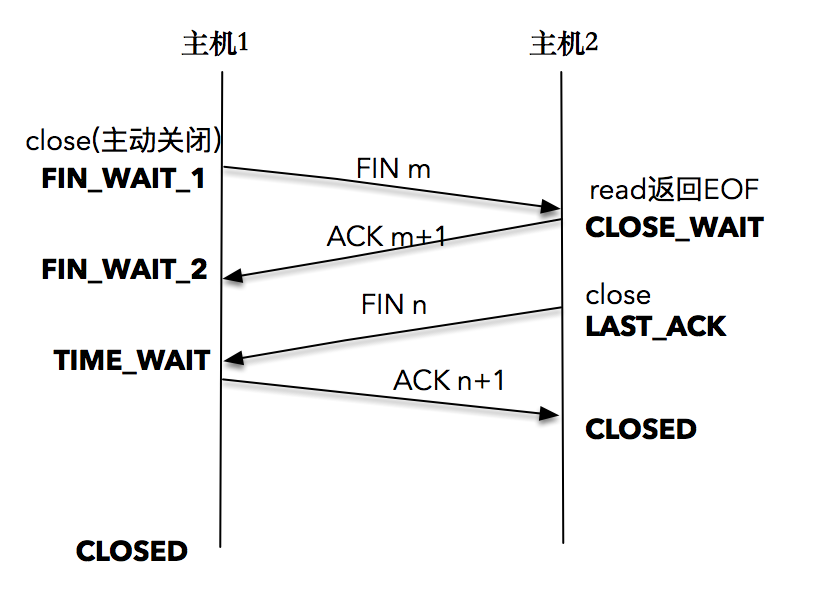

# 如何理解TCP四次握手？



- 首先，一方应用程序调用 `close()`，我们称该方为主动关闭方，该端的TCP发送一个 FIN 包，表示需要关闭连接。之后主动关闭方进入 FIN_WAIT_1 状态
-  接着，接收到这个 FIN 包的对端执行被动关闭。这个 FIN 由 TCP 协议栈处理，TCP协议栈为 FIN 包插入一个文件结束符  `EOF` 到接收缓冲区中，应用程序可以通过 `read()` 调用来感知这个 FIN 包。一定要注意，这个 `EOF` 会被放在已排队等候的其他已接收的数据之后，这就意味着接收端应用程序需要处理这种异常情况，因为 `EOF` 表示在该连接上再无额外数据到达。此时，被动关闭方进入 `CLOSE_WAIT` 状态
- 接下来，被动关闭方将读到这个 `EOF`，于是，应用程序也调用 `close()` 关闭它的套接字，这导致它的 TCP 也发送一个 FIN 包。这样，被动关闭方将进入 LAST_ACK 状态
- 最终，主动关闭方接收到对方的 FIN 包，并确认这个 FIN 包。主动关闭方进入 TIME_WAIT 状态，而接收到 ACK 的被动关闭方则进入 CLOSED 状态。再过 2MSL 时间之后，主动关闭方也进入 CLOSED 状态

每个方向都需要一个 FIN 和一个 ACK ，因此通常被称为四次挥手。当然，这中间使用 `shutdown()`，执行一端到另一端的半关闭也是可以的。

当套接字被关闭时，TCP 为其所在端发送一个 FIN 包。在大多数情况下，这是由应用进程调用 `close()` 而发生的，值得注意的是，一个进程无论是正常退出（`exit()` 或者 `main()` 返回），还是非正常退出（比如，收到 `SIGKILL` 信号关闭，就是我们常常干的kill -9），所有该进程打开的描述符都会被系统关闭，这也导致 TCP 描述符对应的连接上发出一个 FIN 包。

无论是客户端还是服务器，任何一端都可以发起主动关闭。大多数真实情况是客户端执行主动关闭，但是 HTTP/1.0 却是由服务器发起主动关闭的。

# 最大分组 MSL

MSL 是任何 IP 数据报能够在因特网中存活的最长时间。其实它的实现不是靠计时器来完成的，在每个数据报里都包含有一个被称为 TTL（time to live）的 8 位字段，它的最大值为255。TTL 可译为“生存时间”，这个生存时间由源主机设置初始值，它表示的是一个 IP 数据报可以经过的最大跳跃数，每经过一个路由器，就相当于经过了一跳，它的值就减1，当此值减为 0 时，则所在的路由器会将其丢弃，同时发送 ICMP 报文通知源主机。RFC793 中规定 MSL 的时间为2分钟，Linux 实际设置为30秒。

# 关于 listen 函数中参数 backlog 的释义问题

`backlog` 的值含义从来就没有被严格定义过。原先 Linux 实现中，`backlog` 参数定义了该套接字对应的未完成连接队列的最大长度 （pending connections)。如果一个连接到达时，该队列已满，客户端将会接收一个 `ECONNREFUSED` 的错误信息，如果支持重传，该请求可能会被忽略，之后会进行一次重传。

从 Linux 2.2 开始，`backlog` 的参数内核有了新的语义，它现在定义的是已完成连接队列的最大长度，表示的是已建立的连接（established connection），正在等待被接收（`accept()` 调用返回），而不是原先的未完成队列的最大长度。现在，未完成队列的最大长度值可以通过 `/proc/sys/net/ipv4/tcp_max_syn_backlog` 完成修改，默认值为128。

至于已完成连接队列，如果声明的 `backlog`参数比 `/proc/sys/net/core/somaxconn` 的参数要大，那么就会使用我们声明的那个值。

设计良好的程序，在128固定值的情况下也是可以支持成千上万的并发连接的，这取决于I/O分发的效率，以及多线程程序的设计。

# UDP 连接和断开套接字的过程是怎样的？

UDP 连接套接字不是发起连接请求的过程，而是记录目的地址和端口到套接字的映射关系。

断开套接字则相反，将删除原来记录的映射关系。

# 在UDP中不进行connect，为什么客户端会收到信息？

在 `connect()`场景里，我们讨论的是 ICMP 报文和 socket 之间的定位。我们知道，ICMP 报文发送的是一个不可达的信息，不可达的信息是通过目的地址和端口来区分的，如果没有 `connect()` 操作，目的地址和端口就没有办法和 socket 套接字进行对应，所以，即使收到了 ICMP 报文，内核也没有办法通知到对应的应用程序，告诉它连接地址不可达。

在不 `connect()` 的情况下，我们的客户端又可以收到服务器回显的信息了，先通过 `recvfrom()` 函数调用获取了客户端的地址和端口信息，这当然是可以的，因为 UDP 报文里面包含了这部分信息。然后我们看到服务器端又通过调用 `sendto()` 函数，把客户端的地址和端口信息告诉了内核协议栈，可以肯定的是，之后发送的 UDP 报文就带上了客户端的地址和端口信息，通过客户端的地址和端口信息，可以找到对应的套接字和应用程序，完成数据的收发。

```
//@ 服务器端程序，先通过recvfrom函数调用获取了客户端的地址和端口信息
int n = recvfrom(socket_fd, message, MAXLINE, 0, (struct sockaddr *) &client_addr, &client_len);
message[n] = 0;
printf("received %d bytes: %s\n", n, message);

char send_line[MAXLINE];
sprintf(send_line, "Hi, %s", message);

//@ 服务器端程序调用send函数，把客户端的地址和端口信息告诉了内核
sendto(socket_fd, send_line, strlen(send_line), 0, (struct sockaddr *) &client_addr, client_len);
```

这里的 `connect()` 的作用是记录客户端目的地址和端口–套接字的关系，而之所以能正确收到从服务器端发送的报文，那是因为系统已经记录了客户端源地址和端口–套接字的映射关系。

# 我们是否可以对一个 UDP套接字进行多次 connect 的操作?

对于 TCP 套接字，`connect()` 只能调用一次。但是，对一个 UDP 套接字来说，进行多次 `connect()` 操作是被允许的，这样主要有两个作用：

- 第一个作用是可以重新指定新的IP地址和端口号
- 第二个作用是可以断开一个已连接的套接字

为了断开一个已连接的 UDP 套接字，第二次调用 `connect()` 时，调用方需要把套接字地址结构的地址族成员设置为 `AF_UNSPEC`。

