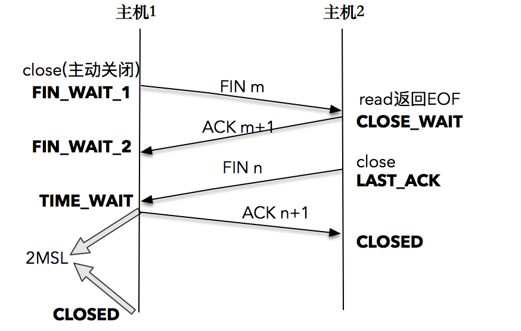

# TIME_WAIT 发生的场景

应用服务需要通过发起 TCP 连接对外提供服务。每个连接会占用一个本地端口，当在高并发的情况下，`TIME_WAIT` 状态的连接过多，多到把本机可用的端口耗尽，应用服务对外表现的症状，就是不能正常工作了。当过了一段时间之后，处于 `TIME_WAIT` 的连接被系统回收并关闭后，释放出本地端口可供使用，应用服务对外表现为，可以正常工作。



TCP 连接终止时，主机 1 先发送 `FIN` 报文，主机 2 进入 `CLOSE_WAIT` 状态，并发送一个 `ACK` 应答，同时，主机 2 通过 `read()` 调用获得 `EOF`，并将此结果通知应用程序进行主动关闭操作，发送 `FIN` 报文。主机 1 在接收到 `FIN` 报文后发送 `ACK` 应答，此时主机 1 进入`TIME_WAIT` 状态。

主机 1 在 `TIME_WAIT` 停留持续时间是固定的，是最长分节生命期 MSL(maximum segment lifetime) 的两倍，一般称之为 2MSL。和大多数 BSD 派生的系统一样，Linux 系统里有一个硬编码的字段，名称为 `TCP_TIMEWAIT_LEN`，其值为 60 秒。也就是说 Linux 系统停留在 `TIME_WAIT` 的时间为固定的 6 0秒。

过了这个时间之后，主机 1 就进入 `CLOSED` 状态。一定要记住一点，只有发起连接终止的一方会进入 `TIME_WAIT` 状态。

# TIME_WAIT 的作用

`TIME_WAIT` 主要基于两个目的：

- 实现可靠的连接终止
- 让老的重复的报文段在网络中过期失效，这样在建立新的连接时将不接收它们

**确保能可靠地终止连接**

为了确保可靠的终止连接需要交换 4 个报文，其中最后一个 `ACK` 报文是从执行主动关闭的一方发往被动关闭的一方，如果这个 `ACK` 包在网络中被丢弃，那么执行 TCP 被动关闭的一方最终会重传它的 `FIN` 报文，让执行 TCP 主动关闭的一方保持 `TIME_WAIT` 状态一段时间，可以确保它在这种情况下可以重新发送最后的 `ACK`  确认报文。如果执行主动关闭的一方已经不存在了，那么由于它不再持有关于连接的任何状态信息，TCP 协议将针对对端重发的 `FIN` 发送一个 `RST` 给执行被动关闭的一方以作为响应，而这个 `RST`  将被解释为错误。这也是 `TIME_WAIT` 状态持续 2 倍 MSL 的原因：

- 1 个 MSL 时间留给最后的 `ACK` 确认报文到达对端的 TCP 节点
- 1 个 MSL 时间留给必须发送的 `FIN` 报文

**确保老的重复的报文在网络中过期失效**

TCP 重传算法可能会产生重复的报文，并且根据路由的选择，这些重复的报文可能会再连接已经终止后才到达，比如 `204.152.189.116:21` 和 `200.0.0.1:50000` 之间的连接已经关闭了，之后使用同样的 IP 地址和端口重新建立连接，这可以看做是原来连接的新化身，在这种情况下，TCP 必须确保上一次连接中老的重复报文不会在新连接中被当成合法数据接收，当有 TCP 节点处于 `TIME_WAIT` 状态时是无法通过该节点创建新的连接的。

**2MSL 计时：**

2MSL 的时间是从主机 1 接收到 `FIN` 后发送 `ACK` 开始计时的；如果在 `TIME_WAIT` 时间内，因为主机 1 的 `ACK` 没有传输到主机 2，主机 1 又接收到了主机 2 重发的 `FIN` 报文，那么 2MSL 时间将重新计时。道理很简单，因为 2MSL 的时间，目的是为了让旧连接的所有报文都能自然消亡，现在主机 1 重新发送了 `ACK` 报文，自然需要重新计时，以便防止这个 `ACK` 报文对新可能的连接化身造成干扰。

# TIME_WAIT 的危害

过多的 `TIME_WAIT` 的主要危害有两种：

- 第一是内存资源占用，这个目前看来不是太严重，基本可以忽略
- 第二是对端口资源的占用，一个TCP连接至少消耗一个本地端口，端口资源也是有限的，一般可以开启的端口为 32768～61000 ，也可以通过`/proc/sys/net/ipv4/ip_local_port_range` 指定，如果 `TIME_WAIT` 状态过多，会导致无法创建新连接。

# 优化 TIME_WAIT

## net.ipv4.tcp_max_tw_buckets

一个暴力的方法是通过 `sysctl` 命令，将系统值调小。这个值默认为18000，当系统中处于 `TIME_WAIT` 的连接一旦超过这个值时，系统就会将所有的 `TIME_WAIT` 连接状态重置，并且只打印出警告信息。这个方法过于暴力，而且治标不治本，带来的问题远比解决的问题多，不推荐使用。

## 调低 TCP_TIMEWAIT_LEN，重新编译系统

这个方法是一个不错的方法，但是需要重新编译内核。

## SO_LINGER 的设置

英文单词 “linger” 的意思为停留，可以通过设置套接字选项，来设置调用 `close()` 或者 `shutdown()` 关闭连接时的行为。

```
#include <sys/types.h>          /* See NOTES */
#include <sys/socket.h>

int setsockopt(int sockfd, int level, int optname,const void *optval, socklen_t optlen);
```

```
struct linger {
　int　 l_onoff;　　　　/* 0=off, nonzero=on */
　int　 l_linger;　　　　/* linger time, POSIX specifies units as seconds */
}
```

- 如果`l_onoff`为 0，那么关闭本选项。`l_linger`的值被忽略，这对应了默认行为，`close()` 或 `shutdown()` 立即返回。如果在套接字发送缓冲区中有数据残留，系统会将试着把这些数据发送出去
- 如果`l_onoff`为非 0， 且`l_linger`值为 0，那么调用 `close()` 后，会立该发送一个 `RST` 标志给对端，该 TCP 连接将跳过四次挥手，也就跳过了`TIME_WAIT` 状态，直接关闭。这种关闭的方式称为“强行关闭”。 在这种情况下，排队数据不会被发送，被动关闭方也不知道对端已经彻底断开。只有当被动关闭方正阻塞在 `recv()` 调用上时，接受到 `RST` 时，会立刻得到一 个 “connet reset by peer” 的异常，但这个是非常危险的行为，不值得提倡
- 如果`l_onoff`为非 0， 且`l_linger`的值也非 0，那么调用 `close()` 后，调用 `close()` 的线程就将阻塞，直到数据被发送出去，或者设置的`l_linger`计时时间到

```
struct linger so_linger;
so_linger.l_onoff = 1;
so_linger.l_linger = 0;
setsockopt(s,SOL_SOCKET,SO_LINGER, &so_linger,sizeof(so_linger));
```

## net.ipv4.tcp_tw_reuse

这是比较安全的设置：

- 只适用于连接发起方（C/S模型中的客户端）
- 对应的 `TIME_WAIT` 状态的连接创建时间超过1秒才可以被复用

使用这个选项，还有一个前提，需要打开对TCP时间戳的支持，即 `net.ipv4.tcp_timestamps=1`（默认即为1）。


