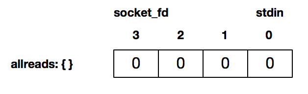
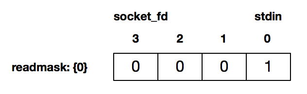

# I/O多路复用

多路复用的意思，就是在任何一路 I/O 有 "事件" 发生的情况下，通知应用程序去处理相应的 I/O 事件，这样程序就变成了 "多面手"，在同一时刻仿佛可以处理多个 I/O 事件。

使用 `select()` 函数，通知内核挂起进程，当一个或多个 I/O 事件发生后，控制权返还给应用程序，由应用程序进行 I/O 事件的处理。

这些I/O事件的类型非常多，比如：

- 标准输入文件描述符准备好可以读
- 监听套接字准备好，新的连接已经建立成功
- 已连接套接字准备好可以写
- 如果一个 I/O 事件等待超过了10 秒，发生了超时事件

# select() 函数的使用方法

```
/* According to earlier standards */
#include <sys/time.h>
#include <sys/types.h>
#include <unistd.h>

int select(int nfds, fd_set *readfds, fd_set *writefds,fd_set *exceptfds, struct timeval *timeout);
```

- `maxfd` 表示的是待测试的描述符基数，它的值是待测试的最大描述符加1。比如现在的 `select()` 待测试的描述符集合是 `{0,1,4}`，那么 `maxfd` 就是 `5`
- `readset` 表示读描述符集合，`writeset` 表示写描述符集合，`exceptset` 表示异常描述符集合，这三个描述符集合分别通知内核，在哪些描述符上检测数据可以读，可以写和有异常发生，三个描述符集合中的每一个都可以设置成空，这样就表示不需要内核进行相关的检测
- 设置文件描述符的方法：

```
#include <sys/time.h>
#include <sys/types.h>
#include <unistd.h>

void FD_ZERO(fd_set *set);
void FD_SET(int fd, fd_set *set);
void FD_CLR(int fd, fd_set *set);
int  FD_ISSET(int fd, fd_set *set);
```

- `FD_ZERO` 用来将这个向量的所有元素都设置成0；
- `FD_SET` 用来把对应套接字fd的元素，a[fd]设置成1；
- `FD_CLR` 用来把对应套接字fd的元素，a[fd]设置成0；
- `FD_ISSET` 对这个向量进行检测，判断出对应套接字的元素a[fd]是0还是1
- `timeval` 结构体

```
struct timeval {
  long   tv_sec; /* seconds */
  long   tv_usec; /* microseconds */
};
```

- `timeout` 字段设置为 `NULL`，表示如果没有 I/O 事件发生，则 `select()` 一直等待下去
- `timeout` 的字段设置一个非零的值，这个表示等待固定的一段时间后从 `select()` 阻塞调用中返回
- 将 `tv_sec` 和 `tv_usec` 都设置成0，表示根本不等待，检测完毕立即返回，这种情况使用得比较少

# 程序示例

```
#include <sys/socket.h>
#include <sys/types.h>
#include <netinet/in.h>
#include <arpa/inet.h>
#include <sys/un.h>
#include <string.h>
#include <stdio.h>
#include <unistd.h>
#include <stdlib.h>
#include <errno.h>
#include <sys/time.h>
#include <sys/select.h>


#define MAX_LINE (1024)
#define SERV_PORT (50005)


int tcp_client(char *address, int port) {
  int socket_fd;
  socket_fd = socket(AF_INET, SOCK_STREAM, 0);

  struct sockaddr_in server_addr;
  bzero(&server_addr, sizeof(server_addr));
  server_addr.sin_family = AF_INET;
  server_addr.sin_port = htons(port);
  inet_pton(AF_INET, address, &server_addr.sin_addr);

  socklen_t server_len = sizeof(server_addr);
  int connect_rt =
      connect(socket_fd, (struct sockaddr *)&server_addr, server_len);
  if (connect_rt < 0) {
    fprintf(stderr, "connect() failed:%s\n", strerror(errno));
    exit(EXIT_FAILURE);
  }

  return socket_fd;
}


int main(int argc,char* argv[])
{
    if(argc != 2){
        printf("usage: %s <IPaddress>", argv[0]);
        exit(EXIT_SUCCESS);
    }

    int socket_fd = tcp_client(argv[1],SERV_PORT);
    char recv_line[MAX_LINE],send_line[MAX_LINE];
    int n;

    fd_set read_mask;
    fd_set allreads;
    FD_ZERO(&allreads);
    FD_SET(0,&allreads);
    FD_SET(socket_fd,&allreads);

    for(;;){
        read_mask = allreads;
        int rc = select(socket_fd+1,&read_mask,NULL,NULL,NULL);
        if(rc < 0){
            fprintf(stderr, "select() failed:%s\n", strerror(errno));
            exit(EXIT_FAILURE);
        }

        if(FD_ISSET(socket_fd,&read_mask)){
            n = read(socket_fd,recv_line,MAX_LINE);
            if(n < 0){
                fprintf(stderr, "read() failed:%s\n", strerror(errno));
                exit(EXIT_FAILURE);
            }else if(n == 0){
                fprintf(stderr, "server terminate\n");
                exit(EXIT_FAILURE);
            }

            recv_line[n] = 0;
            fputs(recv_line,stdout);
            fputs("\n",stdout);
        }

        if(FD_ISSET(STDIN_FILENO,&read_mask)){
            if(fgets(send_line,MAX_LINE,stdin) != NULL){
                int i = strlen(send_line);
                if(send_line[i-1] == '\n'){
                    send_line[i-1] = 0;
                }          
            }

            printf("now sending %s\n",send_line);
            ssize_t rt = write(socket_fd,send_line,strlen(send_line));
            if(rt < 0){
                fprintf(stderr, "write() failed:%s\n", strerror(errno));
                exit(EXIT_FAILURE);
            }
            printf("send bytes:%zu \n",rt);
        }
    }
}
```

需要注意的是：

- 描述符基数是当前最大描述符 +1
- 每次 `select()` 调用完成之后，要重置待测试集合

`FD_ZERO` 初始化了一个描述符集合，这个描述符集合是空的：



`FD_SET` 将描述符 0，即标准输入，以及连接套接字描述符 3 设置为待检测：


接下来循环检测，这里我们没有阻塞在 `fgets()` 或 `read()` 调用，而是通过 `select()` 来检测套接字描述字有数据可读，或者标准输入有数据可读。比如，当用户通过标准输入使得标准输入描述符可读时，返回的 `readmask` 的值为：



这个时候 `select()` 调用返回，可以使用 `FD_ISSET` 来判断哪个描述符准备好可读了。如上图所示，这个时候是标准输入可读。

# 套接字描述符就绪条件

## 套接字可读

- 套接字接收缓冲区有数据可以读，如果我们使用 `read()` 函数去执行读操作，肯定不会被阻塞，而是会直接读到这部分数据
- 对方发送了 FIN，使用 `read()` 函数执行读操作，不会被阻塞，直接返回 0
- 针对一个监听套接字而言的，有已经完成的连接建立，此时使用 `accept()` 函数去执行不会阻塞，直接返回已经完成的连接
- 套接字有错误待处理，使用 `read()` 函数去执行读操作，不阻塞，且返回 -1

## 套接字可写

- 套接字发送缓冲区足够大，如果我们使用非阻塞套接字进行 `write()` 操作，将不会被阻塞，直接返回
- 连接的写半边已经关闭，如果继续进行写操作将会产生 `SIGPIPE` 信号
- 套接字上有错误待处理，使用 `write()` 函数去执行读操作，不阻塞，且返回 -1


