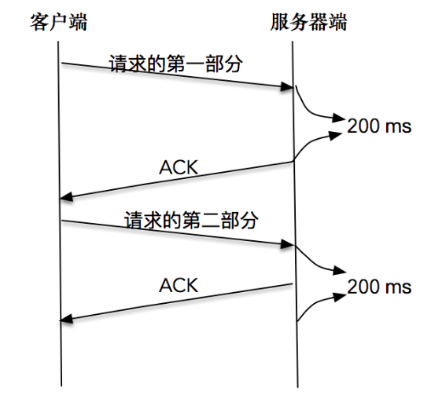

调用数据发送接口以后并不意味着数据被真正发送到网络上，其实，这些数据只是从应用程序中被拷贝到了系统内核的套接字缓冲区中，或者说是发送缓冲区中，等待协议栈的处理。至于这些数据是什么时候被发送出去的，对应用程序来说，是无法预知的。对这件事情真正负责的，是运行于操作系统内核的TCP协议栈实现模块。

# 流量控制和生产者-消费者模型

发送窗口和接收窗口是 TCP 连接的双方，一个作为生产者，一个作为消费者，为了达到一致协同的生产-消费速率、而产生的算法模型实现。

说白了，作为 TCP 发送端，也就是生产者，不能忽略TCP的接收端，也就是消费者的实际状况，不管不顾地把数据包都传送过来。如果都传送过来，消费者来不及消费，必然会丢弃；而丢弃反过使得生产者又重传，发送更多的数据包，最后导致网络崩溃。

# 拥塞控制和数据传输

TCP的生产者-消费者模型，只是在考虑单个连接的数据传递，但是， TCP数据包是需要经过网卡、交换机、核心路由器等一系列的网络设备的，网络设备本身的能力也是有限的，当多个连接的数据包同时在网络上传送时，势必会发生带宽争抢、数据丢失等，这样，TCP 就必须考虑多个连接共享在有限的带宽上，兼顾效率和公平性的控制，这就是拥塞控制的本质。

在TCP协议中，拥塞控制是通过拥塞窗口来完成的，拥塞窗口的大小会随着网络状况实时调整。

拥塞控制常用的算法有“慢启动”，它通过一定的规则，慢慢地将网络发送数据的速率增加到一个阈值。超过这个阈值之后，慢启动就结束了，另一个叫做“拥塞避免”的算法登场。在这个阶段，TCP会不断地探测网络状况，并随之不断调整拥塞窗口的大小。

在任何一个时刻，TCP 发送缓冲区的数据是否能真正发送出去，至少取决于两个因素，一个是当前的发送窗口大小，另一个是拥塞窗口大小，而 TCP 协议中总是取两者中最小值作为判断依据。比如当前发送的字节为100，发送窗口的大小是200，拥塞窗口的大小是80，那么取200和80中的最小值，就是80，当前发送的字节数显然是大于拥塞窗口的，结论就是不能发送出去。

发送窗口反应了作为单 TCP 连接、点对点之间的流量控制模型，它是需要和接收端一起共同协调来调整大小的；而拥塞窗口则是反应了作为多个 TCP 连接共享带宽的拥塞控制模型，它是发送端独立地根据网络状况来动态调整的。

## 一些场景

**第一个场景**

接收端处理得急不可待，比如刚刚读入了100个字节，就告诉发送端：“喂，我已经读走100个字节了，你继续发”。

这个场景也被叫做糊涂窗口综合症，这个场景需要在接收端进行优化。也就是说，接收端不能在接收缓冲区空出一个很小的部分之后，就急吼吼地向发送端发送窗口更新通知，而是需要在自己的缓冲区大到一个合理的值之后，再向发送端发送窗口更新通知。这个合理的值，由对应的 RFC 规范定义。

**第二个场景**

“交互式”场景，比如我们使用telnet登录到一台服务器上，或者使用SSH和远程的服务器交互，这种情况下，我们在屏幕上敲打了一个命令，等待服务器返回结果，这个过程需要不断和服务器端进行数据传输。这里最大的问题是，每次传输的数据可能都非常小。

这个场景需要在发送端进行优化。这个优化的算法叫做 Nagle 算法，Nagle 算法的本质其实就是限制大批量的小数据包同时发送，为此，它提出，在任何一个时刻，未被确认的小数据包不能超过一个。这里的小数据包，指的是长度小于最大报文段长度 MSS 的 TCP 分组。这样，发送端就可以把接下来连续的几个小数据包存储起来，等待接收到前一个小数据包的 ACK 分组之后，再将数据一次性发送出去。

**第三个场景**

接收端需要对每个接收到的 TCP 分组进行确认，也就是发送 ACK 报文，但是 ACK 报文本身是不带数据的分段，如果一直这样发送大量的 ACK 报文，就会消耗大量的带宽。之所以会这样，是因为 TCP 报文、IP 报文固有的消息头是不可或缺的，比如两端的地址、端口号、时间戳、序列号等信息。

这个场景也是需要在接收端进行优化，这个优化的算法叫做延时 ACK。延时ACK在收到数据后并不马上回复，而是累计需要发送的 ACK 报文，等到有数据需要发送给对端时，将累计的 ACK 捎带一并发送出去。当然，延时 ACK 机制，不能无限地延时下去，否则发送端误认为数据包没有发送成功，引起重传，反而会占用额外的网络带宽。

## 禁用 Nagle 算法

Nagle 算法和延时 ACK 的组合使用：

比如，客户端分两次将一个请求发送出去，由于请求的第一部分的报文未被确认，Nagle算法开始起作用；同时延时ACK在服务器端起作用，假设延时时间为200ms，服务器等待200ms后，对请求的第一部分进行确认；接下来客户端收到了确认后，Nagle算法解除请求第二部分的阻止，让第二部分得以发送出去，服务器端在收到之后，进行处理应答，同时将第二部分的确认捎带发送出去。



Nagle 算法和延时确认组合在一起，增大了处理时延，实际上，两个优化彼此在阻止对方。

从上面的例子可以看到，在有些情况下 Nagle 算法并不适用， 比如对时延敏感的应用。我们可以通过对套接字的修改来关闭 Nagle 算法：

```
int on = 1; 
setsockopt(sock, IPPROTO_TCP, TCP_NODELAY, (void *)&on, sizeof(on)); 
```

值得注意的是，除非我们对此有十足的把握，否则不要轻易改变默认的 TCP Nagle 算法。因为在现代操作系统中，针对 Nagle 算法和延时 ACK 的优化已经非常成熟了，有可能在禁用 Nagle 算法之后，性能问题反而更加严重。

# 将写操作合并

我们可以使用如下的方法来进行数据的读写操作，从而避免 Nagle 算法引发的副作用：

```
 #include <sys/uio.h>

ssize_t writev(int filedes, const struct iovec *iov, int iovcnt)
ssize_t readv(int filedes, const struct iovec *iov, int iovcnt);
```

`iovec` 结构体：

```
struct iovec {
    void  *iov_base;    /* Starting address */
    size_t iov_len;     /* Number of bytes to transfer */
};
```

集中写：

```
#include <errno.h>
#include <netinet/in.h>
#include <stdio.h>
#include <stdlib.h>
#include <string.h>
#include <sys/socket.h>
#include <sys/types.h>
#include <sys/uio.h>
#include <sys/un.h>
#include <unistd.h>

#define SERV_PORT (50005)

int main(int argc, char *argv[]) {
  if (argc < 2 || strcmp(argv[1], "--help") == 0) {
    fprintf(stderr, "usage: %s <LocalPath> \n", argv[0]);
    exit(EXIT_FAILURE);
  }

  int socket_fd;
  socket_fd = socket(AF_INET, SOCK_STREAM, 0);

  struct sockaddr_in server_addr;
  bzero(&server_addr, sizeof(server_addr));
  server_addr.sin_family = AF_INET;
  server_addr.sin_port = htons(SERV_PORT);
  inet_pton(AF_INET, argv[1], &server_addr.sin_addr);

  socklen_t server_len = sizeof(server_addr);
  int connect_rt =
      connect(socket_fd, (struct sockaddr *)&server_addr, server_len);
  if (connect_rt < 0) {
    error(1, errno, "connect failed ");
  }

  char buf[128];
  struct iovec iov[2];

  char *send_one = "hello,";
  iov[0].iov_base = send_one;
  iov[0].iov_len = strlen(send_one);
  iov[1].iov_base = buf;
  while (fgets(buf, sizeof(buf), stdin) != NULL) {
    iov[1].iov_len = strlen(buf);
    int n = htonl(iov[1].iov_len);
    if (writev(socket_fd, iov, 2) < 0) error(1, errno, "writev failure");
  }
  exit(0);
}
```

