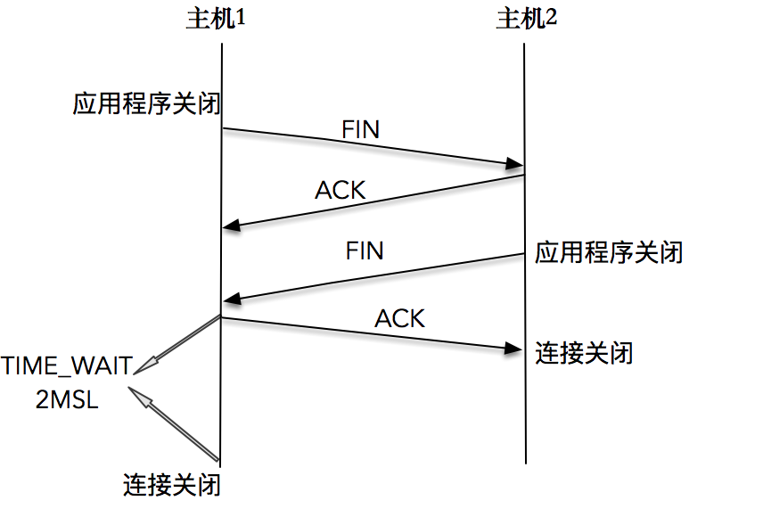

# 服务端程序

```
#include <errno.h>
#include <netinet/in.h>
#include <signal.h>
#include <stdio.h>
#include <stdlib.h>
#include <string.h>
#include <sys/socket.h>
#include <sys/types.h>
#include <sys/un.h>
#include <unistd.h>

#define MAX_LINE 4096
#define SERV_PORT (50005)

static int s_count;

static void sig_int(int signo) {
  printf("\nreceived %d datagrams\n", s_count);
  exit(0);
}

int main(int argc, char **argv) {
  int listenfd;
  listenfd = socket(AF_INET, SOCK_STREAM, 0);

  struct sockaddr_in server_addr;
  bzero(&server_addr, sizeof(server_addr));
  server_addr.sin_family = AF_INET;
  server_addr.sin_addr.s_addr = htonl(INADDR_ANY);
  server_addr.sin_port = htons(SERV_PORT);

  int rt1 =
      bind(listenfd, (struct sockaddr *)&server_addr, sizeof(server_addr));
  if (rt1 < 0) {
    fprintf(stderr, "bind() error:%s\n", strerror(errno));
    exit(EXIT_FAILURE);
  }

  int rt2 = listen(listenfd, 1024);
  if (rt2 < 0) {
    fprintf(stderr, "listen() error:%s\n", strerror(errno));
    exit(EXIT_FAILURE);
  }

  signal(SIGPIPE, SIG_IGN);

  int connfd;
  struct sockaddr_in client_addr;
  socklen_t client_len = sizeof(client_addr);

  if ((connfd = accept(listenfd, (struct sockaddr *)&client_addr,
                       &client_len)) < 0) {
    fprintf(stderr, "accept() error:%s\n", strerror(errno));
    exit(EXIT_FAILURE);
  }

  char message[MAX_LINE];
  s_count = 0;

  for (;;) {
    int n = read(connfd, message, MAX_LINE);
    if (n < 0) {
      fprintf(stderr, "read() error:%s\n", strerror(errno));
      exit(EXIT_FAILURE);
    } else if (n == 0) {
      fprintf(stderr, "client closed\n");
      exit(EXIT_FAILURE);
    }

    message[n] = 0;
    printf("received %d bytes: %s\n", n, message);
    s_count++;
  }
}
```

这个服务器端程序绑定到一个本地端口，使用的是通配地址 `INADDR_ANY`。

启动服务器，之后我们使用 Telnet 登录这个服务器：

```
./addr_used
telnet 127.0.0.1 50005
```

然后直接使用 `Ctrl+C` 方式关闭服务器程序，Telnet  收到：

```
Connection closed by foreign host.
```

这个时候服务端程序重启失败，报错信息为：

```
bind() error:Address already in use
```



```
netstat -a | grep 50005
tcp        0      0 localhost:50005         localhost:42874         TIME_WAIT
```

通过服务器端发起的关闭连接操作，引起了一个已有的 TCP 连接处于 TME_WAIT 状态，正是这个 TIME_WAIT 的连接，使得服务器重启时，继续绑定在`127.0.0.1` 地址和 `50005` 端口上的操作，返回了错误。

# 重用套接字选项

一个 TCP 连接是通过四元组（源地址、源端口、目的地址、目的端口）来唯一确定的，如果每次 Telnet 客户端使用的本地端口都不同，就不会和已有的四元组冲突，也就不会有 TIME_WAIT 的新旧连接化身冲突的问题。

事实上，即使在很小的概率下，客户端 Telnet 使用了相同的端口，从而造成了新连接和旧连接的四元组相同，在现代 Linux 操作系统下，也不会有什么大的问题，原因是现代Linux操作系统对此进行了一些优化：

- 第一种优化是新连接 SYN 告知的初始序列号，一定比 TIME_WAIT 老连接的末序列号大，这样通过序列号就可以区别出新老连接
- 第二种优化是开启了 tcp_timestamps，使得新连接的时间戳比老连接的时间戳大，这样通过时间戳也可以区别出新老连接

在这样的优化之下，一个 TIME_WAIT 的 TCP 连接可以忽略掉旧连接，重新被新的连接所使用。

这就是重用套接字选项，通过给套接字配置可重用属性，告诉操作系统内核，这样的 TCP 连接完全可以复用 TIME_WAIT 状态的连接：

```
int on = 1;
setsockopt(listenfd, SOL_SOCKET, SO_REUSEADDR, &on, sizeof(on));
```

`SO_REUSEADDR` 套接字选项，允许启动绑定在一个端口，即使之前存在一个和该端口一样的连接。

`SO_REUSEADDR` 套接字选项还有一个作用，那就是本机服务器如果有多个地址，可以在不同地址上使用相同的端口提供服务：一台服务器有 `192.168.1.101` 和`10.10.2.102` 连个地址，我们可以在这台机器上启动三个不同的HTTP服务：

- 第一个以本地通配地址 ANY 和端口 80 启动
- 第二个以 `192.168.101` 和端口 80 启动
- 第三个以 `10.10.2.102` 和端口 80 启动

服务器端程序，都应该设置 `SO_REUSEADDR` 套接字选项，以便服务端程序可以在极短时间内复用同一个端口启动。单独重用一个套接字不会有任何问题。TCP 连接是通过四元组唯一区分的，只要客户端不使用相同的源端口，连接服务器是没有问题的，即使使用了相同的端口，根据序列号或者时间戳，也是可以区分出新旧连接的。而且，TCP 的机制绝对不允许在相同的地址和端口上绑定不同的服务器，即使我们设置 `SO_REUSEADDR` 套接字选项，也不可能在 ANY 通配符地址下和端口50005 上重复启动两个服务器实例。

`tcp_tw_reuse` 和 `SO_REUSEADDR`：

- `tcp_tw_reuse` 是内核选项，主要用在连接的发起方。TIME_WAIT 状态的连接创建时间超过1秒后，新的连接才可以被复用，注意，这里是连接的发起方
- `SO_REUSEADDR` 是用户态的选项，`SO_REUSEADDR` 选项用来告诉操作系统内核，如果端口已被占用，但是 TCP 连接状态位于 TIME_WAIT ，可以重用端口。如果端口忙，而TCP处于其他状态，重用端口时依旧得到 "Address already in use" 的错误信息。注意，这里一般都是连接的服务方

```
#include <errno.h>
#include <netinet/in.h>
#include <signal.h>
#include <stdio.h>
#include <stdlib.h>
#include <string.h>
#include <sys/socket.h>
#include <sys/types.h>
#include <sys/un.h>
#include <unistd.h>

#define MAX_LINE 4096
#define SERV_PORT (50005)

static int s_count;

static void sig_int(int signo) {
  printf("\nreceived %d datagrams\n", s_count);
  exit(0);
}

int main(int argc, char **argv) {
  int listenfd;
  listenfd = socket(AF_INET, SOCK_STREAM, 0);

  struct sockaddr_in server_addr;
  bzero(&server_addr, sizeof(server_addr));
  server_addr.sin_family = AF_INET;
  server_addr.sin_addr.s_addr = htonl(INADDR_ANY);
  server_addr.sin_port = htons(SERV_PORT);

  int on = 1;
  setsockopt(listenfd, SOL_SOCKET, SO_REUSEADDR, &on, sizeof(on));

  int rt1 =
      bind(listenfd, (struct sockaddr *)&server_addr, sizeof(server_addr));
  if (rt1 < 0) {
    fprintf(stderr, "bind() error:%s\n", strerror(errno));
    exit(EXIT_FAILURE);
  }

  int rt2 = listen(listenfd, 1024);
  if (rt2 < 0) {
    fprintf(stderr, "listen() error:%s\n", strerror(errno));
    exit(EXIT_FAILURE);
  }

  signal(SIGPIPE, SIG_IGN);

  int connfd;
  struct sockaddr_in client_addr;
  socklen_t client_len = sizeof(client_addr);

  if ((connfd = accept(listenfd, (struct sockaddr *)&client_addr,
                       &client_len)) < 0) {
    fprintf(stderr, "accept() error:%s\n", strerror(errno));
    exit(EXIT_FAILURE);
  }

  char message[MAX_LINE];
  s_count = 0;

  for (;;) {
    int n = read(connfd, message, MAX_LINE);
    if (n < 0) {
      fprintf(stderr, "read() error:%s\n", strerror(errno));
      exit(EXIT_FAILURE);
    } else if (n == 0) {
      fprintf(stderr, "client closed\n");
      exit(EXIT_FAILURE);
    }

    message[n] = 0;
    printf("received %d bytes: %s\n", n, message);
    s_count++;
  }
}
```

重复上面那个例子，马上尝试重启服务器，这个时候我们发现，服务器正常启动，没有出现错误。