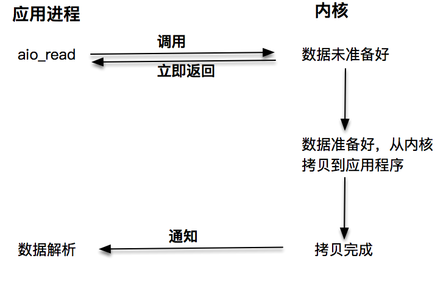

# 阻塞/非阻塞 VS 同步/异步

## 阻塞I/O

阻塞 I/O 发起的 `read()` 请求，线程会被挂起，一直等到内核数据准备好，并把数据从内核区域拷贝到应用程序的缓冲区中，当拷贝过程完成，`read()` 请求调用才返回。接下来，应用程序就可以对缓冲区的数据进行数据解析。

## 非阻塞I/O

非阻塞的 `read()` 请求在数据未准备好的情况下立即返回，应用程序可以不断轮询内核，直到数据准备好，内核将数据拷贝到应用程序缓冲，并完成这次 `read()` 调用。注意，这里最后一次read调用，获取数据的过程，是一个同步的过程。这里的同步指的是内核区域的数据拷贝到缓存区这个过程。

每次让应用程序去轮询内核的 I/O 是否准备好，是一个不经济的做法，因为在轮询的过程中应用进程啥也不能干。于是，像 `select()`、`poll()` 这样的 I/O 多路复用技术就隆重登场了。通过 I/O 事件分发，当内核数据准备好时，再通知应用程序进行操作。这个做法大大改善了应用进程对 CPU 的利用率，在没有被通知的情况下，应用进程可以使用 CPU 做其他的事情。

注意，这里 `read()` 调用，获取数据的过程，也是一个同步的过程：

## 同步/异步

同步调用、异步调用的说法，是对于获取数据的过程而言的，前面几种最后获取数据的read操作调用，都是同步的，在read调用时，内核将数据从内核空间拷贝到应用程序空间，这个过程是在read函数中同步进行的，如果内核实现的拷贝效率很差，read调用就会在这个同步过程中消耗比较长的时间。而真正的异步调用则不用担心这个问题。

发起 `aio_read` 之后，就立即返回，内核自动将数据从内核空间拷贝到应用程序空间，这个拷贝过程是异步的，内核自动完成的，和前面的同步操作不一样，应用程序并不需要主动发起拷贝动作。

