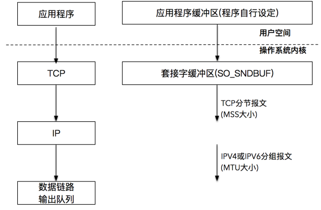

# 发送数据

发送数据时常用的有三个函数，分别是 `write()`、`send()` 和 `sendmsg`：

```
#include <unistd.h>
ssize_t write(int fd, const void *buf, size_t count);

#include <sys/types.h>
#include <sys/socket.h>
ssize_t send(int sockfd, const void *buf, size_t len, int flags);
ssize_t sendmsg(int sockfd, const struct msghdr *msg, int flags);
```

- `write()` 是常见的文件写函数
- 如果想指定选项，发送带外数据，就需要使用 `send()`，所谓带外数据，是一种基于TCP协议的紧急数据，用于客户端-服务器在特定场景下的紧急处理
- 如果想指定多重缓冲区传输数据，就需要使用 `sendmsg()`，以结构体 `msghdr` 的方式发送数据

对于 `write()` 的调用，在普通文件和套接字上进行写入操作是有区别的：

- 对于普通文件描述符而言，一个文件描述符代表了打开的一个文件句柄，通过调用 `write()`，操作系统内核帮我们不断地往文件系统中写入字节流。写入的字节流大小通常和输入参数 `size` 的值是相同的，否则表示出错
- 对于套接字描述符而言，它代表了一个双向连接，在套接字描述符上调用write写入的字节数有可能比请求的数量少，这在普通文件描述符情况下是不正常的

## 发送缓冲区

TCP连接成功建立后，操作系统内核会为每一个连接创建配套的基础设施，比如发送缓冲区。

发送缓冲区的大小可以通过套接字选项来改变，当应用程序调用 `write()` 时，实际所做的事情是把数据从应用程序中拷贝到操作系统内核的发送缓冲区中，并不一定是把数据通过套接字写出去：

- 如果操作系统内核的发送缓冲区足够大，可以直接容纳这份数据， `write()` 将会写入全部请求的字节数，然后返回
- 如果操作系统内核的发送缓冲区不足以容纳全部要发送的数据，在这种情况下将会阻塞，大部分UNIX系统的做法是一直等到可以把应用程序数据完全放到操作系统内核的发送缓冲区中，再从系统调用中返回



# 读取数据

## `read()` 函数

```
#include <unistd.h>

ssize_t read(int fd, void *buf, size_t count);
```

`read()` 要求操作系统内核从套接字描述字 `fd` 读取最多 `count` 个字节，并将结果存储到 `buf` 中。返回值是实际读取的字节数，也有一些特殊情况：

- 如果返回值为 0，表示 EOF（end-of-file），这在网络中表示对端发送了 FIN 包，要处理断连的情况
- 如果返回值为-1，表示出错。当然，如果是非阻塞I/O，情况会略有不同

实现一个 `readn()`：

```
size_t readn(int fd,void* buffer,size_t size)
{
	char* buf = buffer;
	int length = size;
	
	while(length > 0)
	{
		int result = read(fd,buf,length);
		
		if(result < 0)
		{
			if(errno == EINTR)
				continue;
			else
				return -1;
		}
		else if(result == 0)
		{
			break;
		}
		
		length -= result;
		buf += result;
	}
	return (size - length);
}
```

# 读写实验


