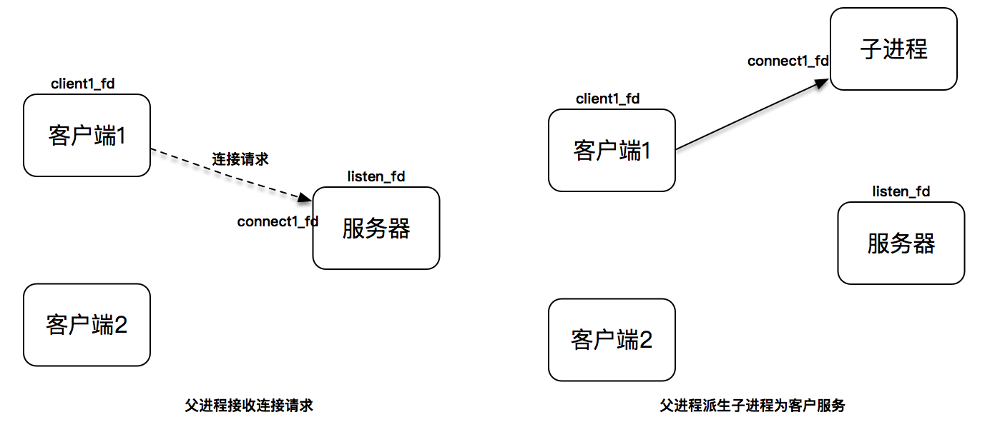
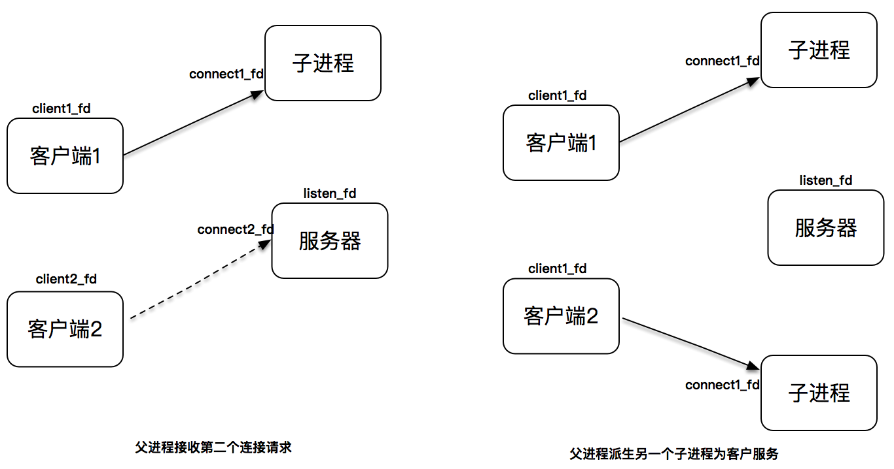

# 阻塞I/O的进程模型

我们假设有两个客户端，服务器初始监听在套接字 `lisnted_fd` 上。当第一个客户端发起连接请求，连接建立后产生出连接套接字，此时，父进程派生出一个子进程，在子进程中，使用连接套接字和客户端通信，因此子进程不需要关心监听套接字，只需要关心连接套接字；父进程则相反，将客户服务交给子进程来处理，因此父进程不需要关心连接套接字，只需要关心监听套接字。





# 程序示例

```
#include <sys/socket.h>
#include <sys/types.h>
#include <netinet/in.h>
#include <arpa/inet.h>
#include <sys/un.h>
#include <string.h>
#include <stdio.h>
#include <unistd.h>
#include <stdlib.h>
#include <errno.h>
#include <sys/time.h>
#include <signal.h>

#define MAX_LINE  (4096)
#define SERV_PORT (50005)

char rot13_char(char c) 
{
    if ((c >= 'a' && c <= 'm') || (c >= 'A' && c <= 'M'))
        return c + 13;
    else if ((c >= 'n' && c <= 'z') || (c >= 'N' && c <= 'Z'))
        return c - 13;
    else
        return c;
}

void child_run(int fd)
{
    char outbuf[MAX_LINE + 1];
    size_t outbuf_used = 0;
    ssize_t result;

    while(1){
        char ch;
        result = recv(fd,&ch,1,0);
        if(result == 0)
            break;
        else if(result == -1){
            fprintf("recv() error:%s\n",strerror(errno));
            break;
        }

        if(outbuf_used < sizeof(outbuf)){
            outbuf[outbuf_used++] = rot13_char(ch);
        }
        if(ch == '\n'){
            send(fd,outbuf,outbuf_used,0);
            outbuf_used = 0;
            continue;
        }
    }
}

void sigchld_handler(int sig){
    while(waitpid(-1,0,WNOHANG) > 0)
        ;
    return;
}

int tcp_server_listen(int port) {
    int listenfd;
    listenfd = socket(AF_INET, SOCK_STREAM, 0);

    struct sockaddr_in server_addr;
    bzero(&server_addr, sizeof(server_addr));
    server_addr.sin_family = AF_INET;
    server_addr.sin_addr.s_addr = htonl(INADDR_ANY);
    server_addr.sin_port = htons(port);

    int on = 1;
    setsockopt(listenfd, SOL_SOCKET, SO_REUSEADDR, &on, sizeof(on));

    int rt1 = bind(listenfd, (struct sockaddr *) &server_addr, sizeof(server_addr));
    if (rt1 < 0) {
        fprintf(stderr, "bind() failed:%s\n", strerror(errno));
        exit(EXIT_FAILURE);
    }

    int rt2 = listen(listenfd, 1024);
    if (rt2 < 0) {
        fprintf(stderr, "listen() failed:%s\n", strerror(errno));
        exit(EXIT_FAILURE);
    }

    signal(SIGPIPE, SIG_IGN);

    return listenfd;
}


int main(int argc,char* argv[])
{
    int listen_fd = tcp_server_listen(SERV_PORT);
    signal(SIGCHLD,sigchld_handler);

    while(1){
        struct sockaddr_storage ss;
        socklen_t slen = sizeof(ss);
        int conn_fd = accept(listen_fd,(struct sockaddr*)&ss,&slen);
        if(conn_fd < 0){
            fprintf(stderr, "accept() failed:%s\n", strerror(errno));
            exit(EXIT_FAILURE);
        }

        switch (fork())
        {
        case -1:
            exit(EXIT_FAILURE);
        case 0:
        {
            close(listen_fd);
            child_run(conn_fd);
            _exit(EXIT_SUCCESS);
        }        
        default:
            close(conn_fd);
        }
    }
}
```

使用阻塞 I/O 和进程模型，为每一个连接创建一个独立的子进程来进行服务，是一个非常简单有效的实现方式，这种方式可能很难足高性能程序的需求，但好处在于实现简单。在实现这样的程序时，我们需要注意两点：

- 要注意对套接字的关闭梳理
- 要注意对子进程进行回收，避免产生不必要的僵尸进程
- 


