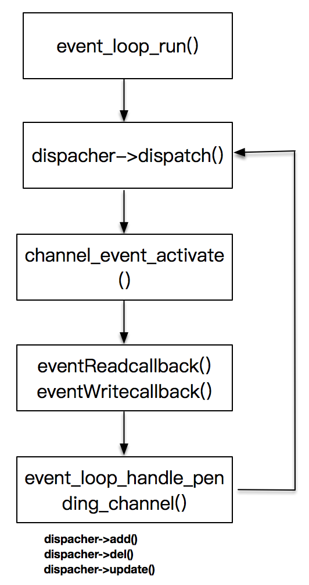
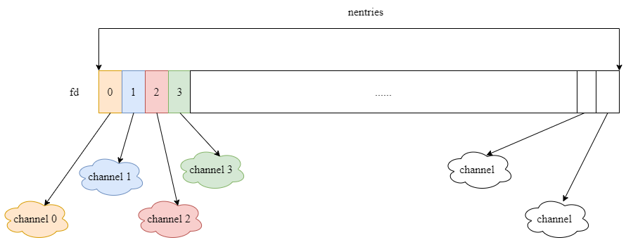
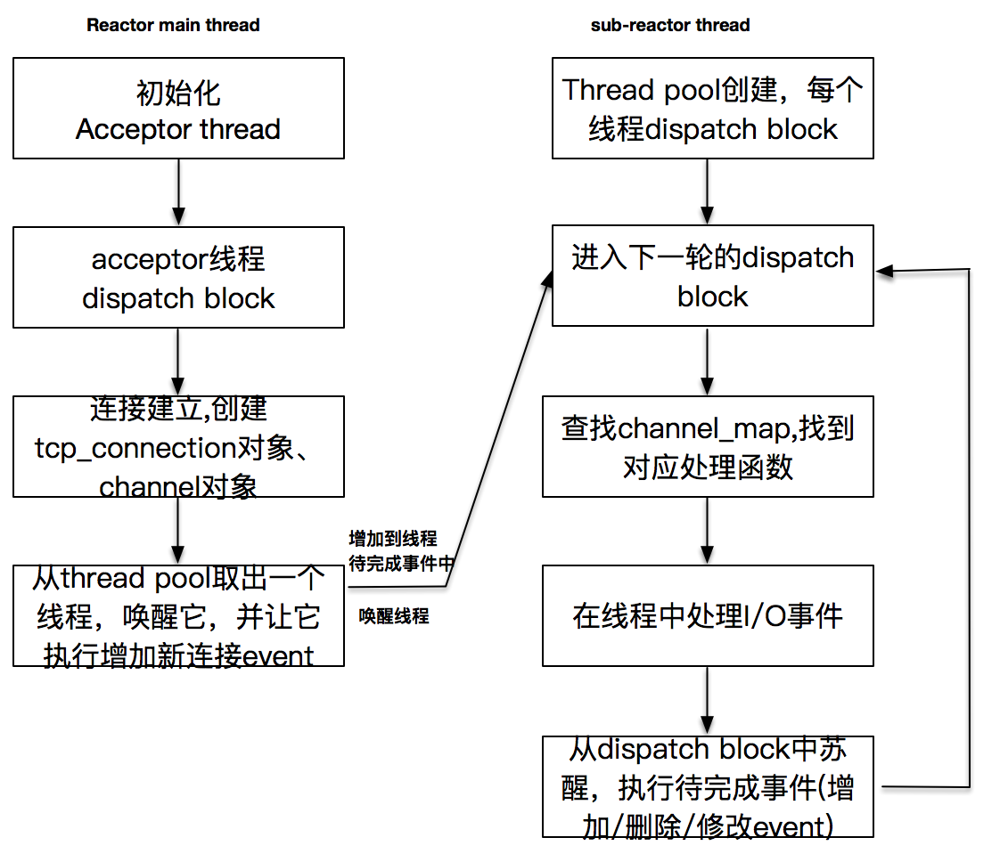
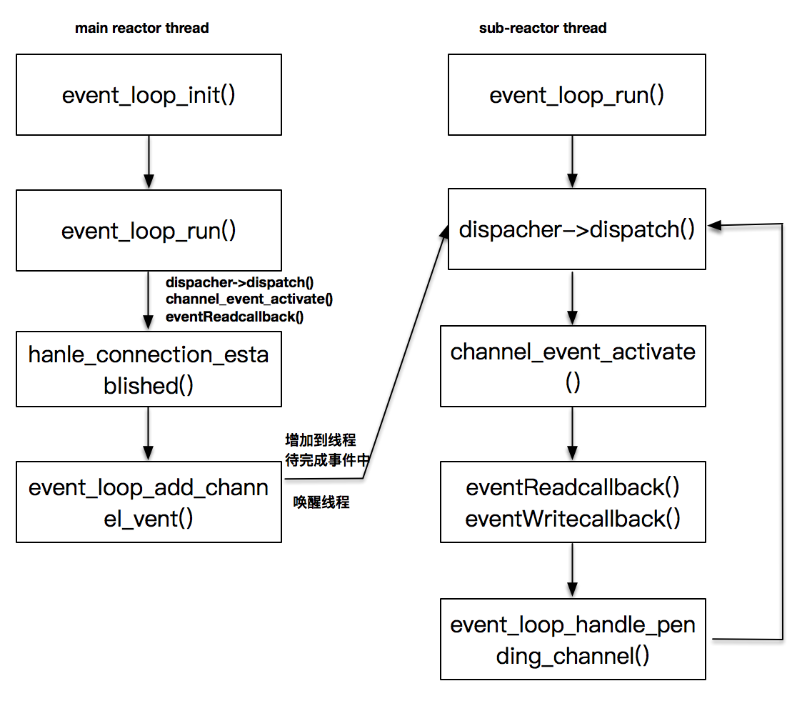
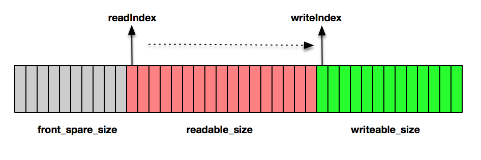
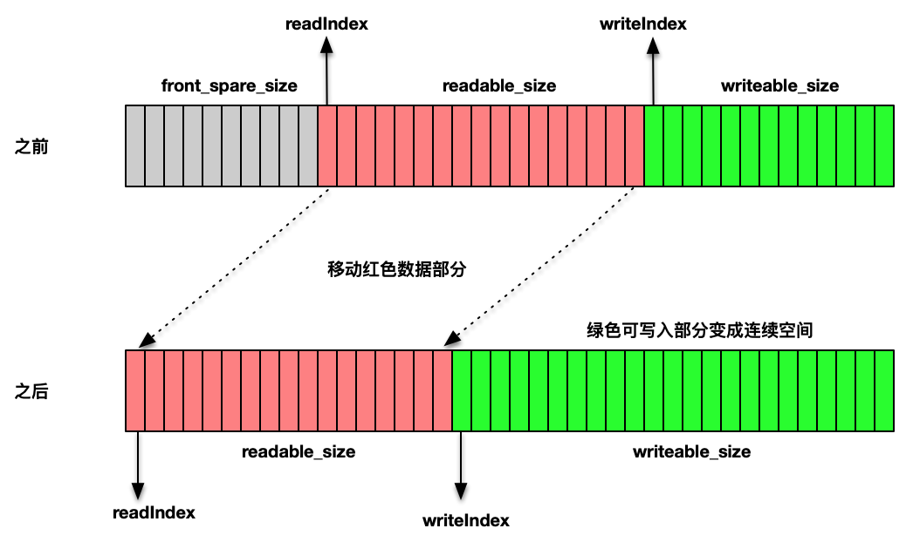
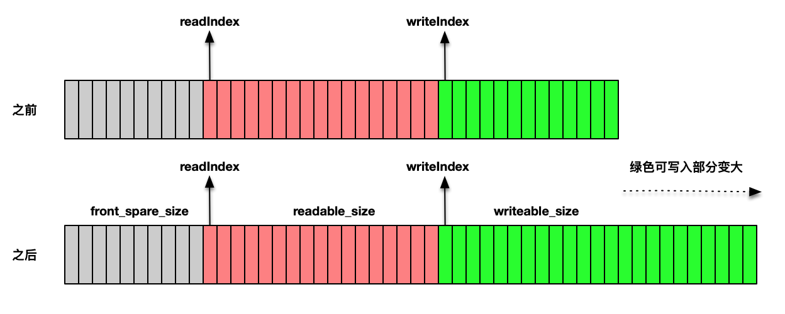

# 设计思路

## 反应堆模式设计概述

反应堆模式，主要是设计一个基于事件分发和回调的反应堆框架。

### event_loop

可以把 `event_loop` 这个对象理解成和一个线程绑定的无限事件循环，简单来说，它就是一个无限循环着的事件分发器，一旦有事件发生，它就会回调预先定义好的回调函数，完成事件的处理。

具体来说，`event_loop` 使用 `poll()` 或者 `epoll()` 方法将一个线程阻塞，等待各种 I/O 事件的发生。

### channel

对各种注册到 `event_loop` 上的对象，我们抽象成 `channel` 来表示，例如：

- 注册到 `event_loop` 上的监听事件
- 注册到 `event_loop` 上的套接字读写事件等。

### acceptor

`acceptor` 对象表示的是服务器端监听器，`acceptor` 对象最终会作为一个 `channel` 对象，注册到 `event_loop` 上，以便进行连接完成的事件分发和检测。

### event_dispatcher

`event_dispatcher` 是对事件分发机制的一种抽象，也就是说，可以实现一个基于 `poll()` 的 `poll_dispatcher`，也可以实现一个基于 `epoll()` 的`epoll_dispatcher`。

### channel_map

`channel_map` 保存了描述字到 `channel` 的映射，这样就可以在事件发生时，根据事件类型对应的套接字快速找到 `chanel` 对象里的事件处理函数。

## I/O模型和多线程模型设计

I/O 线程和多线程模型，主要解决 `event_loop` 的线程运行问题，以及事件分发和回调的线程执行问题。

### thread_pool

`thread_pool` 维护了一个 `sub-reactor` 的线程列表，它可以提供给主 `reactor` 线程使用，每次当有新的连接建立时，可以从 `thread_pool` 里获取一个线程，以便用它来完成对新连接套接字的 `read()/write()` 事件注册，将 I/O 线程和主 `reactor` 线程分离。

### event_loop_thread

`event_loop_thread` 是 `reactor` 的线程实现，连接套接字的 `read()/write()` 事件检测都是在这个线程里完成的。

## Buffer和数据读写

### buffer

`buffer` 对象屏蔽了对套接字进行的写和读的操作，如果没有 `buffer` 对象，连接套接字的 `read()/write()` 事件都需要和字节流直接打交道，这显然是不友好的。所以，我们也提供了一个基本的 `buffer` 对象，用来表示从连接套接字收取的数据，以及应用程序即将需要发送出去的数据。

### tcp_connection

`tcp_connection` 这个对象描述的是已建立的 TCP 连接。它的属性包括接收缓冲区、发送缓冲区、`channel` 对象等。这些都是一个 TCP 连接的天然属性。

`tcp_connection` 是大部分应用程序和我们的高性能框架直接打交道的数据结构。我们不想把最下层的 `channel` 对象暴露给应用程序，因为抽象的 `channel` 对象不仅仅可以表示 `tcp_connection`，前面提到的监听套接字也是一个 `channel` 对象，后面提到的唤醒 `socketpair` 也是一个 channel对象。所以，我们设计了`tcp_connection` 这个对象，希望可以提供给用户比较清晰的编程入口。

## 反应堆模式设计

当 `event_loop_run` 完成之后，线程进入循环，首先执行 `dispatch` 事件分发，一旦有事件发生，就会调用 `channel_event_activate` 函数，在这个函数中完成事件回调函数 `eventReadcallback` 和 `eventWritecallback` 的调用，最后再进行 `event_loop_handle_pending_channel`，用来修改当前监听的事件列表，完成这个部分之后，又进入了事件分发循环。



### event_loop分析

```
struct event_loop {
    int quit;
    const struct event_dispatcher *eventDispatcher;

    /** 对应的event_dispatcher的数据. */
    void *event_dispatcher_data;
    struct channel_map *channelMap;

    int is_handle_pending;
    struct channel_element *pending_head;
    struct channel_element *pending_tail;

    pthread_t owner_thread_id;
    pthread_mutex_t mutex;
    pthread_cond_t cond;
    int socketPair[2];
    char *thread_name;
};
```

- 可以简单地把 `event_dispatcher` 理解为 `poll()` 或者 `epoll()`，它可以让我们的线程挂起，等待事件的发生
- `event_dispatcher_data` 定义为一个void *类型，可以按照需求，任意放置一个我们需要的对象指针
- `event_loop` 中还保留了几个跟多线程有关的对象，如 `owner_thread_id` 是保留了每个 `event loop` 的线程 ID，`mutex` 和 `con` 是用来进行线程同步的
- `socketPair` 是父线程用来通知子线程有新的事件需要处理。`pending_head` 和 `pending_tail` 是保留在子线程内的需要处理的新的事件

`event_loop` 最主要的方法 `event_loop_run()` 方法，`event_loop` 就是一个无限while循环，不断地在分发事件：

```
/**
 * 1.参数验证
 * 2.调用dispatcher来进行事件分发,分发完回调事件处理函数
 */
int event_loop_run(struct event_loop *eventLoop)
{
  assert(eventLoop != NULL);

  struct event_dispatcher *dispatcher = eventLoop->eventDispatcher;

  if (eventLoop->owner_thread_id != pthread_self())
  {
    exit(1);
  }

  msgx("event loop run, %s", eventLoop->thread_name);
  struct timeval timeval;
  timeval.tv_sec = 1;

  while (!eventLoop->quit)
  {
    //@ block here to wait I/O event, and get active channels
    dispatcher->dispatch(eventLoop, &timeval);

    //@ handle the pending channel
    event_loop_handle_pending_channel(eventLoop);
  }

  msgx("event loop end, %s", eventLoop->thread_name);
  return 0;
}
```

`event_loop` 不退出的情况下，一直在循环，循环体中调用了 `dispatcher` 对象的 `dispatch` 方法来等待事件的发生。

### event_dispacher分析

为了实现不同的事件分发机制，这里把 `poll()`、`epoll()` 等抽象成了一个 `event_dispatcher` 结构。`event_dispatcher` 的具体实现有 `poll_dispatcher` 和 `epoll_dispatcher` 两种。

```
/** 抽象的event_dispatcher结构体，对应的实现如select,poll,epoll等I/O复用. */
struct event_dispatcher
{
  /**  对应实现 */
  const char *name;

  /**  初始化函数 */
  void *(*init)(struct event_loop *eventLoop);

  /** 通知dispatcher新增一个channel事件*/
  int (*add)(struct event_loop *eventLoop, struct channel *channel);

  /** 通知dispatcher删除一个channel事件*/
  int (*del)(struct event_loop *eventLoop, struct channel *channel);

  /** 通知dispatcher更新channel对应的事件*/
  int (*update)(struct event_loop *eventLoop, struct channel *channel);

  /** 实现事件分发，然后调用event_loop的event_activate方法执行callback*/
  int (*dispatch)(struct event_loop *eventLoop, struct timeval *);

  /** 清除数据 */
  void (*clear)(struct event_loop *eventLoop);
};
```

### channel对象分析

`channel` 对象是用来和 `event_dispather` 进行交互的最主要的结构体，它抽象了事件分发。一个 `channel` 对应一个描述字，描述字上可以有 `READ` 可读事件，也可以有 `WRITE` 可写事件。`channel` 对象绑定了事件处理函数 `event_read_callback` 和 `event_write_callback`。

```
typedef int (*event_read_callback)(void *data);

typedef int (*event_write_callback)(void *data);

struct channel {
  int fd;
  int events;  //@ 表示 event 类型

  event_read_callback eventReadCallback;
  event_write_callback eventWriteCallback;
  void *data;  //@  callback data,可能是event_loop，也可能是tcp_server或者tcp_connection
};
```

### channel_map对象分析

`event_dispatcher` 在获得活动事件列表之后，需要通过文件描述字找到对应的 `channel`，从而回调 `channel` 上的事件处理函数 `event_read_callback` 和 `event_write_callback`，为此，设计了 `channel_map` 对象。

```
/**
 * channel映射表, key为对应的socket描述字
 */
struct channel_map {
  void **entries;

  /* The number of entries available in entries */
  int nentries;
};
```



`channel_map` 对象是一个数组，数组的下标即为描述字，数组的元素为 `channel` 对象的地址，比如描述字 3 对应的 `channel`，就可以这样直接得到：

```
struct chanenl * channel = map->entries[3];
```

当 `event_dispatcher` 需要回调 `chanel` 上的读、写函数时，调用 `channel_event_activate` 就可以，下面是 `channel_event_activate` 的实现，在找到了对应的`channel` 对象之后，根据事件类型，回调了读函数或者写函数。注意，这里使用了 `EVENT_READ` 和 `EVENT_WRITE` 来抽象了 `poll()` 和 `epoll()` 的所有读写事件类型。

```
int channel_event_activate(struct event_loop *eventLoop, int fd, int revents)
{
  struct channel_map *map = eventLoop->channelMap;
  msgx("activate channel fd == %d, revents=%d, %s", fd, revents, eventLoop->thread_name);

  if (fd < 0)
    return 0;

  if (fd >= map->nentries)
    return (-1);

  struct channel *channel = map->entries[fd];
  assert(fd == channel->fd);

  if (revents & (EVENT_READ))
  {
    if (channel->eventReadCallback)
      channel->eventReadCallback(channel->data);
  }
  if (revents & (EVENT_WRITE))
  {
    if (channel->eventWriteCallback)
      channel->eventWriteCallback(channel->data);
  }

  return 0;
}
```

### 增加、删除、修改channel event

增加、删除和修改 `channel event` 事件：

```
int event_loop_add_channel_event(struct event_loop *eventLoop, int fd, struct channel *channel1);

int event_loop_remove_channel_event(struct event_loop *eventLoop, int fd, struct channel *channel1);

int event_loop_update_channel_event(struct event_loop *eventLoop, int fd, struct channel *channel1);
```

前面三个函数提供了入口能力，而真正的实现则落在这三个函数上：

```
int event_loop_handle_pending_add(struct event_loop *eventLoop, int fd, struct channel *channel);

int event_loop_handle_pending_remove(struct event_loop *eventLoop, int fd, struct channel *channel);

int event_loop_handle_pending_update(struct event_loop *eventLoop, int fd, struct channel *channel);
```

`event_loop_handle_pendign_add` 在当前 `event_loop` 的 `channel_map` 里增加一个新的 `key-value` 对，`key` 是文件描述字，`value` 是 `channel` 对象的地址。之后调用 `event_dispatcher` 对象的 `add` 方法增加 `channel event` 事件。注意这个方法总在当前的 I/O 线程中执行。

```
//@ in the i/o thread
int event_loop_handle_pending_add(struct event_loop *eventLoop, int fd, struct channel *channel)
{
  msgx("add channel fd == %d, %s", fd, eventLoop->thread_name);
  struct channel_map *map = eventLoop->channelMap;

  if (fd < 0)
    return 0;

  if (fd >= map->nentries)
  {
    if (map_make_space(map, fd, sizeof(struct channel *)) == -1)
      return (-1);
  }

  //@ 第一次创建，增加
  if ((map)->entries[fd] == NULL)
  {
    map->entries[fd] = channel;
    // add channel
    struct event_dispatcher *eventDispatcher = eventLoop->eventDispatcher;
    eventDispatcher->add(eventLoop, channel);
    return 1;
  }

  return 0;
}
```

# 多线程设计的几个考虑

`main reactor` 线程是一个 `acceptor` 线程，这个线程一旦创建，会以 `event_loop` 形式阻塞在 `event_dispatcher` 的 `dispatch` 方法上，实际上，它在等待监听套接字上的事件发生，也就是已完成的连接，一旦有连接完成，就会创建出连接对象 `tcp_connection`，以及 `channel` 对象等。

当用户期望使用多个sub-reactor子线程时，主线程会创建多个子线程，每个子线程在创建之后，按照主线程指定的启动函数立即运行，并进行初始化。

子线程是一个 `event_loop` 线程，它阻塞在 `dispatch` 上，一旦有事件发生，它就会查找 `channel_map`，找到对应的处理函数并执行它。之后它就会增加、删除或修改 `pending` 事件，再次进入下一轮的 `dispatch` 。





## 主线程等待多个sub-reactor子线程初始化完

主线程需要等待子线程完成初始化，也就是需要获取子线程对应数据的反馈，而子线程初始化也是对这部分数据进行初始化，实际上这是一个多线程的通知问题。

```
//@ 一定是main thread发起
void thread_pool_start(struct thread_pool *threadPool)
{
    assert(!threadPool->started);
    assertInSameThread(threadPool->mainLoop);

    threadPool->started = 1;
    void *tmp;

    if (threadPool->thread_number <= 0)
    {
        return;
    }

    //@ 创建指定数量的子线程
    threadPool->eventLoopThreads = malloc(threadPool->thread_number * sizeof(struct event_loop_thread));
    for (int i = 0; i < threadPool->thread_number; ++i)
    {
        event_loop_thread_init(&threadPool->eventLoopThreads[i], i);
        event_loop_thread_start(&threadPool->eventLoopThreads[i]);
    }
}
```

调用 `event_loop_thread_init` 对每个子线程初始化，之后调用 `event_loop_thread_start` 来启动子线程。注意，如果应用程序指定的线程池大小为0，则直接返回，这样 `acceptor` 和 I/O 事件都会在同一个主线程里处理，就退化为单 `reactor` 模式。

```
//@ 由主线程调用，初始化一个子线程，并且让子线程开始运行event_loop
struct event_loop *event_loop_thread_start(struct event_loop_thread *eventLoopThread)
{
  pthread_create(&eventLoopThread->thread_tid, NULL, &event_loop_thread_run, eventLoopThread);

  assert(pthread_mutex_lock(&eventLoopThread->mutex) == 0);

  while (eventLoopThread->eventLoop == NULL)
  {
    assert(pthread_cond_wait(&eventLoopThread->cond, &eventLoopThread->mutex) == 0);
  }
  assert(pthread_mutex_unlock(&eventLoopThread->mutex) == 0);

  msgx("event loop thread started, %s", eventLoopThread->thread_name);
  return eventLoopThread->eventLoop;
}
```

这里使用了 `pthread_create()` 创建了子线程，子线程一旦创建，立即执行 `event_loop_thread_run()`，`event_loop_thread_run()` 进行了子线程的初始化工作。这个函数最重要的部分是使用了 `pthread_mutex_lock` 和 `pthread_mutex_unlock` 进行了加锁和解锁，并使用了 `pthread_cond_wait` 来守候 `eventLoopThread` 中的 `eventLoop` 的变量。

```
static void *event_loop_thread_run(void *arg)
{
  struct event_loop_thread *eventLoopThread = (struct event_loop_thread *)arg;

  pthread_mutex_lock(&eventLoopThread->mutex);

  //@ 初始化化event loop，之后通知主线程
  eventLoopThread->eventLoop = event_loop_init_with_name(eventLoopThread->thread_name);
  msgx("event loop thread init and signal, %s", eventLoopThread->thread_name);
  pthread_cond_signal(&eventLoopThread->cond);

  pthread_mutex_unlock(&eventLoopThread->mutex);

  //@ 子线程event loop run
  event_loop_run(eventLoopThread->eventLoop);
}
```

子线程执行函数 `event_loop_thread_run()` 一上来也是进行了加锁，之后初始化 `event_loop` 对象，当初始化完成之后，调用了 `pthread_cond_signal()` 函数来通知此时阻塞在 `pthread_cond_wait()` 上的主线程。这样，主线程就会从 `wait` 中苏醒，代码得以往下执行。子线程本身也通过调用 `event_loop_run()` 进入了一个无限循环的事件分发执行体中，等待子线程 reator 上注册过的事件发生。

这里主线程和子线程共享的变量正是每个 `event_loop_thread` 的 `eventLoop` 对象，这个对象在初始化的时候为 `NULL`，只有当子线程完成了初始化，才变成一个非 `NULL` 的值，这个变化是子线程完成初始化的标志，也是信号量守护的变量。通过使用锁和信号量，解决了主线程和子线程同步的问题。当子线程完成初始化之后，主线程才会继续往下执行。

```
struct event_loop_thread {
    struct event_loop *eventLoop;
    pthread_t thread_tid;        /* thread ID */
    pthread_mutex_t mutex;
    pthread_cond_t cond;
    char * thread_name;
    long thread_count;    /* # connections handled */
};
```

## 增加已连接套接字事件到sub-reactor线程中

主线程是一个 main reactor 线程，这个线程负责检测监听套接字上的事件，当有事件发生时，也就是一个连接已完成建立，如果我们有多个 sub-reactor子线程，我们期望的结果是，把这个已连接套接字相关的 I/O 事件交给 sub-reactor 子线程负责检测。这样的好处是，main reactor 只负责连接套接字的建立，可以一直维持在一个非常高的处理效率，在多核的情况下，多个 sub-reactor 可以很好地利用上多核处理的优势。

```
struct event_loop *event_loop_init_with_name(char *thread_name)
{
  struct event_loop *eventLoop = malloc(sizeof(struct event_loop));
  pthread_mutex_init(&eventLoop->mutex, NULL);
  pthread_cond_init(&eventLoop->cond, NULL);

  if (thread_name != NULL)
  {
    eventLoop->thread_name = thread_name;
  }
  else
  {
    eventLoop->thread_name = "main thread";
  }

  eventLoop->quit = 0;
  eventLoop->channelMap = malloc(sizeof(struct channel_map));
  map_init(eventLoop->channelMap);

#ifdef EPOLL_ENABLE
  msgx("set epoll as dispatcher, %s", eventLoop->thread_name);
  eventLoop->eventDispatcher = &epoll_dispatcher;
#else
  msgx("set poll as dispatcher, %s", eventLoop->thread_name);
  eventLoop->eventDispatcher = &poll_dispatcher;
#endif
  eventLoop->event_dispatcher_data = eventLoop->eventDispatcher->init(eventLoop);

  eventLoop->owner_thread_id = pthread_self();

  //@ add the socketfd to event
  if (socketpair(AF_UNIX, SOCK_STREAM, 0, eventLoop->socketPair) < 0)
  {
    LOG_ERR("socketpair set fialed");
  }
  eventLoop->is_handle_pending = 0;
  eventLoop->pending_head = NULL;
  eventLoop->pending_tail = NULL;

  struct channel *channel = channel_new(eventLoop->socketPair[1], EVENT_READ, handleWakeup, NULL, eventLoop);
  event_loop_add_channel_event(eventLoop, eventLoop->socketPair[1], channel);

  return eventLoop;
}
```

在 `event_loop_init_with_name()` 函数里，调用了 `socketpair()` 函数创建了套接字对，当我们想让 sub-reactor 线程苏醒时，往管道上发送一个字符就可以了。

`socketPair[1]` 描述字上的READ事件，如果有 `READ` 事件发生，就调用 `handleWakeup()` 函数来完成事件处理。

```
int handleWakeup(void *data)
{
  struct event_loop *eventLoop = (struct event_loop *)data;
  char one;
  ssize_t n = read(eventLoop->socketPair[1], &one, sizeof one);
  if (n != sizeof one)
  {
    LOG_ERR("handleWakeup  failed");
  }
  msgx("wakeup, %s", eventLoop->thread_name);
}
```

这个函数就是简单的从 `socketPair[1]` 描述字上读取了一个字符而已，除此之外，它什么也没干。它的主要作用就是让子线程从 `dispatch` 的阻塞中苏醒。

```
int handle_connection_established(void *data)
{
  struct TCPserver *tcpServer = (struct TCPserver *)data;
  struct acceptor *acceptor = tcpServer->acceptor;
  int listenfd = acceptor->listen_fd;

  struct sockaddr_in client_addr;
  socklen_t client_len = sizeof(client_addr);
  int connected_fd = accept(listenfd, (struct sockaddr *)&client_addr, &client_len);
  make_nonblocking(connected_fd);

  msgx("new connection established, socket == %d", connected_fd);

  // choose event loop from the thread pool
  struct event_loop *eventLoop = thread_pool_get_loop(tcpServer->threadPool);

  // create a new tcp connection
  struct tcp_connection *tcpConnection = tcp_connection_new(
      connected_fd, eventLoop, tcpServer->connectionCompletedCallBack,
      tcpServer->connectionClosedCallBack, tcpServer->messageCallBack,
      tcpServer->writeCompletedCallBack);
  // for callback use
  if (tcpServer->data != NULL)
  {
    tcpConnection->data = tcpServer->data;
  }
  return 0;
}
```

`handle_connection_established()` 中，通过 `accept()` 调用获取了已连接套接字，将其设置为非阻塞套接字（切记），接下来调用 `thread_pool_get_loop()` 获取一个 `event_loop`。`thread_pool_get_loop()` 的逻辑非常简单，从 `thread_pool` 线程池中按照顺序挑选出一个线程来服务。接下来是创建了 `tcp_connection` 对象。

```
struct tcp_connection *tcp_connection_new(
    int connected_fd, struct event_loop *eventLoop,
    connection_completed_call_back connectionCompletedCallBack,
    connection_closed_call_back connectionClosedCallBack,
    message_call_back messageCallBack,
    write_completed_call_back writeCompletedCallBack)
{
  struct tcp_connection *tcpConnection = malloc(sizeof(struct tcp_connection));
  tcpConnection->writeCompletedCallBack = writeCompletedCallBack;
  tcpConnection->messageCallBack = messageCallBack;
  tcpConnection->connectionCompletedCallBack = connectionCompletedCallBack;
  tcpConnection->connectionClosedCallBack = connectionClosedCallBack;
  tcpConnection->eventLoop = eventLoop;
  tcpConnection->input_buffer = buffer_new();
  tcpConnection->output_buffer = buffer_new();

  char *buf = malloc(16);
  sprintf(buf, "connection[%d]\0", connected_fd);
  tcpConnection->name = buf;

  // add event read for the new connection
  struct channel *channel1 = channel_new(connected_fd, EVENT_READ, handle_read,
                                         handle_write, tcpConnection);
  tcpConnection->channel = channel1;

  // connectionCompletedCallBack callback
  if (tcpConnection->connectionCompletedCallBack != NULL)
  {
    tcpConnection->connectionCompletedCallBack(tcpConnection);
  }

  event_loop_add_channel_event(tcpConnection->eventLoop, connected_fd,
                               tcpConnection->channel);
  return tcpConnection;
}
```

在调用 `tcp_connection_new()` 创建 `tcp_connection` 对象的代码里，可以看到先是创建了一个 `channel` 对象，并注册了 `READ` 事件，之后调用`event_loop_add_channel_event()` 方法往子线程中增加 `channel` 对象。

```
int event_loop_do_channel_event(struct event_loop *eventLoop, int fd, struct channel *channel1, int type)
{
  // get the lock
  pthread_mutex_lock(&eventLoop->mutex);
  assert(eventLoop->is_handle_pending == 0);
  event_loop_channel_buffer_nolock(eventLoop, fd, channel1, type);
  // release the lock
  pthread_mutex_unlock(&eventLoop->mutex);
  if (!isInSameThread(eventLoop))
  {
    event_loop_wakeup(eventLoop);
  }
  else
  {
    event_loop_handle_pending_channel(eventLoop);
  }

  return 0;
}
```

如果能够获取锁，主线程就会调用 `event_loop_channel_buffer_nolock()` 往子线程的数据中增加需要处理的 `channel event` 对象。所有增加的 `channel` 对象以列表的形式维护在子线程的数据结构中。

如果当前增加 `channel event` 的不是当前 `event loop` 线程自己，就会调用 `event_loop_wakeup()` 函数把 `event_loop` 子线程唤醒。唤醒的方法很简单，就是往刚刚的 `socketPair[0]` 上写一个字节，`event_loop` 已经注册了 `socketPair[1]` 的可读事件。如果当前增加 `channel event` 的是当前 `event loop` 线程自己，则直接调用 `event_loop_handle_pending_channel()` 处理新增加的 `channel event` 事件列表。

```
/**
 * 1.参数验证
 * 2.调用dispatcher来进行事件分发,分发完回调事件处理函数
 */
int event_loop_run(struct event_loop *eventLoop)
{
  assert(eventLoop != NULL);

  struct event_dispatcher *dispatcher = eventLoop->eventDispatcher;

  if (eventLoop->owner_thread_id != pthread_self())
  {
    exit(1);
  }

  msgx("event loop run, %s", eventLoop->thread_name);
  struct timeval timeval;
  timeval.tv_sec = 1;

  while (!eventLoop->quit)
  {
    //@ block here to wait I/O event, and get active channels
    dispatcher->dispatch(eventLoop, &timeval);

    //@ handle the pending channel
    event_loop_handle_pending_channel(eventLoop);
  }

  msgx("event loop end, %s", eventLoop->thread_name);
  return 0;
}
```

如果是 `event_loop` 被唤醒之后，接下来也会执行 `event_loop_handle_pending_channel()` 函数。你可以看到在循环体内从dispatch退出之后，也调用了 `event_loop_handle_pending_channel()` 函数。

`event_loop_handle_pending_channel()` 函数的作用是遍历当前 `event loop` 里 `pending` 的 `channel event` 列表，将它们和 `event_dispatcher` 关联起来，从而修改感兴趣的事件集合。

# buffer对象

```
//数据缓冲区
struct buffer {
    char *data;          //实际缓冲
    int readIndex;       //缓冲读取位置
    int writeIndex;      //缓冲写入位置
    int total_size;      //总大小
};
```



`make_room()` 的具体实现：

```
void make_room(struct buffer *buffer, int size) {
    if (buffer_writeable_size(buffer) >= size) {
        return;
    }
    //如果front_spare和writeable的大小加起来可以容纳数据，则把可读数据往前面拷贝
    if (buffer_front_spare_size(buffer) + buffer_writeable_size(buffer) >= size) {
        int readable = buffer_readable_size(buffer);
        int i;
        for (i = 0; i < readable; i++) {
            memcpy(buffer->data + i, buffer->data + buffer->readIndex + i, 1);
        }
        buffer->readIndex = 0;
        buffer->writeIndex = readable;
    } else {
        //扩大缓冲区
        void *tmp = realloc(buffer->data, buffer->total_size + size);
        if (tmp == NULL) {
            return;
        }
        buffer->data = tmp;
        buffer->total_size += size;
    }
}
```





# 套接字接收数据处理

```
int handle_read(void *data)
{
  struct tcp_connection *tcpConnection = (struct tcp_connection *)data;
  struct buffer *input_buffer = tcpConnection->input_buffer;
  struct channel *channel = tcpConnection->channel;

  if (buffer_socket_read(input_buffer, channel->fd) > 0)
  {
    //应用程序真正读取Buffer里的数据
    if (tcpConnection->messageCallBack != NULL)
    {
      tcpConnection->messageCallBack(input_buffer, tcpConnection);
    }
  }
  else
  {
    handle_connection_closed(tcpConnection);
  }
}
```

在这个函数里，通过调用 `buffer_socket_read()` 函数接收来自套接字的数据流，并将其缓冲到 `buffer` 对象中。之后你可以看到，我们将 `buffer` 对象和 `tcp_connection` 对象传递给应用程序真正的处理函数 `messageCallBack()` 来进行报文的解析工作。

```
int buffer_socket_read(struct buffer *buffer, int fd) {
    char additional_buffer[INIT_BUFFER_SIZE];
    struct iovec vec[2];
    int max_writable = buffer_writeable_size(buffer);
    vec[0].iov_base = buffer->data + buffer->writeIndex;
    vec[0].iov_len = max_writable;
    vec[1].iov_base = additional_buffer;
    vec[1].iov_len = sizeof(additional_buffer);
    int result = readv(fd, vec, 2);
    if (result < 0) {
        return -1;
    } else if (result <= max_writable) {
        buffer->writeIndex += result;
    } else {
        buffer->writeIndex = buffer->total_size;
        buffer_append(buffer, additional_buffer, result - max_writable);
    }
    return result;
}
```

在 `buffer_socket_read()` 函数里，调用 `readv()` 往两个缓冲区写入数据，一个是 `buffer` 对象，另外一个是这里的 `additional_buffer`，之所以这样做，是担心 `buffer` 对象没办法容纳下来自套接字的数据流，而且也没有办法触发 `buffer` 对象的扩容操作。通过使用额外的缓冲，一旦判断出从套接字读取的数据超过了buffer对象里的实际最大可写大小，就可以触发 `buffer` 对象的扩容操作。

```
int buffer_socket_read(struct buffer *buffer, int fd) {
    char additional_buffer[INIT_BUFFER_SIZE];
    struct iovec vec[2];
    int max_writable = buffer_writeable_size(buffer);
    vec[0].iov_base = buffer->data + buffer->writeIndex;
    vec[0].iov_len = max_writable;
    vec[1].iov_base = additional_buffer;
    vec[1].iov_len = sizeof(additional_buffer);
    int result = readv(fd, vec, 2);
    if (result < 0) {
        return -1;
    } else if (result <= max_writable) {
        buffer->writeIndex += result;
    } else {
        buffer->writeIndex = buffer->total_size;
        buffer_append(buffer, additional_buffer, result - max_writable);
    }
    return result;
}
```

# 套接字发送数据处理

当应用程序需要往套接字发送数据时，即完成了 `read-decode-compute-encode()` 过程后，通过往 `buffer` 对象里写入 `encode` 以后的数据，调用`tcp_connection_send_buffer()`，将 `buffer` 里的数据通过套接字缓冲区发送出去。

```
int tcp_connection_send_buffer(struct tcp_connection *tcpConnection, struct buffer *buffer) {
    int size = buffer_readable_size(buffer);
    int result = tcp_connection_send_data(tcpConnection, buffer->data + buffer->readIndex, size);
    buffer->readIndex += size;
    return result;
}
```

如果发现当前 `channel` 没有注册 `WRITE` 事件，并且当前 `tcp_connection` 对应的发送缓冲无数据需要发送，就直接调用write函数将数据发送出去。如果这一次发送不完，就将剩余需要发送的数据拷贝到当前 `tcp_connection` 对应的发送缓冲区中，并向 `event_loop` 注册 `WRITE` 事件。这样数据就由框架接管，应用程序释放这部分数据。

```
//应用层调用入口
int tcp_connection_send_data(struct tcp_connection *tcpConnection, void *data, int size) {
    size_t nwrited = 0;
    size_t nleft = size;
    int fault = 0;

    struct channel *channel = tcpConnection->channel;
    struct buffer *output_buffer = tcpConnection->output_buffer;

    //先往套接字尝试发送数据
    if (!channel_write_event_registered(channel) && buffer_readable_size(output_buffer) == 0) {
        nwrited = write(channel->fd, data, size);
        if (nwrited >= 0) {
            nleft = nleft - nwrited;
        } else {
            nwrited = 0;
            if (errno != EWOULDBLOCK) {
                if (errno == EPIPE || errno == ECONNRESET) {
                    fault = 1;
                }
            }
        }
    }

    if (!fault && nleft > 0) {
        //拷贝到Buffer中，Buffer的数据由框架接管
        buffer_append(output_buffer, data + nwrited, nleft);
        if (!channel_write_event_registered(channel)) {
            channel_write_event_add(channel);
        }
    }

    return nwrited;
}
```

# HTTP协议实现

我们首先定义了一个 `http_server` 结构，这个 `http_server` 本质上就是一个 `TCPServer`，只不过暴露给应用程序的回调函数更为简单，只需要看到 `http_request` 和 `http_responsde` 结构。

```
typedef int (*request_callback)(struct http_request *httpRequest, struct http_response *httpResponse);

struct http_server {
    struct TCPserver *tcpServer;
    request_callback requestCallback;
};
```

在 `http_server` 里面，重点是需要完成报文的解析，将解析的报文转化为 `http_request` 对象，这件事情是通过 `http_onMessage` 回调函数来完成的。在`http_onMessage` 函数里，调用的是 `parse_http_request` 完成报文解析。

```
// buffer是框架构建好的，并且已经收到部分数据的情况下
// 注意这里可能没有收到全部数据，所以要处理数据不够的情形
int http_onMessage(struct buffer *input, struct tcp_connection *tcpConnection)
{
  msgx("get message from tcp connection: %s", tcpConnection->name);

  struct http_request *httpRequest =
      (struct http_request *)tcpConnection->request;
  struct http_server *httpServer = (struct http_server *)tcpConnection->data;

  if (parse_http_request(input, httpRequest) == 0)
  {
    char *error_response = "HTTP/1.1 400 Bad Request\r\n\r\n";
    tcp_connection_send_data(tcpConnection, error_response,
                             sizeof(error_response));
    tcp_connection_shutdown(tcpConnection);
  }

  //处理完了所有的request数据，接下来进行编码和发送
  if (http_request_current_state(httpRequest) == REQUEST_DONE)
  {
    struct http_response *httpResponse = http_response_new();

    // httpServer暴露的requestCallback回调
    if (httpServer->requestCallback != NULL)
    {
      httpServer->requestCallback(httpRequest, httpResponse);
    }
    struct buffer *buffer = buffer_new();
    http_response_encode_buffer(httpResponse, buffer);
    tcp_connection_send_buffer(tcpConnection, buffer);

    if (http_request_close_connection(httpRequest))
    {
      tcp_connection_shutdown(tcpConnection);
    }
    http_request_reset(httpRequest);
  }
}
```

`parse_http_request()` 的思路就是寻找报文的边界，同时记录下当前解析工作所处的状态。根据解析工作的前后顺序，把报文解析的工作分成`REQUEST_STATUS`、`REQUEST_HEADERS`、`REQUEST_BODY` 和 `REQUEST_DONE` 四个阶段，每个阶段解析的方法各有不同。

在解析状态行时，先通过定位 `CRLF` 回车换行符的位置来圈定状态行，进入状态行解析时，再次通过查找空格字符来作为分隔边界。在解析头部设置时，也是先通过定位 `CRLF` 回车换行符的位置来圈定一组key-value对，再通过查找冒号字符来作为分隔边界。最后，如果没有找到冒号字符，说明解析头部的工作完成：

```
int parse_http_request(struct buffer *input, struct http_request *httpRequest) {
    int ok = 1;
    while (httpRequest->current_state != REQUEST_DONE) {
        if (httpRequest->current_state == REQUEST_STATUS) {
            char *crlf = buffer_find_CRLF(input);
            if (crlf) {
                int request_line_size = process_status_line(input->data + input->readIndex, crlf, httpRequest);
                if (request_line_size) {
                    input->readIndex += request_line_size;  // request line size
                    input->readIndex += 2;  //CRLF size
                    httpRequest->current_state = REQUEST_HEADERS;
                }
            }
        } else if (httpRequest->current_state == REQUEST_HEADERS) {
            char *crlf = buffer_find_CRLF(input);
            if (crlf) {
                /**
                 *    <start>-------<colon>:-------<crlf>
                 */
                char *start = input->data + input->readIndex;
                int request_line_size = crlf - start;
                char *colon = memmem(start, request_line_size, ": ", 2);
                if (colon != NULL) {
                    char *key = malloc(colon - start + 1);
                    strncpy(key, start, colon - start);
                    key[colon - start] = '\0';
                    char *value = malloc(crlf - colon - 2 + 1);
                    strncpy(value, colon + 1, crlf - colon - 2);
                    value[crlf - colon - 2] = '\0';

                    http_request_add_header(httpRequest, key, value);

                    input->readIndex += request_line_size;  //request line size
                    input->readIndex += 2;  //CRLF size
                } else {
                    //读到这里说明:没找到，就说明这个是最后一行
                    input->readIndex += 2;  //CRLF size
                    httpRequest->current_state = REQUEST_DONE;
                }
            }
        }
    }
    return ok;
}
```

处理完了所有的 `request` 数据，接下来进行编码和发送的工作。为此，创建了一个 `http_response` 对象，并调用了应用程序提供的编码函数 `requestCallback`，接下来，创建了一个 `buffer` 对象，函数 `http_response_encode_buffer` 用来将 `http_response` 中的数据，根据 HTTP 协议转换为对应的字节流。可以看到， `http_response_encode_buffer` 设置了如 `Content-Length` 等 `http_response` 头部，以及 `http_response` 的 `body` 部分数据。

```
void http_response_encode_buffer(struct http_response *httpResponse, struct buffer *output) {
    char buf[32];
    snprintf(buf, sizeof buf, "HTTP/1.1 %d ", httpResponse->statusCode);
    buffer_append_string(output, buf);
    buffer_append_string(output, httpResponse->statusMessage);
    buffer_append_string(output, "\r\n");

    if (httpResponse->keep_connected) {
        buffer_append_string(output, "Connection: close\r\n");
    } else {
        snprintf(buf, sizeof buf, "Content-Length: %zd\r\n", strlen(httpResponse->body));
        buffer_append_string(output, buf);
        buffer_append_string(output, "Connection: Keep-Alive\r\n");
    }

    if (httpResponse->response_headers != NULL && httpResponse->response_headers_number > 0) {
        for (int i = 0; i < httpResponse->response_headers_number; i++) {
            buffer_append_string(output, httpResponse->response_headers[i].key);
            buffer_append_string(output, ": ");
            buffer_append_string(output, httpResponse->response_headers[i].value);
            buffer_append_string(output, "\r\n");
        }
    }

    buffer_append_string(output, "\r\n");
    buffer_append_string(output, httpResponse->body);
}
```


