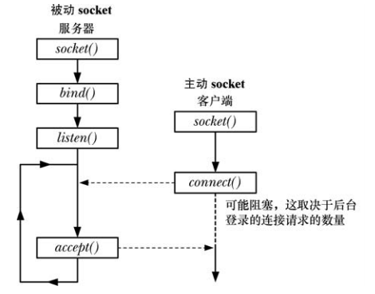
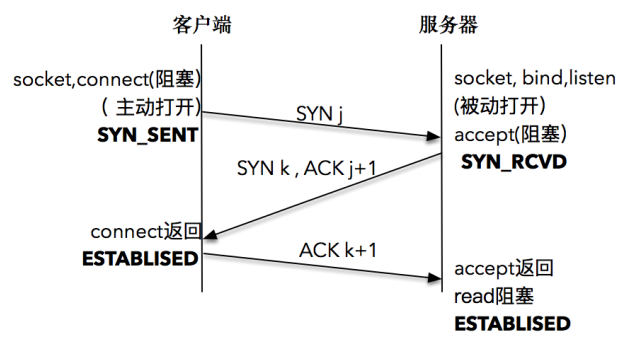

# 服务端准备连接的过程

## 创建套接字

```
#include <sys/types.h>
#include <sys/socket.h>

int socket(int domain, int type, int protocol);
```

- `domain` 就是指 `PF_INET`、`PF_INET6` 以及 `PF_LOCAL` 等，表示什么样的套接字
- `type` 可用的值是：
  - `SOCK_STREAM`: 表示的是字节流，对应TCP
  - `SOCK_DGRAM`： 表示的是数据报，对应UDP
  - `SOCK_RAW`: 表示的是原始套接字
- `protocol` 原本是用来指定通信协议的，但现在基本废弃。因为协议已经通过前面两个参数指定完成。目前一般写成 0 即可

## 将套接字绑定到地址

```
#include <sys/types.h> 
#include <sys/socket.h>

int bind(int sockfd, const struct sockaddr *addr,socklen_t addrlen);
```

- 这里的 `addr` 可以设置为通配地址，对于 IPv4 的地址来说，使用 `INADDR_ANY` 来完成通配地址的设置；对于 IPv6 的地址来说，使用 `IN6ADDR_ANY` 来完成通配地址的设置

## 监听接入连接

初始化创建的套接字，可以认为是一个"主动"套接字，其目的是之后主动发起请求（通过调用 `connect()`）。通过 `listen()`，可以将原来的"主动"套接字转换为"被动"套接字，告诉操作系统内核：“我这个套接字是用来等待用户请求的。

```
#include <sys/types.h>
#include <sys/socket.h>

int listen(int sockfd, int backlog);
```

- `backlog` 限制了未决连接的数量，在这个限制之内的连接请求会立即成功，之外的连接请求就会阻塞直到一个未决连接被 `accept()` 并从未决连接队列中删除为止，Linux 下特有的 `/proc/sys/net/core/somaxconn` 文件用来调整这个限制

客户端可能会在服务器调用 `accept()` 之前调用 `connect()`，如果服务器可能正忙于处理其他客户端，这将产生一个未决连接，内核必须记录所有未决连接请求的相关信息，这样后续的 `accept()` 就能够处理这些请求：



## 接受连接

```
#include <sys/types.h>
#include <sys/socket.h>

int accept(int sockfd, struct sockaddr *addr, socklen_t *addrlen);
```

- `sockfd `是监听套接字是监听套接字，监听套接字一直都存在，它是要为成千上万的客户来服务的，直到这个监听套接字关闭
- 如果在调用 `accept()` 时不存在未决连接，那么调用就会阻塞直到有连接请求到达为止
- `accept()` 会创建一个新 socket，并且正是这个新 socket 会与执行  `connect()` 对等 socket 进行连接，其返回的结果是已连接的 socket 的文件描述符
- `addrlen` 是一个值-结果参数，它指向一个整数，在调用被执行前必须将这个值初始化为 `addr` 指向的缓冲区大小，这样内核就知道有多少空间可以用于返回  socket 地址，当 `accept()` 返回之后，这个整数会被设置成实际被复制进缓冲区中的数据的字节数
- 如果不关心对等 socket 地址，那么可以将 `addr` 和 `addrlen` 指定为 `NULL` 和 0

# 客户端发起连接的过程

## 创建套接字

步骤同上。

## 连接到对等套接字

```
#include <sys/types.h>  
#include <sys/socket.h>

int connect(int sockfd, const struct sockaddr *addr,socklen_t addrlen);
```

- `sockfd` 是连接套接字，通过上一步中 `socket()` 创建
- `addr` 和 `addrlen` 分别代表指向套接字地址结构的指针和该结构的大小，套接字地址结构必须含有服务器的 IP 地址和端口号

客户端在调用函数 `connect()` 前不必非得调用 `bind()`，因为如果需要的话，内核会确定源 IP 地址，并按照一定的算法选择一个临时端口作为源端口。

# TCP 三次握手

调用 `connect()` 将激发 TCP 的三次握手过程，而且仅在连接建立成功或出错时才返回。其中出错返回可能有以下几种情况：

- 三次握手无法建立，客户端发出的 SYN 包没有任何响应，于是返回 TIMEOUT 错误
- 客户端收到了RST（复位）回答，这时候客户端会立即返回 CONNECTION REFUSED 错误，产生 RST 的三个条件：
  - 目的地为某端口的 SYN 到达，然而该端口上没有正在监听的服务器
  - TCP 想取消一个已有连接
  - TCP 接收到一个根本不存在的连接上的分节
- 客户发出的SYN包在网络上引起了 "destination unreachable"，即目的不可达的错误

## 三次握手的解读



服务器端通过 `socket()`，`bind()` 和 `listen()` 完成了被动套接字的准备工作，被动的意思就是等着别人来连接，然后调用 `accept()`，就会阻塞在这里，等待客户端的连接来临。

客户端通过调用 `socket()` 和 `connect()` 之后也会阻塞。

接下来的事情是由操作系统内核网络协议栈完成的：

- 客户端的协议栈向服务器端发送了SYN包，并告诉服务器端当前发送序列号 j，客户端进入SYNC_SENT 状态
- 服务器端的协议栈收到这个包之后，和客户端进行 ACK 应答，应答的值为 j+1，表示对 SYN 包 j 的确认，同时服务器也发送一个 SYN 包，告诉客户端当前我的发送序列号为 k，服务器端进入 SYNC_RCVD 状态
- 客户端协议栈收到 ACK 之后，使得应用程序从 `connect()` 调用返回，表示客户端到服务器端的单向连接建立成功，客户端的状态为 ESTABLISHED，同时客户端协议栈也会对服务器端的 SYN 包进行应答，应答数据为 k+1
- 应答包到达服务器端后，服务器端协议栈使得 `accept()` 阻塞调用返回，这个时候服务器端到客户端的单向连接也建立成功，服务器端也进入ESTABLISHED状态


